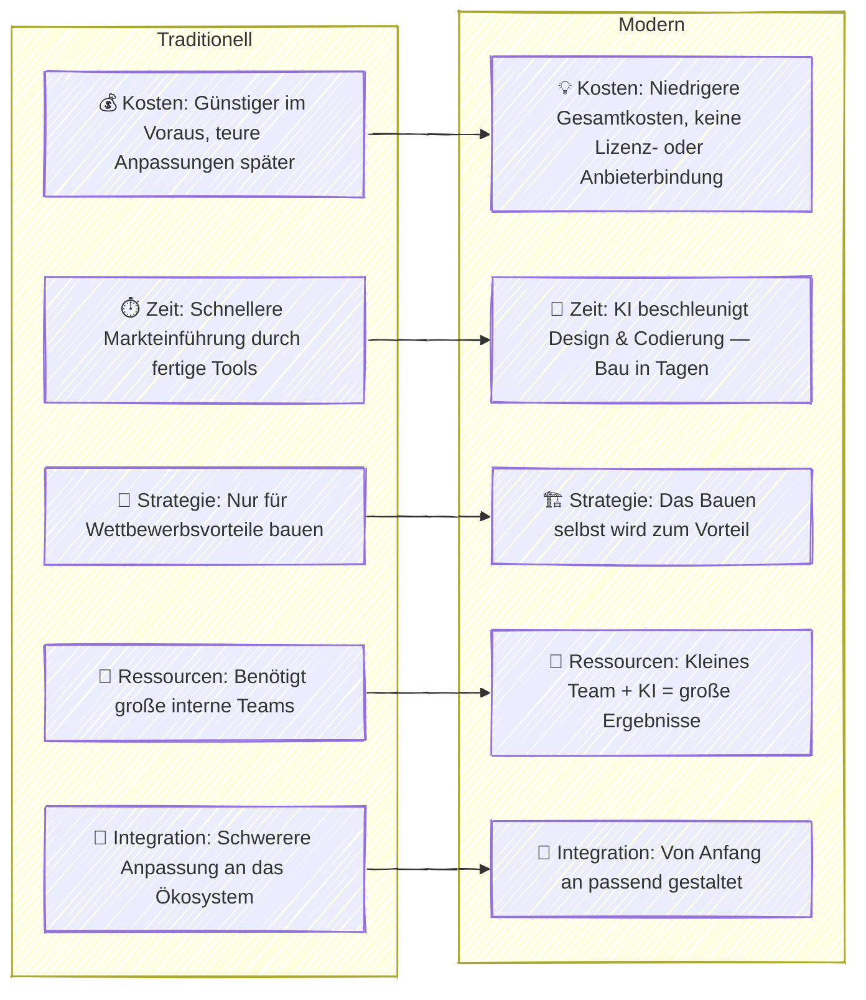

Das Prinzip „kaufen vor bauen“ war jahrzehntelang eine klassische Regel in der IT. Es stammt aus den frühen Tagen der Unternehmensarchitektur, in denen großen Unternehmen geraten wurde, Software zuerst zu kaufen und nur dann zu entwickeln, wenn es absolut notwendig war. Doch mit dem Aufstieg von KI und modernen Plattform-Tools ([PaaS](https://de.wikipedia.org/wiki/Platform_as_a_service)) wird diese Regel weniger klar — und in vielen Fällen sogar veraltet.  

Heute können Technologieingenieure mit sowohl technischem als auch geschäftlichem Verständnis funktionierende Lösungen viel schneller und günstiger liefern als zuvor. Mit KI-Copiloten und modernen Cloud-Plattformen können wir vollständige Geschäftsprodukte in Tagen — nicht Monaten — entwerfen, entwickeln und bereitstellen, ohne schwere Lizenzen oder Anbieterabhängigkeiten. Diese Lösungen sind leichter zu ändern und zu verbessern, sodass Unternehmen schneller agieren und sich an das anpassen können, was der Markt **jetzt** will, nicht erst nächstes Jahr.

### Wie KI und Plattformen "Kaufen vs. Bauen" verändern

### Reales Beispiel: 36-Stunden-Web-App-Entwicklung

Kürzlich habe ich eine **wiederverwendbare und konfigurierbare Webformularanwendung** von Grund auf in nur **36 Stunden** mit einfachem React, Node.js und einem KI-Copiloten entwickelt.  
Ich begann damit, die **Produktstrategie** zu definieren, ein **PRD** zu schreiben und ein **Lösungsdesign** zu erstellen — alles mit KI-Unterstützung und menschlicher Validierung in jedem Schritt.  
Sobald das Konzept klar war, nutzte ich KI, um die Entwicklung der Frontend-Komponenten, der API-Logik und der Konfigurationsmodule zu beschleunigen. Das Ergebnis war eine funktionierende, voll anpassbare App, die mit minimalen Änderungen für verschiedene Kunden wiederverwendet werden kann — etwas, das traditionell Wochen oder sogar Monate dauern würde.  

### Zeit, Ihre IT-Prinzipien zu überdenken

KI und Plattform-Tools haben die Regeln bereits geändert. Bauen ist nicht mehr langsam, teuer oder riskant — es ist oft die klügere, schnellere und günstigere Option. Vielleicht ist es an der Zeit, von *„kaufen vor bauen“* zu *„bauen, wenn du kannst“* zu wechseln.

---
Veröffentlicht: 23-OCT-2025