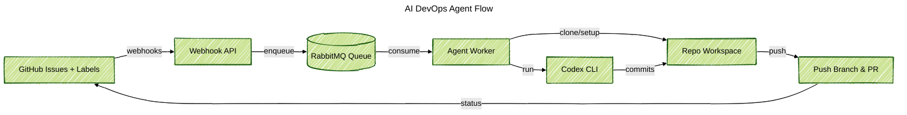

### Projektüberblick
Ein Docker-Agent wurde entwickelt, der GitHub-Issues überwacht, benutzerdefinierte Eingabeaufforderungen schreibt und die Codex-CLI ausführt, um kleine Korrekturen zu liefern, ohne auf einen Menschen warten zu müssen. Ich habe den gesamten Pfad entworfen: Webhook-Aufnahme, Warteschlangenverarbeitung, Repository-Einrichtung und Pull-Request-Lieferung, sowie die Sicherheitsmaßnahmen, die den Agenten in gemeinsamen Repositories höflich halten.

### Problemkontext
Teams wollten KI-Helfer testen, aber jeder Durchlauf erforderte immer noch manuelles Klonen, Zweigvorbereitung und Statusaktualisierungen. Leitplanken für Labels, Zweignamen und Fortschrittsnotizen waren schwer synchron zu halten, sobald mehr Repositories teilnahmen.

### Wichtige technische Herausforderungen
- GitHub-Webhooks in vertrauenswürdige Arbeitssignale umwandeln und Labels ignorieren, die keine Automatisierung zulassen.
- GitHub-App-Tokens für viele Repositories verwalten, ohne Geheimnisse preiszugeben.
- Codex CLI einen klaren Arbeitsbereich, Plan-Dateien und Rückfallschritte bereitstellen, wenn Pushes fehlschlagen.
- Die Pipeline sichtbar halten, damit wir die Warteschlangengesundheit, Agentenprotokolle und geöffnete Pull-Requests überprüfen können.

### Lösungsarchitektur
Zwei Dienste wurden bereitgestellt. Eine Express-API empfängt GitHub-Webhooks, überprüft Header und sendet dauerhafte Nachrichten an RabbitMQ. Ein langlaufender Agent liest die Warteschlange, bereitet jedes Repository vor, führt die Codex CLI aus und sendet die Ergebnisse zurück. Der Agent schreibt Plan-Dateien, passt Labels an, pusht Zweige und öffnet Pull-Requests mit dem Transkript, sodass Prüfer sehen, was passiert ist.

### Technologie-Highlights
- Octokit GitHub App-Authentifizierung mit installationsspezifischen Tokens und automatischen Label-Helfern.
- RabbitMQ-Warteschlange, die Webhook-Spitzen glättet und dauerhafte Wiederholungen ermöglicht.
- Repository-Orchestrierung, die Arbeitsbäume klont oder aktualisiert, konventionelle Zweignamen erstellt und Plan-Dateien vor Codex-Ausführungen vorbereitet.
- Codex CLI-Wrapper mit Modellauswahl, strukturierten Eingabeaufforderungen und abgesicherter Fehlerbehandlung für saubere Protokolle und Transkripte.
- Docker-Dienste mit docker-compose, sodass API, Agent und Messaging lokal und remote gleich laufen.

### Ergebnisse
- Markierte Issues innerhalb von Minuten in Pull-Requests umgewandelt, ohne manuelle Repository-Einrichtung.
- Standardisierte Zweignamen, Plan-Dateien und Statuskommentare, sodass Prüfer jedes Mal denselben Kontext erhalten.
- Klare Protokolle, Warteschlangenmetriken und Pull-Request-Transkripte für einfache Audits hinzugefügt.
- Das Onboarding neuer Repositories zu einer Konfigurationsänderung gemacht, anstatt einen neuen Bot zu erstellen.