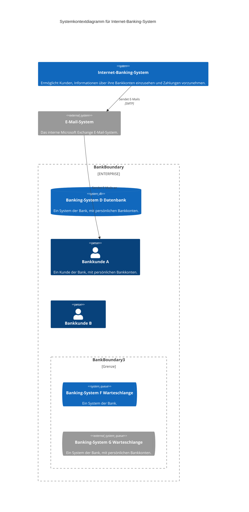

// experimentiere mit C4

```mermaid
C4Context
    title Systemkontextdiagramm für Internet-Banking-System
    
    System(SystemAA, "Internet-Banking-System", "Ermöglicht Kunden, Informationen über ihre Bankkonten einzusehen und Zahlungen vorzunehmen.")

    System_Ext(SystemC, "E-Mail-System", "Das interne Microsoft Exchange E-Mail-System.")

    Enterprise_Boundary(b1, "BankBoundary") {

        SystemDb(SystemD, "Banking-System D Datenbank", "Ein System der Bank, mit persönlichen Bankkonten.")

        Person(customerA, "Bankkunde A", "Ein Kunde der Bank, mit persönlichen Bankkonten.")
        
        Person(customerB, "Bankkunde B")

        Boundary(b3, "BankBoundary3", "Grenze") {
            SystemQueue(SystemF, "Banking-System F Warteschlange", "Ein System der Bank.")
            SystemQueue_Ext(SystemG, "Banking-System G Warteschlange", "Ein System der Bank, mit persönlichen Bankkonten.")
        }

    }

    Rel(SystemAA, SystemC, "Sendet E-Mails", "SMTP")
    Rel(SystemC, customerA, "Sendet E-Mails an")

```