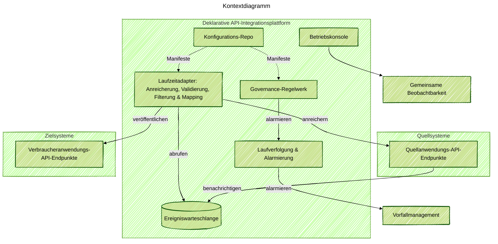

### Projektüberblick
Bereitstellung eines wiederverwendbaren Integrations-Backbones, damit Produktteams Geschäftsvorfälle veröffentlichen und abonnieren können, ohne auf eine zentrale Middleware-Gruppe warten zu müssen. Ich fungierte als Lösungsarchitekt und praktischer Ingenieur: Ich definierte das Zielerlebnis, schrieb die Kernadapter-Laufzeit, baute die Bedienkonsole und coachte die Domänenteams durch die ersten Einführungen.

### Problemkontext
Viele Teams mussten SaaS-Produkte, Altsysteme und neue Dienste verbinden, aber jede Integration befand sich in einer langen Warteschlange für spezialisierte Ingenieure. Selbst mit einem Unternehmensdatenmodell und einem ereignisgesteuerten Plan konnten Teams ohne tiefgehende Integrationskenntnisse keine Adapter alleine starten oder warten.

### Wichtige technische Herausforderungen
- Alte Tools benötigten benutzerdefinierte JVM-Komponenten, benutzerdefinierte DSLs und Release-Pipelines, die nur das Integrationsteam kannte.
- Integrationslogik wurde zwischen Teams kopiert, was zu Abweichungen vom Hauptdatenmodell und höheren Wartungskosten führte.
- Der Betrieb auf sowohl AWS als auch Azure führte zu ungleichmäßiger Beobachtbarkeit, Identität und Bereitstellungsabläufen.

### Lösungsarchitektur
Aufbau einer konfigurationsbasierten Plattform, die vollständige Integrationspipelines aus einem deklarativen Manifest erstellt. Die Plattform standardisiert Ingress, Schemaüberprüfungen, Filterung, Mapping und Bereitstellung über Clouds hinweg, während sie dennoch Hooks für benutzerdefinierte Logik offenlegt. Gemeinsame Module übernehmen Telemetrie, Wiederholungen und Lebenszyklus, sodass sich Domänenteams nur um das Mapping von Quell-Payloads zum Hauptdatenmodell kümmern müssen.

### Technologische Höhepunkte
- Serverlose Laufzeiten auf AWS und Azure, die sich automatisch mit dem Durchsatz skalieren.
- Einheitliches Monitoring, Tracing und Alarmierung, verbunden mit gemeinsamen Beobachtungs- und Vorfallwerkzeugen.
- Bedienkonsole, die den Flussstatus, Prüfpfade und Nachrichtenwiedergabesteuerungen anzeigt.
- Schema-Validierung, Datensatzfilter mit Transformationen und wiederverwendbare Domänenfunktionen.
- Infrastructure-as-Code-Pipelines, die Adapterinstanzen und Beobachtungsdashboards über Clouds hinweg bereitstellen.

### Ergebnisse
- Entwicklern wurden Self-Service-Integrationen über Domänen und Partnerteams hinweg ermöglicht.
- Ermöglichte ereignisgesteuerte Integrationen mit Mustern, die zwischen AWS und Azure reisen.
- Verkürzte die Vorlaufzeit für neue Integrationen von Wochen auf Tage mit automatisiertem Gerüstbau und Leitplanken.
- Reduzierte doppelte Adaptercodes und hielt alles im Einklang mit dem Unternehmensdatenmodell.