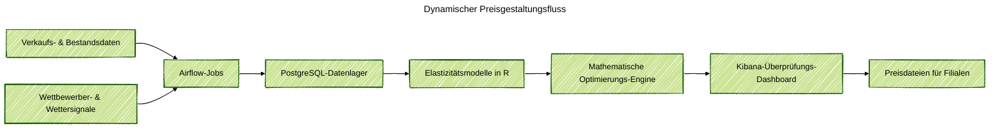

### Projektüberblick
Ich habe einen Backend für dynamische Preisgestaltung für einen regionalen Lebensmittelhändler entworfen und implementiert, der mit 8 Filialen und 6.000 SKUs begann. Das System verarbeitet tägliche Verkaufssignale, modelliert die Preissensitivität und schlägt neue Preisniveaus vor, die Schlüsselprodukte schützen und gleichzeitig den Gewinn steigern. Kategoriemanager überprüfen ein übersichtliches Dashboard, genehmigen Änderungen und veröffentlichen aktualisierte Preisdateien noch am selben Tag.

### Problemkontext
Vor dem Projekt war die Preisgestaltung manuell und reaktiv. Analysten exportierten statische Tabellenkalkulationen, Regeln wurden inkonsistent angewendet, und Filialleiter konnten keine Szenarien vor der Umsetzung testen. Da der Einzelhändler plante, weitere Standorte zu eröffnen, benötigten sie eine selbstverwaltete Preis-Engine, die Umsatz, Marge und Kundenvertrauen ausbalanciert, ohne ein teures Anbieterpaket zu kaufen.

### Wichtige technische Herausforderungen
- Aufbau vertrauenswürdiger Preiselastizitätsmodelle unter Verwendung von Transaktionshistorie, Aktionen und filialbezogenem Kontext für Tausende von SKUs.
- Einhaltung von Geschäftsregeln wie Preiskorridoren, begrenzten täglichen Änderungen und Schutz für Schlüsselprodukte.
- Schnelle Erstellung von Empfehlungen zur Unterstützung von täglichen und wöchentlichen Kategoriebesprechungen.
- Erklärung, warum sich eine Preisempfehlung geändert hat, damit Teams mit Zuversicht handeln können.

### Lösungsarchitektur
End-to-End-Pipeline auf AWS unter Verwendung verwalteter und Open-Source-Dienste. Airflow koordiniert Datenabrufe von Verkaufsstellen-Feeds, Inventarsystemen und Wettbewerber-Crawlern in PostgreSQL. Feature-Engineering-Jobs in Python und SQL aggregieren Nachfragetreiber, Wettersignale und Aktionskennzeichen. In R erstellte Elastizitätsmodelle quantifizieren die Preisreaktion und die Nachfrageübertragung über Produkte hinweg. Eine Optimierungsschicht läuft auf EC2 mit Python und Gurobi, um Preisbewegungen auszuwählen, die Leitplanken und Gewinnziele respektieren. Ergebnisse fließen in Elasticsearch, wo Kibana-Dashboards es den Preisgestaltern ermöglichen, Szenarien zu vergleichen und genehmigte Preislisten zurück in die Filialen zu veröffentlichen.

### Technologische Highlights
- Airflow-Pipelines in Python verwalten die tägliche Datenaufnahme und Qualitätsprüfungen über Filialen hinweg.
- SQL- und Python-Feature-Engineering-Jobs bereiten Trainingssets mit Aktionen, Wetter- und Verfügbarkeitssignalen vor.
- R-basierte GPBoost-Modelle erfassen hierarchische Effekte nach Filialcluster und Produktfamilie.
- Optimierungsjobs auf AWS EC2 kombinieren Gurobi und benutzerdefinierte Python-Logik, um Preisgrenzen, Gewinnziele und Änderungsbeschränkungen durchzusetzen.
- Elasticsearch und Kibana bieten Echtzeit-Dashboards, Szenarienvergleiche und exportierbare Preisdateien.

### Ergebnisse
- Erzielte eine Gewinnsteigerung von 2,4 % und ein Umsatzwachstum von 5,8 % für verwaltete Kategorien während der anfänglichen Einführung in 8 Filialen.
- Skalierte die Plattform auf 75 Filialen, während Genehmigungs-Workflows und Preisleitplanken intakt blieben.
- Reduzierte die Preisgestaltung von mehrtägigen Tabellenkalkulationszyklen auf Stunden, was Testszenarien und Bereitstellungen am selben Tag ermöglicht.
- Lieferte transparente, prüfbare Empfehlungen, denen die Preisgestalter vertrauen, ohne auf externe Anbieter angewiesen zu sein.