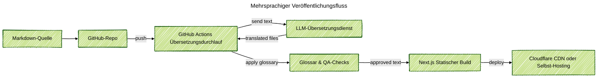

### Projektübersicht
Ich habe ein mehrsprachiges Website-Framework für Produktteams entwickelt, die eine klare Marketingseite ohne Übersetzer benötigen. Redakteure schreiben einmal Markdown, pushen es zu GitHub, und die Pipeline liefert lokalisierte Seiten in wenigen Minuten. Das React-Frontend bleibt leicht, mobilfreundlich und einfach mit neuen Abschnitten oder Komponenten erweiterbar.

### Problemkontext
Unternehmen mit wachsenden globalen Zielgruppen benötigen schnell neue Inhalte online, aber Übersetzungsagenturen verlangsamen jedes Update. Selbstgeschriebene Skripte brechen oft das Format, übersehen Glossare oder vergessen von rechts nach links Layouts. Produktmanager forderten auch einen transparenten Ansatz, der menschliche Überprüfung einbezieht und auf kostengünstiger Infrastruktur laufen kann.

### Wichtige technische Herausforderungen
- Halten Sie das Quell-Markdown einfach, während Sie dennoch strukturierte Metadaten für jede Sprache erfassen.
- Führen Sie LLM-Übersetzungen mit Glossarunterstützung, Tonkontrolle und der Möglichkeit für menschliche Bearbeitungen vor der Veröffentlichung durch.
- Vermeiden Sie teures Cloud-Hosting, damit kleine Teams das Framework auf ihrer eigenen Hardware oder kostengünstigen Servern hosten können.
- Gewährleisten Sie, dass Build-Artefakte über alle Sprachen hinweg synchron bleiben, einschließlich Bilder, Links und Navigationsbeschriftungen.

### Lösungsarchitektur
Das Framework verwendet ein GitHub-Repository als einzige Quelle der Wahrheit. Ein GitHub-Actions-Workflow erkennt neue Commits, zerlegt Markdown in übersetzungsbereite Segmente und ruft einen LLM-Übersetzungsdienst mit Projektglossaren auf. Der Workflow schreibt die übersetzten Markdown-Dateien über eine Pull-Anfrage zurück ins Repository, damit Prüfer den Text annehmen oder anpassen können. Nach der Genehmigung erstellt ein weiterer Job die statische Next.js-Site und stellt sie auf Cloudflare Pages oder einem beliebigen CDN bereit, das Edge-Caching unterstützt.

### Technologische Highlights
- Next.js-Frontend mit lokalisierungsbewusster Routing, RTL-Unterstützung und wiederverwendbaren Komponenten, die in Storybook erstellt wurden.
- Markdown-Pipeline, die Inhalte in der Versionskontrolle speichert und optionale Frontmatter für SEO-Metadaten bereitstellt.
- GitHub Actions Jobs, die Übersetzungsanfragen, Glossarüberprüfungen und Pull-Request-Reviews verwalten.
- LLM-Übersetzungsadapter mit Wiederholungslogik, Ratenbegrenzungen und Rückgriffen auf menschliche Prüfer, wenn das Vertrauen sinkt.
- Bereitstellung von einem Heimlabor-Server, der über Cloudflare Zero Trust getunnelt wird.

### Ergebnisse
- Verkürzte die Übersetzungsdauer von Wochen auf Minuten, während die menschliche Überprüfung vor dem Live-Gang beibehalten wurde.
- Senkte die Hosting-Kosten, indem selbst gehostete Labs oder kostengünstige Edge-Plattformen anstelle großer Cloud-Cluster unterstützt wurden.
- Gab Inhaltsredakteuren einen vorhersehbaren Workflow mit überprüfbaren Pull-Anfragen und integrierten Glossaren.
- Gelieferte eine mehrsprachige Site-Hülle, die Marketingteams erweitern können, ohne Backend-Code zu berühren.