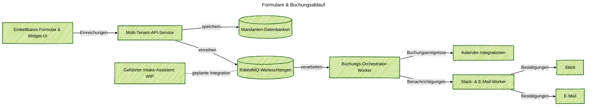

### Projektübersicht
Entwickelte eine SaaS-Formularplattform, damit Marketing- und Operationsteams gebrandete Formulare auf jeder Website platzieren, strukturierte Antworten sammeln und Meetings buchen können, ohne jedes Mal Ingenieure zu fragen. Diese Website betreibt bereits den Service für den „Lass uns reden“-Button: jedes Feld, jede Sprachversion und jeder Verfügbarkeitszeitraum kommt aus den Mandanteneinstellungen und ist direkt mit dem Kalender des Anfragenden verknüpft. Ein einfacher Konversationsassistent ist noch in Arbeit, und ich habe noch nicht gelöst, wie ich seine Qualität überwachen kann.

### Problemkontext
Geschäftseinheiten wollten zuverlässige Funnels—Newsletter-Anmeldungen, Beratungsbuchungen, Workshop-Anmeldungen—über viele Websites hinweg. Ad-hoc-Formulare brachen Eigentumsregeln, Kalenderübergaben blieben manuell, und Compliance-Überprüfungen verzögerten jedes kleine Experiment. Teams wollten auch einen AI-Concierge ausprobieren, aber es gab keine gemeinsame Schicht, die normale Formulare mit Konversationseingaben mischte und dabei die Prüfspur beibehielt.

### Wichtige technische Herausforderungen
- Halten Sie die Formschemas, Validierungen und Übersetzungen der Mandanten isoliert, vermeiden Sie jedoch Copy-Paste über Mikroseiten hinweg.
- Lösen Sie Kalender, Bestätigungs-E-Mails und Slack-Benachrichtigungen aus einer Einreichung aus, ohne die Ratenlimits der Mandanten zu ignorieren.
- Teilen Sie ein Datenmodell zwischen API, Workern und Widgets, damit Analysen und Aufbewahrungsregeln synchron bleiben.
- Planen Sie den zukünftigen geführten Konversationsassistenten ohne klare Methode zur Verfolgung der Modellqualität oder zur Erkennung von Regressionen.

### Lösungsarchitektur
Geliefert wurde ein modulares Monorepo mit einer Express-API, Orchestrator-Workern und einbettbaren Widget-Paketen, die über RabbitMQ verbunden sind. Formulareinreichungen erreichen die API, werden mit gemeinsamen Mongoose-Modellen gespeichert und dann auf Buchungsabläufe, E-Mail-Bestätigungen und Slack-Benachrichtigungen verteilt. Eine Roadmap-Konversationsschicht (wir nennen sie vorerst Guided Intake Assistant) teilt dieselben Pipes, bleibt jedoch deaktiviert, bis wir die Überwachung von LLM-Antworten und Qualitätsbewertungen herausfinden.

### Technische Highlights
- Express REST API mit Mandanten-Middleware, strikter Validierung und Buchungsendpunkten, unterstützt durch gemeinsame Datenmodelle.
- RabbitMQ-Warteschlangen für Buchungen, Benachrichtigungen und zukünftige Chat-Ereignisse, unter Verwendung von Lazy-Policies, um Spitzen zu überstehen.
- Orchestrator-Worker, der Buchungspläne erstellt, Kalender-Slots überprüft und Standard-Lebenszyklusereignisse ausgibt.
- Benachrichtigungs-Worker, der Slack-Benachrichtigungen und lokalisierte E-Mail-Vorlagen sendet und dabei Prüfprotokolle pro Mandant führt.
- Widget-Bootloader plus React-UI-Pakete, die steckbare Formulare rendern, Zustimmung respektieren und Mandantenthemen laden.
- Früher Guided Intake Assistant, der denselben Orchestrierungs-Stack wiederverwendet; Überwachungs- und Bewertungs-Pipelines sind noch ungelöst.

### Ergebnisse

- Gelieferte Plug-and-Play-Formulare mit konsistentem Branding und Validierung über Mandantenseiten hinweg, wodurch die Startzeit von Wochen auf Tage verkürzt wurde.
- Automatisierte Buchungsbestätigungen, Kalendererstellung und Stakeholder-Benachrichtigungen, wodurch manuelle Übergaben entfallen.
- Ein gemeinsames Datenmodell, das Analysen, Aufbewahrungsrichtlinien und Compliance-Überprüfungen ohne Nacharbeit unterstützt.
- Den Weg für den konversationellen Intake vorbereitet, während klar darauf hingewiesen wird, dass Qualitätsüberwachung und Schutzmaßnahmen vor der allgemeinen Freigabe gelöst werden müssen.