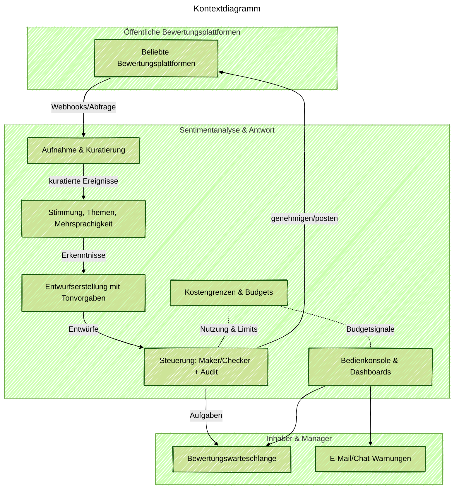

Status: Aktive Entwicklung (MVP in Arbeit). Die unten stehenden Notizen beschreiben das Design und die Ziele; nicht alle Funktionen sind bereits verfügbar.

### Projektüberblick
Ich entwickle einen kleinen, pragmatischen Dienst, der öffentliche Bewertungen sammelt, die Stimmung und Themen versteht und freundliche und markenkonforme Entwurfsantworten vorbereitet. Mein Fokus liegt auf Geschwindigkeit und Steuerung: schnelle Entwürfe für Inhaber und Manager, aber immer mit menschlicher Kontrolle. Ich entwerfe den Ablauf, implementiere die Kernanalyse und den Entwurfspipeline, erstelle die Bedienkonsole und setze Kostengrenzen, damit die KI-Ausgaben vorhersehbar bleiben.

### Problemkontext
Kleinunternehmer erhalten viele Bewertungen auf verschiedenen Plattformen. Die manuelle Bearbeitung ist langsam und nicht konsistent. Es ist schwierig, den Ton in mehreren Sprachen freundlich zu halten und dennoch das Budget für die KI-Nutzung einzuhalten. Teams verbringen Zeit damit, Texte zwischen Tools zu kopieren und verpassen den besten Zeitpunkt für eine Antwort.

### Wichtige technische Herausforderungen
- Die Mehrkanalaufnahme muss zuverlässig sein, Bewertungen deduplizieren und Standorte korrekt taggen.
- Entwurfsantworten müssen menschlich wirken und Tonvorgaben folgen, aber dennoch schnelles Bearbeiten und Genehmigen ermöglichen.
- Mehrsprachige Bewertungen erfordern Erkennung, Übersetzung für Betreiber und Entwurf in derselben Sprache.
- Steuerung ist wichtig: Maker/Checker-Workflow, Prüfpfad und Richtlinienfilter (wie keine Versprechen von Entschädigungen ohne Genehmigung).
- KI-Token-Kosten müssen sichtbar und mit Budgets, Warnungen und Caching kontrolliert werden.

### Lösungsarchitektur
Ich baue eine ereignisgesteuerte Pipeline, die Bewertungen aufnimmt, anreichert, Stimmungs- und Themenanalysen durchführt und Entwurfsantworten mit Tonkontrollen generiert. Eine Konsole zeigt eine Bewertungswarteschlange, Dashboards und Warnungen. Kostengrenzen verfolgen die Token-Nutzung und reduzieren automatisch die Kosten, wenn das Budget nahe an der Obergrenze liegt.

### Technische Highlights (Geplant/Alpha)
- Ereignisgesteuerte Dienste, die mit der Warteschlangentiefe skalieren und die Verarbeitung in wenigen Minuten halten.
- Mehrsprachige Handhabung: Sprache erkennen, Übersetzung für Betreiber nebeneinander anzeigen, Entwürfe in derselben Sprache erstellen.
- Tonvorgaben (Formal, Warm, Prägnant, Empathisch) mit Richtlinienfiltern und verfolgten Änderungen während der Bearbeitung.
- Maker/Checker-Workflow mit vollständigem Prüfprotokoll und Eskalation für risikoreichere Antworten.
- Dashboards für Stimmungstrends, Top-Themen, Antwort-SLA und gesparte Stunden.
- Kostengrenzen mit Tokenabrechnung, Budgetobergrenzen, Warnungen und Caching/Fallback-Aufforderungen.

### Zielergebnisse
- Schnellere Bearbeitung negativer Bewertungen mit konsistentem, freundlichem Ton.
- Weniger manueller Aufwand für Inhaber und Manager durch bereit zur Genehmigung stehende Entwürfe.
- Klare Steuerung: Genehmigungsstatus, Prüfpfad und Richtlinienprüfungen reduzieren das Risiko.
- Vorhersehbare KI-Ausgaben mit Live-Budgetanzeige und automatischen kostensicheren Modi.