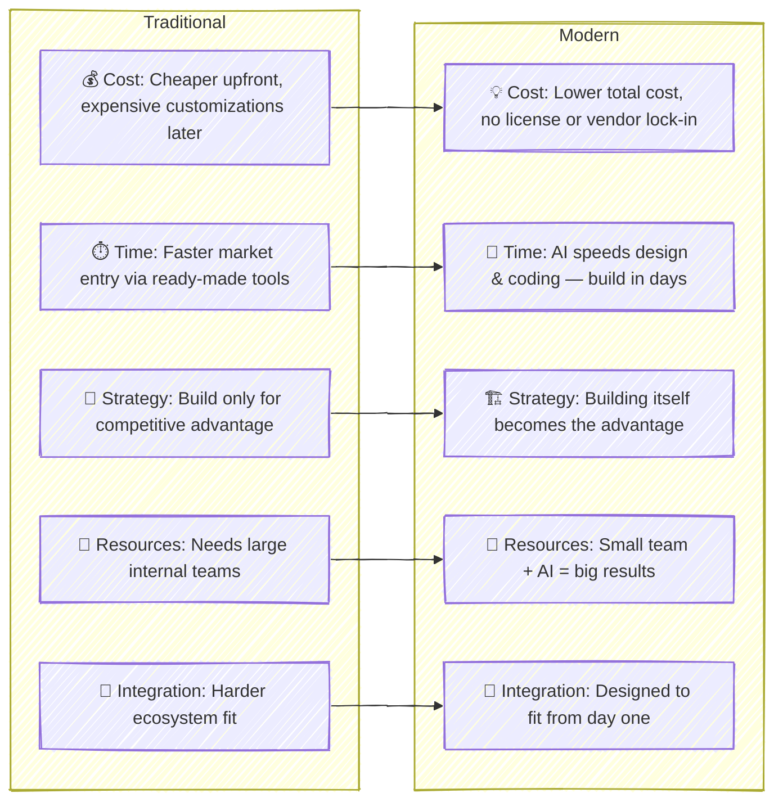

The "buy before build" principle has been a classic rule in IT for decades. It came from the early enterprise architecture days, where large companies were told to buy software first and build only when absolutely needed. But with the rise of AI and modern platform tools ([PaaS](https://en.wikipedia.org/wiki/Platform_as_a_service)), this rule is becoming less clear — and in many cases, even outdated.  

Today, technology engineers with both technical and business understanding can deliver working solutions much faster and cheaper than before. With AI copilots and modern cloud platforms, we can design, build, and deploy full business products in days — not months — without heavy licenses or vendor lock-ins. These solutions are easier to change and improve, letting businesses move faster and adapt to what the market wants **now**, not next year.

### How AI and Platforms Are Changing "Buy vs Build"

### Real Example: 36-Hour Web App Build

Recently, I built a **reusable and configurable web form application** from scratch in just **36 hours** using plain React, Node.js, and an AI copilot.  
I started by defining the **product strategy**, writing a **PRD**, and creating a **solution design** — all with AI assistance and human validation at every step.  
Once the concept was clear, I used AI to speed up development of the front-end components, API logic, and configuration modules. The result was a working, fully adaptable app that can be reused for different clients with minimal changes — something that would traditionally take weeks or even months.  

### Time to Revisit Your IT Principles

AI and platform tools have already changed the rules. Building is no longer slow, expensive, or risky — it’s often the smarter, faster, and cheaper option. Maybe it’s time to move from *“buy before build”* to *“build if you can.”*

---
Published: 23-OCT-2025
