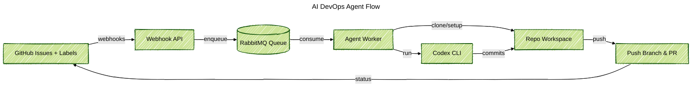

### Project Snapshot
Built a Docker agent that watches GitHub issues, writes custom prompts, and runs Codex CLI to ship small fixes without waiting for a human. I designed the full path: webhook intake, queue processing, repo setup, and pull-request delivery, plus the safety steps that keep the agent polite inside shared repos.

### Problem Context
Teams wanted to test AI helpers, but every run still needed manual cloning, branch prep, and status updates. Guardrails for labels, branch names, and progress notes were hard to keep in sync once more repositories opted in.

### Key Technical Challenges
- Turn GitHub webhooks into trusted work signals and ignore labels that do not allow automation.
- Handle GitHub App tokens for many repos without exposing secrets.
- Feed Codex CLI a clear workspace, plan file, and fallback steps when pushes fail.
- Keep the pipeline visible so we can audit queue health, agent logs, and opened pull requests.

### Solution Architecture
Delivered two services. An Express API receives GitHub webhooks, checks headers, and sends durable messages into RabbitMQ. A long-running agent reads the queue, prepares each repository, runs Codex CLI, and posts back results. The agent writes plan files, adjusts labels, pushes branches, and opens pull requests with the transcript so reviewers see what happened.

### Technology Highlights
- Octokit GitHub App auth with per-repo installation tokens and auto label helpers.
- RabbitMQ queue that smooths webhook spikes and keeps durable retries.
- Repo orchestration that clones or refreshes worktrees, creates convention branch names, and seeds plan files before Codex runs.
- Codex CLI wrapper with model selection, structured prompts, and guarded error handling for clean logs and transcripts.
- Docker services with docker-compose so API, agent, and messaging run the same local and remote.

### Outcomes
- Turned labeled issues into pull requests within minutes without manual repo setup.
- Standardized branch names, plan files, and status comments so reviewers get the same context each time.
- Added clear logs, queue metrics, and pull-request transcripts for easy audits.
- Made onboarding new repositories a config change instead of building a new bot.
