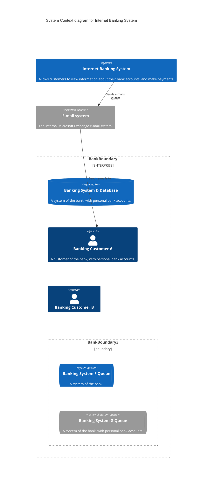

// experiment with C4

```mermaid
C4Context
    title System Context diagram for Internet Banking System
    
    System(SystemAA, "Internet Banking System", "Allows customers to view information about their bank accounts, and make payments.")

    System_Ext(SystemC, "E-mail system", "The internal Microsoft Exchange e-mail system.")

    Enterprise_Boundary(b1, "BankBoundary") {

        SystemDb(SystemD, "Banking System D Database", "A system of the bank, with personal bank accounts.")

        Person(customerA, "Banking Customer A", "A customer of the bank, with personal bank accounts.")
        
        Person(customerB, "Banking Customer B")

        Boundary(b3, "BankBoundary3", "boundary") {
            SystemQueue(SystemF, "Banking System F Queue", "A system of the bank.")
            SystemQueue_Ext(SystemG, "Banking System G Queue", "A system of the bank, with personal bank accounts.")
        }

    }

    Rel(SystemAA, SystemC, "Sends e-mails", "SMTP")
    Rel(SystemC, customerA, "Sends e-mails to")

```