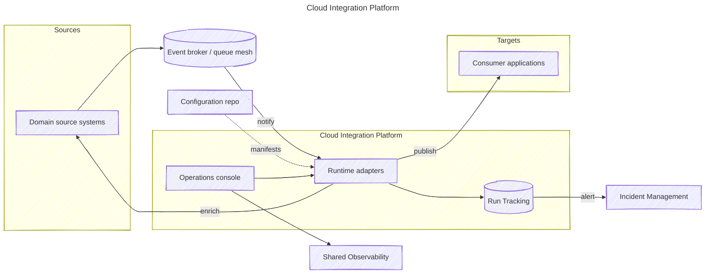

### Project Snapshot
Delivered a reusable integration backbone so product teams can publish and subscribe to business events without queueing behind a central middleware group. Led the initiative as a solution architect and hands-on engineer—defining the target integration experience, authoring the core adapter runtime, building the operator console, and coaching domain teams through the first launches.

### Problem Context
Multiple teams needed to connect SaaS products, heritage systems, and modern services, yet every integration had to queue behind specialist engineers. Even with an enterprise data model and event-driven principles in place, teams lacking deep integration expertise could not independently launch or maintain adapters.

### Key Technical Challenges
- Legacy tooling required custom JVM components, bespoke DSLs, and release pipelines that only the integration team could operate.
- Integration logic was duplicated across teams, increasing drift from the canonical data model and raising maintenance costs.
- Operating across AWS and Azure introduced inconsistent observability, identity, and deployment flows.

### Solution Architecture
Delivered a configuration-first platform that provisions entire integration pipelines from a single declarative manifest. The platform standardizes ingress, schema validation, transformation, and delivery across cloud providers while exposing extension points for custom logic. Shared modules handle telemetry, retries, and lifecycle management so domain teams focus on mapping source payloads to the canonical model.

### Technology Highlights
- Cloud-native, serverless runtimes on AWS and Azure that auto-scale with throughput.
- Unified monitoring, tracing, and alerting wired into shared observability and incident management tooling.
- Operations console that exposes flow health, audit trails, and message replay controls.
- Schema validation, record filters with transformations, and reusable domain-specific functions.
- Infrastructure-as-code pipelines that deploy adapter instances and observability dashboards across clouds.

### Outcomes
- Accelerated developer self-service across domains and partner-facing teams.
- Enabled event-driven integrations with portable patterns across AWS and Azure services.
- Cut lead time for new integrations from weeks to days through automated scaffolding and guardrails.
- Reduced duplicated adapter code and enforced conformance with the enterprise data model.

