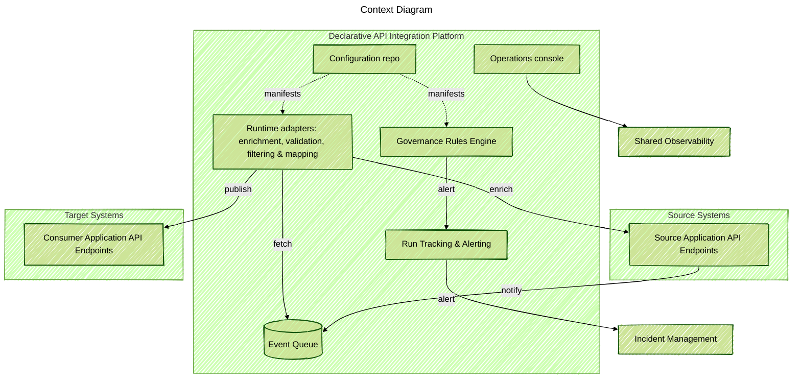

### Project Snapshot
Delivered a reusable integration backbone so product teams can publish and subscribe to business events without waiting for a central middleware group. I acted as solution architect and hands-on engineer: I defined the target experience, wrote the core adapter runtime, built the operator console, and coached domain teams through the first launches.

### Problem Context
Many teams had to connect SaaS products, legacy systems, and new services, but every integration sat in a long queue for specialist engineers. Even with an enterprise data model and event-driven plan, teams without deep integration skills could not launch or maintain adapters alone.

### Key Technical Challenges
- Legacy tooling needed custom JVM pieces, custom DSLs, and release pipelines that only the integration team knew.
- Integration logic was copied between teams, creating drift from the main data model and higher maintenance cost.
- Running on both AWS and Azure gave uneven observability, identity, and deployment flows.

### Solution Architecture
Built a configuration-first platform that creates full integration pipelines from one declarative manifest. The platform standardizes ingress, schema checks, filtering, mapping, and delivery across clouds while still exposing hooks for custom logic. Shared modules handle telemetry, retries, and lifecycle so domain teams only worry about mapping source payloads to the main data model.

### Technology Highlights
- Serverless runtimes on AWS and Azure that auto scale with throughput.
- Unified monitoring, tracing, and alerting connected to shared observability and incident tools.
- Operator console that shows flow health, audit trails, and message replay controls.
- Schema validation, record filters with transformations, and reusable domain functions.
- Infrastructure-as-code pipelines that deploy adapter instances and observability dashboards across clouds.

### Outcomes
- Gave developers self-service integrations across domains and partner teams.
- Enabled event-driven integrations with patterns that travel between AWS and Azure.
- Cut lead time for new integrations from weeks to days with automated scaffolding and guardrails.
- Reduced duplicate adapter code and kept everything aligned with the enterprise data model.
