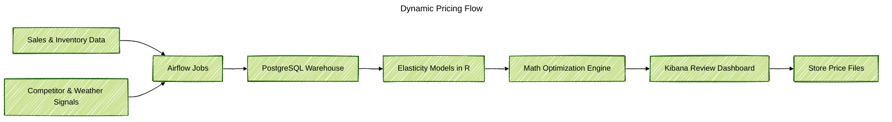

### Project Snapshot
I designed and implemented a dynamic pricing backend for a regional grocer that started with 8 stores and 6,000 SKUs. The system ingests daily sales signals, models price sensitivity, and proposes new price points that protect key-value items while lifting profit. Category managers review a clear dashboard, approve changes, and publish updated price files within the same day.

### Problem Context
Before the project, pricing work was manual and reactive. Analysts exported static spreadsheets, rules were applied inconsistently, and store managers could not test scenarios before execution. As the retailer prepared to open more locations, they needed a self-managed pricing engine that balanced revenue, margin, and customer trust without buying an expensive vendor package.

### Key Technical Challenges
- Build trustworthy price elasticity models using transaction history, promotions, and store-level context for thousands of SKUs.
- Honor business rules such as price corridors, limited daily changes, and protection for key value items.
- Produce recommendations fast enough to support daily and weekly category meetings.
- Explain why a price recommendation changed so teams could act with confidence.

### Solution Architecture
End-to-end pipeline on AWS using managed and open-source services. Airflow orchestrates data pulls from point-of-sale feeds, inventory systems, and competitor crawlers into PostgreSQL. Feature engineering jobs in Python and SQL aggregate demand drivers, weather signals, and promotion flags. Elasticity models built in R quantify price response and demand transfer across products. An optimization layer runs on EC2 with Python and Gurobi to choose price moves that respect guardrails and profit targets. Results flow into Elasticsearch, where Kibana dashboards let pricing leads compare scenarios and publish approved price lists back to stores.

### Technology Highlights
- Airflow pipelines in Python manage daily ingestion and data quality checks across stores.
- SQL and Python feature engineering jobs prepare training sets with promotions, weather, and availability signals.
- R-based GPBoost models capture hierarchical effects by store cluster and product family.
- Optimization jobs on AWS EC2 combine Gurobi and custom Python logic to enforce price bounds, profit targets, and change limits.
- Elasticsearch and Kibana provide real-time dashboards, scenario comparisons, and exportable price files.

### Outcomes
- Achieved a 2.4% profitability lift and 5.8% revenue growth for managed categories during the initial 8-store rollout.
- Scaled the platform to 75 stores while keeping approval workflows and price guardrails intact.
- Reduced pricing turnaround from multi-day spreadsheet cycles to hours, enabling same-day scenario testing and deployment.
- Delivered transparent, auditable recommendations that pricing leads trust without relying on outside vendors.
