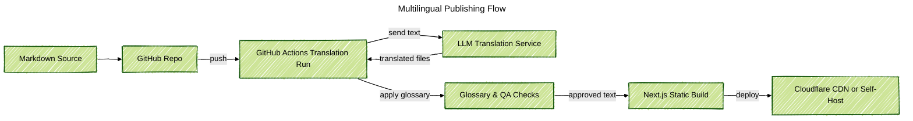

### Project Snapshot
I built a multilingual website framework for product teams that want a clear marketing site without hiring translators. Editors write Markdown once, push to GitHub, and the pipeline delivers localized pages in minutes. The React front end stays light, mobile friendly, and easy to extend with new sections or components.

### Problem Context
Companies with growing global audiences need new content online fast, but translation agencies slow down every update. Homegrown scripts often break formatting, miss glossaries, or forget right-to-left layouts. Product managers also asked for an approach that is transparent, keeps human review in the loop, and can run on low-cost infrastructure.

### Key Technical Challenges
- Keep the source Markdown simple while still capturing structured metadata for each language.
- Run LLM translations with glossary support, tone control, and the option for human edits before publishing.
- Avoid expensive cloud hosting so small teams can host the framework on their own hardware or budget servers.
- Guarantee that build artifacts stay synchronized across languages, including images, links, and navigation labels.

### Solution Architecture
The framework uses a GitHub repository as the single source of truth. A GitHub Actions workflow detects new commits, slices Markdown into translation-ready segments, and calls an LLM translation service with project glossaries. The workflow writes translated Markdown files back to the repository through a pull request so reviewers can accept or tweak the text. After approval, another job builds the static Next.js site and deploys it to Cloudflare Pages or any CDN that supports edge caching.

### Technology Highlights
- Next.js front end with locale-aware routing, RTL support, and reusable components built in Storybook.
- Markdown pipeline that stores content in version control and exposes optional front matter for SEO metadata.
- GitHub Actions jobs that manage translation requests, glossary checks, and pull request reviews.
- LLM translation adapters with retry logic, rate limits, and fallbacks to human reviewers when confidence drops.
- Deployment from a home lab server tunneled through Cloudflare Zero Trust.

### Outcomes
- Cut translation turnaround from weeks to minutes while keeping human review before go-live.
- Lowered hosting costs by supporting self-hosted labs or low-cost edge platforms instead of large cloud clusters.
- Gave content editors a predictable workflow with auditable pull requests and built-in glossaries.
- Delivered a multilingual site shell that marketing teams can extend without touching backend code.
