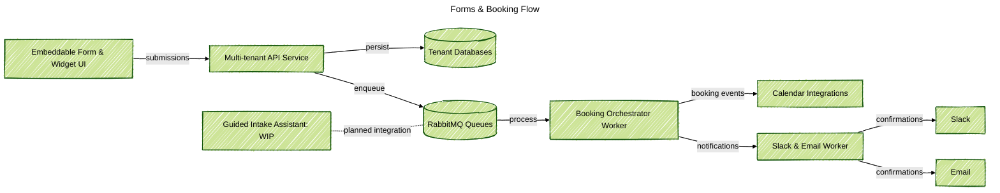

### Project Snapshot
Built a SaaS intake platform so marketing and operations teams can drop branded forms on any site, collect structured answers, and book meetings without asking engineers each time. I led the API, the queue workers, and the widget bundles, and documented how confirmations, calendar hooks, and admin alerts stay aligned across tenants. This website already runs the service for the "Let's talk" button: every field, language version, and availability slot comes from tenant settings and links straight into the requester calendar. A simple conversation assistant is still work in progress, and we have not solved yet how to watch its quality.

### Problem Context
Business units wanted reliable funnels—newsletter opt-ins, consultation booking, workshop sign-ups—across many websites. Ad-hoc forms broke ownership rules, calendar hand-offs stayed manual, and compliance reviews delayed every small experiment. Teams also asked to try an AI concierge, but there was no shared layer that mixed normal forms with conversation input while keeping the audit trail.

### Key Technical Challenges
- Keep tenant form schemas, validation, and translations isolated but avoid copy-paste across microsites.
- Trigger calendars, confirmation email, and Slack alerts from one submission without ignoring tenant rate limits.
- Share one data model between API, workers, and widgets so analytics and retention rules stay in sync.
- Plan the future guided conversation assistant without a clear method to track model quality or detect regressions.

### Solution Architecture
Delivered a modular monorepo with an Express API, orchestrator workers, and embeddable widget packages connected through RabbitMQ. Form submissions reach the API, save with shared Mongoose models, then fan out to booking flows, email confirmations, and Slack notifications. A roadmap conversation layer (we call it Guided Intake Assistant for now) shares the same pipes but stays disabled until we figure out monitoring for LLM replies and quality scoring.

### Technology Highlights
- Express REST API with tenant middleware, strict validation, and booking endpoints backed by shared data models.
- RabbitMQ queues for bookings, notifications, and future chat events, using lazy policies to survive bursts.
- Orchestrator worker that builds booking plans, checks calendar slots, and emits standard lifecycle events.
- Notification worker that sends Slack alerts and localized email templates while keeping audit logs per tenant.
- Widget bootloader plus React UI packages that render pluggable forms, respect consent, and load tenant themes.
- Early Guided Intake Assistant reusing the same orchestration stack; monitoring and scoring pipelines are still unsolved.

### Outcomes
- Delivered plug-and-play forms with consistent branding and validation across tenant sites, shrinking launch time from weeks to days.
- Automated booking confirmations, calendar creation, and stakeholder notifications, removing manual hand-offs.
- Kept one shared data model powering analytics, retention policies, and compliance reviews without rework.
- Prepared the path for conversational intake while clearly warning that quality monitoring and guardrails must be solved before general release.
