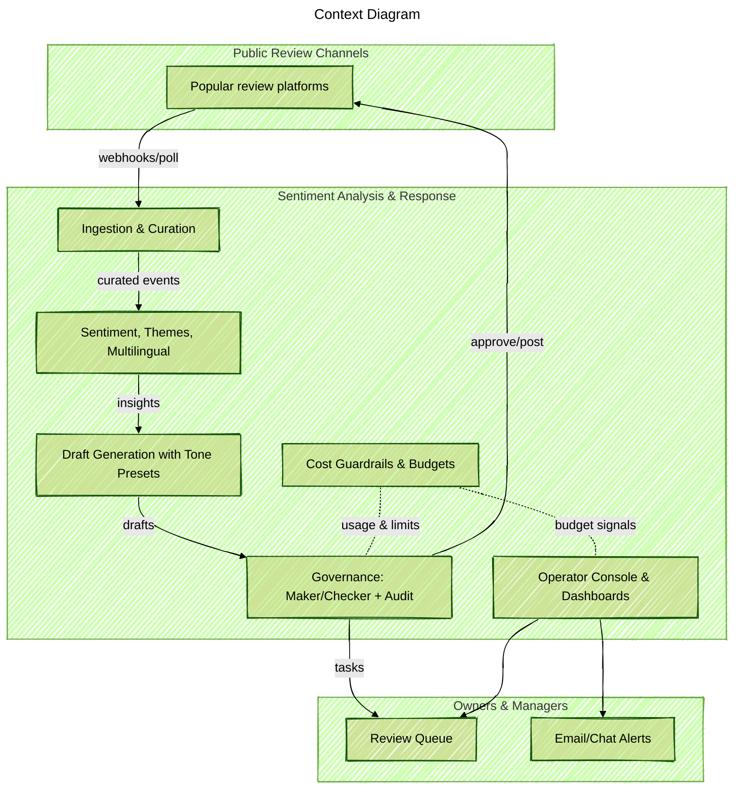

Status: Active development (MVP in progress). The notes below describe the design and targets; not all features are shipped yet.

### Project Snapshot
I am building a small, pragmatic service that collects public reviews, understands the sentiment and themes, and prepares kind and on-brand draft responses. My focus is speed and governance: quick drafts for owners and managers, but always with human control. I am designing the flow, implementing the core analysis and drafting pipeline, creating the operator console, and setting up the cost guardrails so AI spend stays predictable.

### Problem Context
Small business owners receive many reviews across different platforms. Manual handling is slow and not consistent. It is hard to keep tone friendly in multiple languages and still stay on budget for AI usage. Teams spend time copying text between tools and miss the best time to respond.

### Key Technical Challenges
- Multi-channel ingestion needs to be reliable, deduplicate reviews, and tag locations correctly.
- Draft responses must feel human and follow tone presets, but still allow fast editing and approval.
- Multilingual reviews require detection, translation for operators, and same-language drafting.
- Governance is important: maker/checker workflow, audit trail, and policy filters (like no promises of compensation without approval).
- AI token costs must be visible and controlled with budgets, alerts, and caching.

### Solution Architecture
I am building an event-driven pipeline that ingests reviews, enriches them, runs sentiment and theme analysis, and generates draft responses with tone controls. A console will show a review queue, dashboards, and alerts. Cost guardrails track token usage and will automatically reduce cost when budget is close to the cap.

### Technology Highlights (Planned/Alpha)
- Event-driven services that scale with queue depth and keep processing under a few minutes.
- Multilingual handling: detect language, show side-by-side translation for operators, produce same-language drafts.
- Tone presets (Formal, Warm, Concise, Empathetic) with policy filters and tracked changes during edits.
- Maker/checker workflow with full audit log and escalation for higher-risk responses.
- Dashboards for sentiment trends, top themes, response SLA, and hours saved.
- Cost guardrails with token accounting, budget caps, alerts, and caching/fallback prompts.

### Target Outcomes
- Faster turnaround for negative reviews with consistent, friendly tone.
- Less manual effort for owners and managers by providing ready-to-approve drafts.
- Clear governance: approval states, audit trail, and policy checks reduce risk.
- Predictable AI spend with live budget meter and automatic cost-safe modes.
