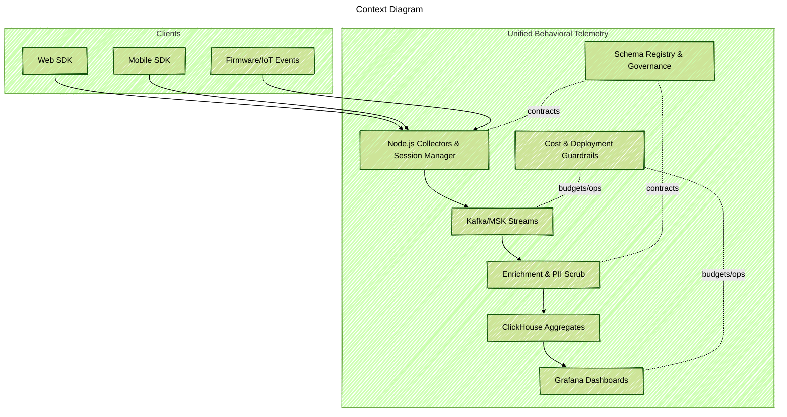

Status: Active development (MVP in progress). The notes below explain the design and targets; not everything is shipped yet.

### Project Snapshot
I am building a self-hosted (DIY) system that allows capturing behavioral telemetry at the required granularity. Timely and detailed data allow experimenting with streaming ML/AI models to build a highly personalized UX. Third party collectors are sharing aggregated data due to regulatory and cost conserns. For the tech stack I've choosen Node.js for collectors and session services, Kafka for durable streaming, ClickHouse for real-time aggregates, and Grafana for visualisation. 

### Problem Context
Many teams collect data from web, mobile, and firmware with different tools. Events are inconsistent; dashboards are slow or missing; and the total cost grows without clear guardrails. Making a single view of customer journey and device behavior is hard, and new questions require more ad-hoc pipelines.

### Key Technical Challenges
- Consistent instrumentation across JavaScript, mobile apps, and firmware with versioned schemas.
- Session stitching and identity resolution while keeping privacy controls simple to operate.
- Near real-time aggregates (<2 minutes) without an expensive warehouse bill.
- Dual deployment (DIY and AWS) that stays interoperable (same schemas and dashboards).
- Data quality rules, dead-letter handling, and exactly-once semantics for streaming.
- PII-safe event shapes and audit-friendly lineage for compliance.

### Solution Architecture
I am building an event-driven pipeline with a shared event taxonomy. Collectors accept batched events, apply light transforms, and publish to a streaming backbone. Enrichment services add geo and device metadata and scrub PII. Curated streams land in ClickHouse where materialised views power product funnels, retention, and device boards. Grafana reads these views for fast dashboards. Cost guardrails and deployment modules keep operations simple in both Docker and AWS tracks.

### Technology Highlights (Planned/Alpha)
- Instrumentation kit: JavaScript/mobile guidance and a firmware event template with validation tools.
- Node.js session services with batching, backpressure, and edge buffering.
- Streaming backbone with raw/clean/enriched topics, schema registry, and dead-letter queues.
- Enrichment workers (Lambda in AWS, Node.js worker in DIY) for geo/device joins and PII scrubbing.
- ClickHouse materialised views for sessions, funnels, retention cohorts, and device status.
- Grafana dashboard packs with alert routes (email, chat, on-call tools) and <5s query latency on curated views.
- IaC modules: Docker Compose/Terraform for DIY; CloudFormation/Terraform for AWS-native, both sharing the same schemas and dashboards.
- Privacy and governance: role-based access, audit logs for schema changes, opt-in privacy filters.

### Target Outcomes
- First useful dashboards within two weeks from kick-off.
- Ingest-to-visualise latency under two minutes for top aggregates.
- Processing cost per million events in a predictable range using ClickHouse + tiered storage.
- Reduced drift in event schemas with versioning, checks, and clear playbooks.
- Path to autonomy: teams can operate the DIY track after the Run phase if they prefer.

