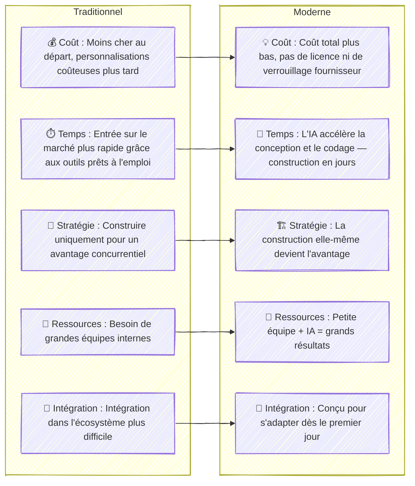

Le principe "acheter avant de construire" a été une règle classique en informatique pendant des décennies. Il provenait des premiers jours de l'architecture d'entreprise, où l'on conseillait aux grandes entreprises d'acheter d'abord des logiciels et de ne construire que lorsque cela était absolument nécessaire. Mais avec l'essor de l'IA et des outils de plateforme modernes ([PaaS](https://fr.wikipedia.org/wiki/Plate-forme_en_tant_que_service)), cette règle devient moins claire — et dans de nombreux cas, même obsolète.

Aujourd'hui, les ingénieurs en technologie ayant une compréhension à la fois technique et commerciale peuvent fournir des solutions fonctionnelles beaucoup plus rapidement et à moindre coût qu'auparavant. Avec les copilotes IA et les plateformes cloud modernes, nous pouvons concevoir, construire et déployer des produits commerciaux complets en quelques jours — et non en mois — sans licences lourdes ni verrouillage par les fournisseurs. Ces solutions sont plus faciles à modifier et à améliorer, permettant aux entreprises de bouger plus vite et de s'adapter à ce que le marché veut **maintenant**, pas l'année prochaine.

### Comment l'IA et les Plateformes Changent "Acheter vs Construire"

### Exemple Réel : Application Web Construite en 36 Heures

Récemment, j'ai construit une **application de formulaire web réutilisable et configurable** à partir de zéro en seulement **36 heures** en utilisant React, Node.js, et un copilote IA.  
J'ai commencé par définir la **stratégie produit**, rédiger un **PRD**, et créer un **design de solution** — le tout avec l'assistance de l'IA et une validation humaine à chaque étape.  
Une fois le concept clair, j'ai utilisé l'IA pour accélérer le développement des composants front-end, de la logique API, et des modules de configuration. Le résultat était une application fonctionnelle, entièrement adaptable, qui peut être réutilisée pour différents clients avec des modifications minimales — quelque chose qui prendrait traditionnellement des semaines voire des mois.

### Il est Temps de Réviser Vos Principes Informatiques

L'IA et les outils de plateforme ont déjà changé les règles. Construire n'est plus lent, coûteux ou risqué — c'est souvent l'option la plus intelligente, rapide et économique. Peut-être est-il temps de passer de *« acheter avant de construire »* à *« construire si vous pouvez »*.

---
Publié : 23-OCT-2025