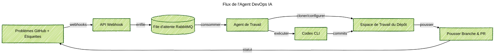

### Aperçu du Projet
Création d'un agent Docker qui surveille les problèmes GitHub, rédige des invites personnalisées et exécute Codex CLI pour livrer de petites corrections sans attendre un humain. J'ai conçu l'ensemble du processus : réception des webhooks, traitement de la file d'attente, configuration du dépôt et livraison des pull requests, ainsi que les étapes de sécurité qui maintiennent l'agent courtois dans les dépôts partagés.

### Contexte du Problème
Les équipes voulaient tester des assistants IA, mais chaque exécution nécessitait encore un clonage manuel, une préparation de branche et des mises à jour de statut. Les garde-fous pour les étiquettes, les noms de branches et les notes de progression étaient difficiles à synchroniser une fois que plusieurs dépôts optaient pour cette solution.

### Principaux Défis Techniques
- Transformer les webhooks GitHub en signaux de travail fiables et ignorer les étiquettes qui n'autorisent pas l'automatisation.
- Gérer les jetons d'application GitHub pour de nombreux dépôts sans exposer les secrets.
- Fournir à Codex CLI un espace de travail clair, un fichier de planification et des étapes de secours lorsque les push échouent.
- Garder le pipeline visible pour pouvoir auditer la santé de la file d'attente, les journaux de l'agent et les pull requests ouvertes.

### Architecture de la Solution
Livraison de deux services. Une API Express reçoit les webhooks GitHub, vérifie les en-têtes et envoie des messages durables dans RabbitMQ. Un agent à long terme lit la file d'attente, prépare chaque dépôt, exécute Codex CLI et publie les résultats. L'agent écrit des fichiers de planification, ajuste les étiquettes, pousse les branches et ouvre des pull requests avec la transcription pour que les réviseurs voient ce qui s'est passé.

### Points Forts de la Technologie
- Authentification Octokit GitHub App avec des jetons d'installation par dépôt et des aides à l'étiquetage automatique.
- File d'attente RabbitMQ qui lisse les pics de webhooks et maintient des reprises durables.
- Orchestration de dépôt qui clone ou actualise les worktrees, crée des noms de branches conventionnels et initialise les fichiers de planification avant l'exécution de Codex.
- Wrapper Codex CLI avec sélection de modèle, invites structurées et gestion des erreurs sécurisée pour des journaux et transcriptions propres.
- Services Docker avec docker-compose pour que l'API, l'agent et la messagerie fonctionnent de la même manière en local et à distance.

### Résultats
- Transformation des problèmes étiquetés en pull requests en quelques minutes sans configuration manuelle du dépôt.
- Standardisation des noms de branches, des fichiers de planification et des commentaires de statut pour que les réviseurs aient le même contexte à chaque fois.
- Ajout de journaux clairs, de métriques de file d'attente et de transcriptions de pull requests pour des audits faciles.
- Intégration de nouveaux dépôts par un changement de configuration au lieu de construire un nouveau bot.