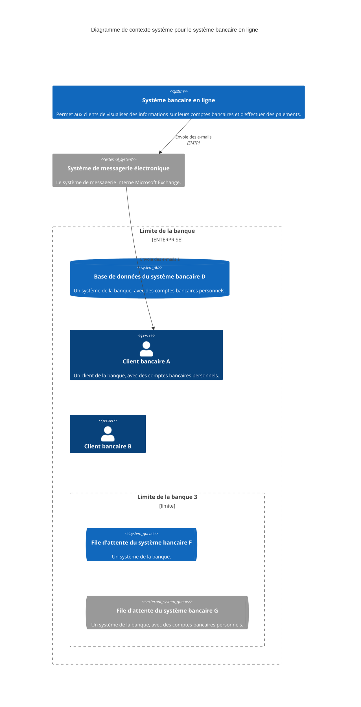

// expérimenter avec C4

```mermaid
C4Context
    title Diagramme de contexte système pour le système bancaire en ligne
    
    System(SystemAA, "Système bancaire en ligne", "Permet aux clients de visualiser des informations sur leurs comptes bancaires et d'effectuer des paiements.")

    System_Ext(SystemC, "Système de messagerie électronique", "Le système de messagerie interne Microsoft Exchange.")

    Enterprise_Boundary(b1, "Limite de la banque") {

        SystemDb(SystemD, "Base de données du système bancaire D", "Un système de la banque, avec des comptes bancaires personnels.")

        Person(customerA, "Client bancaire A", "Un client de la banque, avec des comptes bancaires personnels.")
        
        Person(customerB, "Client bancaire B")

        Boundary(b3, "Limite de la banque 3", "limite") {
            SystemQueue(SystemF, "File d'attente du système bancaire F", "Un système de la banque.")
            SystemQueue_Ext(SystemG, "File d'attente du système bancaire G", "Un système de la banque, avec des comptes bancaires personnels.")
        }

    }

    Rel(SystemAA, SystemC, "Envoie des e-mails", "SMTP")
    Rel(SystemC, customerA, "Envoie des e-mails à")

```