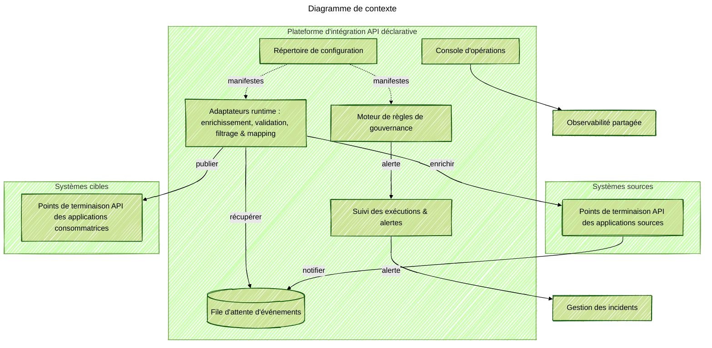

### Aperçu du projet
Livré une infrastructure d'intégration réutilisable permettant aux équipes produit de publier et de s'abonner à des événements métiers sans attendre un groupe central de middleware. J'ai agi en tant qu'architecte de solution et ingénieur praticien : j'ai défini l'expérience cible, écrit le runtime de l'adaptateur principal, construit la console opérateur et coaché les équipes de domaine lors des premiers lancements.

### Contexte du problème
De nombreuses équipes devaient connecter des produits SaaS, des systèmes hérités et de nouveaux services, mais chaque intégration était en attente dans une longue file pour les ingénieurs spécialistes. Même avec un modèle de données d'entreprise et un plan orienté événements, les équipes sans compétences approfondies en intégration ne pouvaient pas lancer ou maintenir des adaptateurs seules.

### Principaux défis techniques
- Les outils hérités nécessitaient des pièces JVM personnalisées, des DSL personnalisés et des pipelines de publication connus uniquement de l'équipe d'intégration.
- La logique d'intégration était copiée entre les équipes, créant une dérive par rapport au modèle de données principal et un coût de maintenance plus élevé.
- Fonctionner à la fois sur AWS et Azure offrait une observabilité, une identité et des flux de déploiement inégaux.

### Architecture de la solution
Construit une plateforme axée sur la configuration qui crée des pipelines d'intégration complets à partir d'un seul manifeste déclaratif. La plateforme standardise l'ingress, les vérifications de schéma, le filtrage, le mapping et la livraison à travers les clouds tout en exposant des hooks pour la logique personnalisée. Les modules partagés gèrent la télémétrie, les reprises et le cycle de vie afin que les équipes de domaine ne se préoccupent que du mapping des charges utiles sources au modèle de données principal.

### Points forts technologiques
- Runtimes serverless sur AWS et Azure qui s'adaptent automatiquement au débit.
- Surveillance, traçage et alertes unifiés connectés aux outils d'observabilité et de gestion des incidents partagés.
- Console opérateur qui montre la santé des flux, les pistes d'audit et les contrôles de relecture des messages.
- Validation de schéma, filtres d'enregistrement avec transformations et fonctions de domaine réutilisables.
- Pipelines d'infrastructure en tant que code qui déploient des instances d'adaptateurs et des tableaux de bord d'observabilité à travers les clouds.

### Résultats
- Permis aux développeurs de réaliser des intégrations en libre-service à travers les domaines et les équipes partenaires.
- Activé des intégrations orientées événements avec des modèles qui voyagent entre AWS et Azure.
- Réduit le délai de mise en œuvre des nouvelles intégrations de semaines à jours grâce à un échafaudage automatisé et des garde-fous.
- Réduit le code d'adaptateur dupliqué et maintenu tout aligné avec le modèle de données d'entreprise.