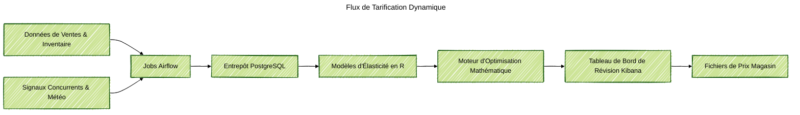

### Aperçu du Projet
J'ai conçu et mis en œuvre un backend de tarification dynamique pour un épicier régional qui a commencé avec 8 magasins et 6 000 SKU. Le système ingère des signaux de vente quotidiens, modélise la sensibilité aux prix et propose de nouveaux points de prix qui protègent les articles à valeur clé tout en augmentant le profit. Les gestionnaires de catégorie examinent un tableau de bord clair, approuvent les changements et publient des fichiers de prix mis à jour le même jour.

### Contexte du Problème
Avant le projet, le travail de tarification était manuel et réactif. Les analystes exportaient des feuilles de calcul statiques, les règles étaient appliquées de manière incohérente, et les responsables de magasin ne pouvaient pas tester des scénarios avant l'exécution. Alors que le détaillant se préparait à ouvrir plus de sites, il avait besoin d'un moteur de tarification autogéré qui équilibre revenu, marge et confiance des clients sans acheter un package fournisseur coûteux.

### Principaux Défis Techniques
- Construire des modèles de prix élasticité fiables en utilisant l'historique des transactions, les promotions et le contexte au niveau du magasin pour des milliers de SKU.
- Respecter les règles commerciales telles que les corridors de prix, les changements quotidiens limités et la protection des articles à valeur clé.
- Produire des recommandations suffisamment rapidement pour soutenir les réunions de catégorie quotidiennes et hebdomadaires.
- Expliquer pourquoi une recommandation de prix a changé afin que les équipes puissent agir en toute confiance.

### Architecture de la Solution
Pipeline de bout en bout sur AWS utilisant des services gérés et open-source. Airflow orchestre les extractions de données des flux de points de vente, des systèmes d'inventaire et des crawlers concurrents dans PostgreSQL. Les travaux d'ingénierie des caractéristiques en Python et SQL agrègent les moteurs de demande, les signaux météorologiques et les indicateurs de promotion. Les modèles d'élasticité construits en R quantifient la réponse aux prix et le transfert de la demande entre les produits. Une couche d'optimisation fonctionne sur EC2 avec Python et Gurobi pour choisir les mouvements de prix qui respectent les garde-fous et les objectifs de profit. Les résultats circulent dans Elasticsearch, où les tableaux de bord Kibana permettent aux responsables de la tarification de comparer les scénarios et de publier les listes de prix approuvées dans les magasins.

### Points Forts Technologiques
- Les pipelines Airflow en Python gèrent l'ingestion quotidienne et les vérifications de qualité des données dans les magasins.
- Les travaux d'ingénierie des caractéristiques en SQL et Python préparent des ensembles d'entraînement avec des promotions, des signaux météorologiques et de disponibilité.
- Les modèles GPBoost basés sur R capturent les effets hiérarchiques par cluster de magasins et famille de produits.
- Les travaux d'optimisation sur AWS EC2 combinent Gurobi et une logique Python personnalisée pour appliquer des limites de prix, des objectifs de profit et des limites de changement.
- Elasticsearch et Kibana fournissent des tableaux de bord en temps réel, des comparaisons de scénarios et des fichiers de prix exportables.

### Résultats
- Réalisation d'une augmentation de 2,4 % de la rentabilité et de 5,8 % de la croissance des revenus pour les catégories gérées lors du déploiement initial de 8 magasins.
- Mise à l'échelle de la plateforme à 75 magasins tout en conservant les flux de travail d'approbation et les garde-fous de prix intacts.
- Réduction du délai de tarification de cycles de feuilles de calcul de plusieurs jours à quelques heures, permettant des tests de scénario et un déploiement le jour même.
- Fourniture de recommandations transparentes et vérifiables que les responsables de la tarification peuvent approuver sans dépendre de fournisseurs externes.