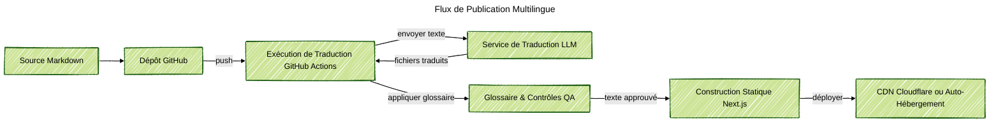

### Aperçu du Projet
J'ai construit un cadre de site web multilingue pour les équipes produit qui souhaitent un site marketing clair sans embaucher de traducteurs. Les éditeurs écrivent une fois en Markdown, poussent sur GitHub, et le pipeline livre des pages localisées en quelques minutes. Le front-end React reste léger, adapté aux mobiles, et facile à étendre avec de nouvelles sections ou composants.

### Contexte du Problème
Les entreprises avec un public mondial croissant ont besoin de nouveau contenu en ligne rapidement, mais les agences de traduction ralentissent chaque mise à jour. Les scripts maison cassent souvent la mise en forme, manquent les glossaires, ou oublient les mises en page de droite à gauche. Les chefs de produit ont également demandé une approche transparente, qui maintient la révision humaine dans la boucle, et qui peut fonctionner sur une infrastructure à faible coût.

### Principaux Défis Techniques
- Garder le Markdown source simple tout en capturant des métadonnées structurées pour chaque langue.
- Exécuter des traductions LLM avec support de glossaire, contrôle du ton, et option pour des modifications humaines avant publication.
- Éviter l'hébergement cloud coûteux pour que les petites équipes puissent héberger le cadre sur leur propre matériel ou serveurs à budget limité.
- Garantir que les artefacts de construction restent synchronisés entre les langues, y compris les images, les liens, et les étiquettes de navigation.

### Architecture de la Solution
Le cadre utilise un dépôt GitHub comme source unique de vérité. Un workflow GitHub Actions détecte les nouveaux commits, découpe le Markdown en segments prêts pour la traduction, et appelle un service de traduction LLM avec les glossaires du projet. Le workflow écrit les fichiers Markdown traduits dans le dépôt via une demande de tirage afin que les réviseurs puissent accepter ou ajuster le texte. Après approbation, un autre travail construit le site statique Next.js et le déploie sur Cloudflare Pages ou tout CDN qui prend en charge la mise en cache en périphérie.

### Points Forts de la Technologie
- Front-end Next.js avec routage sensible à la langue, support RTL, et composants réutilisables construits dans Storybook.
- Pipeline Markdown qui stocke le contenu dans le contrôle de version et expose des métadonnées optionnelles pour le SEO.
- Jobs GitHub Actions qui gèrent les demandes de traduction, les vérifications de glossaire, et les révisions de demandes de tirage.
- Adaptateurs de traduction LLM avec logique de réessai, limites de taux, et recours à des réviseurs humains lorsque la confiance diminue.
- Déploiement depuis un serveur de laboratoire à domicile via Cloudflare Zero Trust.

### Résultats
- Réduit le délai de traduction de semaines à minutes tout en maintenant la révision humaine avant la mise en ligne.
- Réduit les coûts d'hébergement en prenant en charge les laboratoires auto-hébergés ou les plateformes de périphérie à faible coût au lieu de grands clusters cloud.
- Offert aux éditeurs de contenu un flux de travail prévisible avec des demandes de tirage auditables et des glossaires intégrés.
- Livré une coquille de site multilingue que les équipes marketing peuvent étendre sans toucher au code backend.