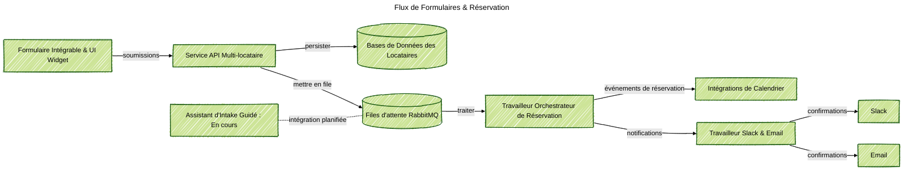

### Aperçu du Projet
J'ai construit une plateforme de formulaires SaaS pour que les équipes marketing et opérationnelles puissent déposer des formulaires de marque sur n'importe quel site, collecter des réponses structurées et réserver des réunions sans demander aux ingénieurs à chaque fois. Ce site web exécute déjà le service pour le bouton "Parlons-en" : chaque champ, version linguistique et créneau de disponibilité provient des paramètres du locataire et est directement lié au calendrier du demandeur. Un assistant de conversation simple est encore en cours de développement, et je n'ai pas encore résolu comment surveiller sa qualité.

### Contexte du Problème
Les unités commerciales voulaient des entonnoirs fiables — inscriptions à la newsletter, réservation de consultations, inscriptions à des ateliers — sur de nombreux sites web. Les formulaires ad hoc enfreignaient les règles de propriété, les transferts de calendrier restaient manuels, et les examens de conformité retardaient chaque petite expérience. Les équipes ont également demandé à essayer un concierge IA, mais il n'y avait pas de couche partagée qui mélangeait les formulaires normaux avec l'entrée de conversation tout en gardant la piste d'audit.

### Principaux Défis Techniques
- Garder les schémas de formulaire, la validation et les traductions du locataire isolés mais éviter le copier-coller à travers les microsites.
- Déclencher les calendriers, les emails de confirmation et les alertes Slack à partir d'une seule soumission sans ignorer les limites de taux du locataire.
- Partager un modèle de données entre l'API, les travailleurs et les widgets pour que les règles d'analyse et de rétention restent synchronisées.
- Planifier l'assistant de conversation guidée futur sans méthode claire pour suivre la qualité du modèle ou détecter les régressions.

### Architecture de la Solution
Livré un monorepo modulaire avec une API Express, des travailleurs orchestrateurs et des packages de widgets intégrables connectés via RabbitMQ. Les soumissions de formulaires atteignent l'API, sont enregistrées avec des modèles Mongoose partagés, puis se déploient vers les flux de réservation, les confirmations par email et les notifications Slack. Une couche de conversation sur la feuille de route (nous l'appelons pour l'instant Assistant d'Intake Guidé) partage les mêmes canaux mais reste désactivée jusqu'à ce que nous trouvions comment surveiller les réponses LLM et l'évaluation de la qualité.

### Points Forts Technologiques
- API REST Express avec middleware locataire, validation stricte et points de terminaison de réservation soutenus par des modèles de données partagés.
- Files d'attente RabbitMQ pour les réservations, notifications et futurs événements de chat, utilisant des politiques paresseuses pour survivre aux pics.
- Travailleur orchestrateur qui construit des plans de réservation, vérifie les créneaux du calendrier et émet des événements de cycle de vie standard.
- Travailleur de notification qui envoie des alertes Slack et des modèles d'email localisés tout en gardant des journaux d'audit par locataire.
- Bootloader de widget plus packages UI React qui rendent des formulaires modulaires, respectent le consentement et chargent les thèmes des locataires.
- Premier Assistant d'Intake Guidé réutilisant la même pile d'orchestration ; les pipelines de surveillance et d'évaluation sont encore non résolus.

### Résultats

- Livré des formulaires plug-and-play avec une image de marque et une validation cohérentes sur les sites des locataires, réduisant le temps de lancement de semaines à jours.
- Automatisé les confirmations de réservation, la création de calendrier et les notifications des parties prenantes, éliminant les transferts manuels.
- Conservé un modèle de données partagé alimentant l'analyse, les politiques de rétention et les examens de conformité sans retravail.
- Préparé le chemin pour l'intake conversationnel tout en avertissant clairement que la surveillance de la qualité et les garde-fous doivent être résolus avant la sortie générale.