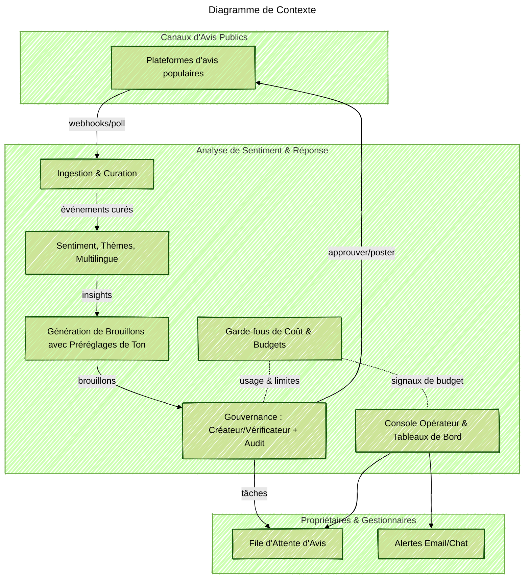

Status: Développement actif (MVP en cours). Les notes ci-dessous décrivent le design et les objectifs ; toutes les fonctionnalités ne sont pas encore disponibles.

### Aperçu du Projet
Je construis un petit service pragmatique qui collecte des avis publics, comprend le sentiment et les thèmes, et prépare des brouillons de réponses aimables et conformes à la marque. Mon objectif est la rapidité et la gouvernance : des brouillons rapides pour les propriétaires et les gestionnaires, mais toujours avec un contrôle humain. Je conçois le flux, mets en œuvre l'analyse de base et le pipeline de rédaction, crée la console opérateur et établis des garde-fous pour que les dépenses en IA restent prévisibles.

### Contexte du Problème
Les propriétaires de petites entreprises reçoivent de nombreux avis sur différentes plateformes. La gestion manuelle est lente et incohérente. Il est difficile de garder un ton amical dans plusieurs langues tout en respectant le budget d'utilisation de l'IA. Les équipes passent du temps à copier du texte entre les outils et manquent le meilleur moment pour répondre.

### Principaux Défis Techniques
- L'ingestion multi-canal doit être fiable, dédupliquer les avis et étiqueter correctement les emplacements.
- Les brouillons de réponses doivent paraître humains et suivre les préréglages de ton, tout en permettant une édition et une approbation rapides.
- Les avis multilingues nécessitent détection, traduction pour les opérateurs et rédaction dans la même langue.
- La gouvernance est importante : flux de travail créateur/vérificateur, piste d'audit et filtres de politique (comme pas de promesses de compensation sans approbation).
- Les coûts des jetons IA doivent être visibles et contrôlés avec des budgets, des alertes et de la mise en cache.

### Architecture de la Solution
Je construis un pipeline piloté par événements qui ingère les avis, les enrichit, effectue une analyse de sentiment et de thème, et génère des brouillons de réponses avec des contrôles de ton. Une console affichera une file d'attente d'avis, des tableaux de bord et des alertes. Les garde-fous de coût suivent l'utilisation des jetons et réduiront automatiquement les coûts lorsque le budget est proche de la limite.

### Points Forts Technologiques (Prévu/Alpha)
- Services pilotés par événements qui s'adaptent à la profondeur de la file d'attente et maintiennent le traitement en quelques minutes.
- Gestion multilingue : détection de la langue, affichage de la traduction côte à côte pour les opérateurs, production de brouillons dans la même langue.
- Préréglages de ton (Formel, Chaleureux, Concis, Empathique) avec filtres de politique et suivi des modifications lors des éditions.
- Flux de travail créateur/vérificateur avec journal d'audit complet et escalade pour les réponses à risque plus élevé.
- Tableaux de bord pour les tendances de sentiment, les principaux thèmes, le SLA de réponse et les heures économisées.
- Garde-fous de coût avec comptabilité des jetons, plafonds budgétaires, alertes et invites de mise en cache/repli.

### Résultats Ciblés
- Délai de réponse plus rapide pour les avis négatifs avec un ton cohérent et amical.
- Moins d'effort manuel pour les propriétaires et les gestionnaires en fournissant des brouillons prêts à être approuvés.
- Gouvernance claire : états d'approbation, piste d'audit et vérifications des politiques réduisent les risques.
- Dépenses en IA prévisibles avec un compteur de budget en direct et des modes de coût sécurisés automatiques.