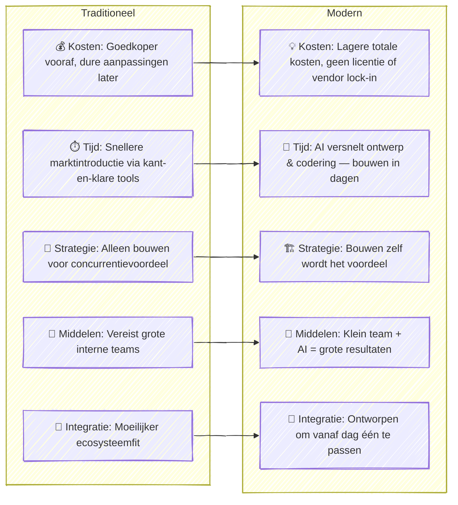

Het "kopen voor bouwen"-principe is al decennia lang een klassieke regel in IT. Het kwam voort uit de vroege dagen van enterprise-architectuur, waar grote bedrijven werd verteld eerst software te kopen en alleen te bouwen wanneer dat absoluut nodig was. Maar met de opkomst van AI en moderne platformtools ([PaaS](https://nl.wikipedia.org/wiki/Platform_as_a_service)), wordt deze regel minder duidelijk — en in veel gevallen zelfs verouderd.

Tegenwoordig kunnen technologie-ingenieurs met zowel technische als zakelijke kennis werkende oplossingen veel sneller en goedkoper leveren dan voorheen. Met AI copiloten en moderne cloudplatforms kunnen we volledige bedrijfsproducten ontwerpen, bouwen en implementeren in dagen — niet maanden — zonder zware licenties of vendor lock-ins. Deze oplossingen zijn gemakkelijker te veranderen en te verbeteren, waardoor bedrijven sneller kunnen bewegen en zich kunnen aanpassen aan wat de markt **nu** wil, niet volgend jaar.

### Hoe AI en Platforms "Kopen vs Bouwen" Veranderen

### Echt Voorbeeld: 36-Uur Webapplicatie Bouw

Onlangs bouwde ik een **herbruikbare en configureerbare webformulierapplicatie** vanaf nul in slechts **36 uur** met behulp van plain React, Node.js en een AI copilot.  
Ik begon met het definiëren van de **productstrategie**, het schrijven van een **PRD**, en het maken van een **oplossingsontwerp** — allemaal met AI-assistentie en menselijke validatie bij elke stap.  
Zodra het concept duidelijk was, gebruikte ik AI om de ontwikkeling van de front-end componenten, API-logica en configuratiemodules te versnellen. Het resultaat was een werkende, volledig aanpasbare app die met minimale wijzigingen kan worden hergebruikt voor verschillende klanten — iets wat traditioneel weken of zelfs maanden zou duren.

### Tijd om Je IT-principes te Herzien

AI en platformtools hebben de regels al veranderd. Bouwen is niet langer traag, duur of risicovol — het is vaak de slimste, snelste en goedkoopste optie. Misschien is het tijd om te verschuiven van *“kopen voor bouwen”* naar *“bouwen als je kunt.”*

---
Gepubliceerd: 23-OKT-2025
