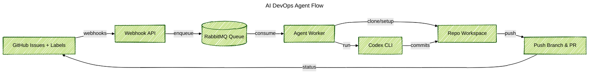

### Projectoverzicht
Gebouwd een Docker-agent die GitHub-issues in de gaten houdt, aangepaste prompts schrijft en Codex CLI uitvoert om kleine fixes te leveren zonder op een mens te hoeven wachten. Ik ontwierp het volledige pad: webhook-intake, wachtrijverwerking, repo-opzet en pull-request levering, plus de veiligheidsstappen die de agent beleefd houden binnen gedeelde repos.

### Probleemcontext
Teams wilden AI-hulpmiddelen testen, maar elke run vereiste nog steeds handmatig klonen, branchvoorbereiding en statusupdates. Het was moeilijk om richtlijnen voor labels, branchnamen en voortgangsnotities synchroon te houden zodra meer repositories meededen.

### Belangrijke Technische Uitdagingen
- Zet GitHub-webhooks om in betrouwbare werksignalen en negeer labels die geen automatisering toestaan.
- Beheer GitHub App-tokens voor veel repos zonder geheimen bloot te stellen.
- Geef Codex CLI een duidelijke werkruimte, planbestand en terugvalstappen wanneer pushes mislukken.
- Houd de pijplijn zichtbaar zodat we de gezondheid van de wachtrij, agentlogs en geopende pull requests kunnen controleren.

### Oplossingsarchitectuur
Twee diensten geleverd. Een Express API ontvangt GitHub-webhooks, controleert headers en stuurt duurzame berichten naar RabbitMQ. Een langlopende agent leest de wachtrij, bereidt elke repository voor, voert Codex CLI uit en post de resultaten terug. De agent schrijft planbestanden, past labels aan, pusht branches en opent pull requests met het transcript zodat reviewers zien wat er is gebeurd.

### Technologische Hoogtepunten
- Octokit GitHub App-authenticatie met installatie tokens per repo en automatische labelhelpers.
- RabbitMQ-wachtrij die webhookpieken afvlakt en duurzame herhalingen behoudt.
- Repo-orkestratie die werkbomen kloont of vernieuwt, conventionele branchnamen creëert en planbestanden zaait voordat Codex wordt uitgevoerd.
- Codex CLI-wrapper met modelselectie, gestructureerde prompts en beveiligde foutafhandeling voor schone logs en transcripties.
- Docker-diensten met docker-compose zodat API, agent en messaging lokaal en op afstand hetzelfde draaien.

### Resultaten
- Omgezette gelabelde issues in pull requests binnen enkele minuten zonder handmatige repo-opzet.
- Gestandaardiseerde branchnamen, planbestanden en statuscommentaren zodat reviewers elke keer dezelfde context krijgen.
- Duidelijke logs, wachtrijstatistieken en pull-request transcripties toegevoegd voor eenvoudige audits.
- Het onboarden van nieuwe repositories veranderd in een configuratiewijziging in plaats van het bouwen van een nieuwe bot.