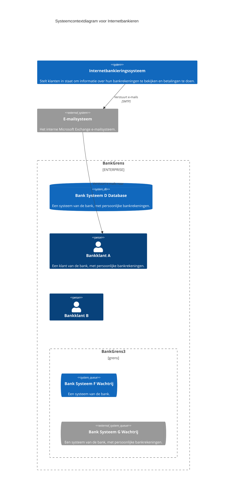

// experimenteren met C4

```mermaid
C4Context
    title Systeemcontextdiagram voor Internetbankieren
    
    System(SystemAA, "Internetbankieringssysteem", "Stelt klanten in staat om informatie over hun bankrekeningen te bekijken en betalingen te doen.")

    System_Ext(SystemC, "E-mailsysteem", "Het interne Microsoft Exchange e-mailsysteem.")

    Enterprise_Boundary(b1, "BankGrens") {

        SystemDb(SystemD, "Bank Systeem D Database", "Een systeem van de bank, met persoonlijke bankrekeningen.")

        Person(customerA, "Bankklant A", "Een klant van de bank, met persoonlijke bankrekeningen.")
        
        Person(customerB, "Bankklant B")

        Boundary(b3, "BankGrens3", "grens") {
            SystemQueue(SystemF, "Bank Systeem F Wachtrij", "Een systeem van de bank.")
            SystemQueue_Ext(SystemG, "Bank Systeem G Wachtrij", "Een systeem van de bank, met persoonlijke bankrekeningen.")
        }

    }

    Rel(SystemAA, SystemC, "Verstuurt e-mails", "SMTP")
    Rel(SystemC, customerA, "Verstuurt e-mails naar")

```