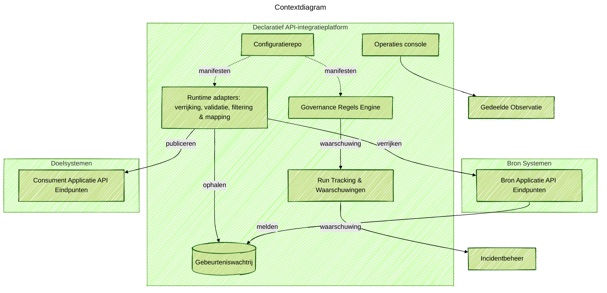

### Projectoverzicht
Een herbruikbare integratieruggegraat geleverd zodat productteams zakelijke evenementen kunnen publiceren en abonneren zonder te wachten op een centrale middlewaregroep. Ik trad op als oplossingsarchitect en hands-on ingenieur: ik definieerde de doelervaring, schreef de kernadapter-runtime, bouwde de operatorconsole en coachte domeinteams tijdens de eerste lanceringen.

### Probleemcontext
Veel teams moesten SaaS-producten, legacy-systemen en nieuwe diensten verbinden, maar elke integratie stond in een lange wachtrij voor specialistische ingenieurs. Zelfs met een bedrijfsdatamodel en event-driven plan konden teams zonder diepgaande integratievaardigheden geen adapters alleen lanceren of onderhouden.

### Belangrijkste technische uitdagingen
- Legacy-tools hadden aangepaste JVM-onderdelen, aangepaste DSL's en release-pijplijnen nodig die alleen het integratieteam kende.
- Integratielogica werd tussen teams gekopieerd, wat leidde tot afwijkingen van het hoofdgegevensmodel en hogere onderhoudskosten.
- Draaien op zowel AWS als Azure gaf ongelijke observatie, identiteit en implementatiestromen.

### Oplossingsarchitectuur
Gebouwd een configuratie-eerst platform dat volledige integratiepijplijnen creëert vanuit één declaratief manifest. Het platform standaardiseert ingress, schema-controles, filtering, mapping en levering over clouds terwijl het nog steeds hooks voor aangepaste logica blootstelt. Gedeelde modules behandelen telemetrie, retries en levenscyclus zodat domeinteams zich alleen zorgen hoeven te maken over het mappen van bronbelastingen naar het hoofdgegevensmodel.

### Technologiehoogtepunten
- Serverloze runtimes op AWS en Azure die automatisch schalen met doorvoer.
- Geïntegreerde monitoring, tracing en waarschuwingen verbonden met gedeelde observatie- en incidenttools.
- Operatorconsole die de gezondheid van de stroom, audittrails en berichtherhalingscontroles toont.
- Schema-validatie, recordfilters met transformaties en herbruikbare domeinfuncties.
- Infrastructure-as-code pijplijnen die adapterinstanties en observatiedashboards over clouds implementeren.

### Resultaten
- Biedt ontwikkelaars zelfbedieningsintegraties over domeinen en partnerteams.
- In staat gesteld gebeurtenisgestuurde integraties met patronen die tussen AWS en Azure reizen.
- Verminderde doorlooptijd voor nieuwe integraties van weken naar dagen met geautomatiseerde scaffolding en vangrails.
- Verminderde dubbele adaptercode en hield alles in lijn met het bedrijfsdatamodel.