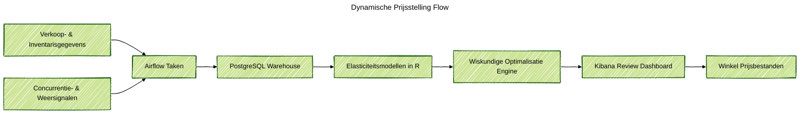

### Projectoverzicht
Ik heb een dynamische prijsstelling backend ontworpen en geïmplementeerd voor een regionale kruidenier die begon met 8 winkels en 6.000 SKU's. Het systeem verwerkt dagelijkse verkoopsignalen, modelleert prijsgevoeligheid en stelt nieuwe prijsniveaus voor die belangrijke waarde-items beschermen terwijl de winst wordt verhoogd. Categoriemanagers bekijken een duidelijk dashboard, keuren wijzigingen goed en publiceren bijgewerkte prijslijsten binnen dezelfde dag.

### Probleemcontext
Voor het project was het prijsstellingswerk handmatig en reactief. Analisten exporteerden statische spreadsheets, regels werden inconsistent toegepast en winkelmanagers konden geen scenario's testen voordat ze werden uitgevoerd. Terwijl de retailer zich voorbereidde op het openen van meer locaties, hadden ze een zelfbeheerde prijsstellingsengine nodig die inkomsten, marge en klantvertrouwen in balans houdt zonder een duur leverancierspakket aan te schaffen.

### Belangrijkste Technische Uitdagingen
- Bouw betrouwbare prijselasticiteitsmodellen met behulp van transactiegeschiedenis, promoties en winkelcontext voor duizenden SKU's.
- Eerbiediging van bedrijfsregels zoals prijscorridors, beperkte dagelijkse wijzigingen en bescherming van belangrijke waarde-items.
- Aanbevelingen snel genoeg produceren om dagelijkse en wekelijkse categoriemeetings te ondersteunen.
- Uitleggen waarom een prijsaanbeveling is gewijzigd, zodat teams met vertrouwen kunnen handelen.

### Oplossingsarchitectuur
End-to-end pijplijn op AWS met behulp van beheerde en open-source diensten. Airflow orkestreert datatrekkingen van point-of-sale feeds, inventarisatiesystemen en concurrenten crawlers naar PostgreSQL. Feature engineering taken in Python en SQL aggregeren vraagdrivers, weersignalen en promotievlaggen. Elasticiteitsmodellen gebouwd in R kwantificeren prijsrespons en vraagoverdracht tussen producten. Een optimalisatielaag draait op EC2 met Python en Gurobi om prijsbewegingen te kiezen die voldoen aan richtlijnen en winstdoelen. Resultaten stromen naar Elasticsearch, waar Kibana dashboards prijsleiders scenario's laten vergelijken en goedgekeurde prijslijsten terug naar winkels publiceren.

### Technologie Hoogtepunten
- Airflow pijplijnen in Python beheren dagelijkse gegevensinvoer en kwaliteitscontroles in winkels.
- SQL en Python feature engineering taken bereiden trainingssets voor met promoties, weer en beschikbaarheidssignalen.
- R-gebaseerde GPBoost modellen vangen hiërarchische effecten op per winkelcluster en productfamilie.
- Optimalisatietaken op AWS EC2 combineren Gurobi en aangepaste Python-logica om prijsgrenzen, winstdoelen en wijzigingslimieten af te dwingen.
- Elasticsearch en Kibana bieden real-time dashboards, scenariocomparaties en exporteerbare prijsbestanden.

### Resultaten
- Bereikte een winststijging van 2,4% en een omzetgroei van 5,8% voor beheerde categorieën tijdens de initiële uitrol in 8 winkels.
- Schaalde het platform op naar 75 winkels terwijl goedkeuringsworkflows en prijsrichtlijnen intact bleven.
- Verminderde de doorlooptijd van prijsstelling van meerdaagse spreadsheetcycli naar uren, waardoor dezelfde dag scenario testen en implementatie mogelijk werd.
- Leverde transparante, controleerbare aanbevelingen die prijsleiders vertrouwen zonder afhankelijk te zijn van externe leveranciers.