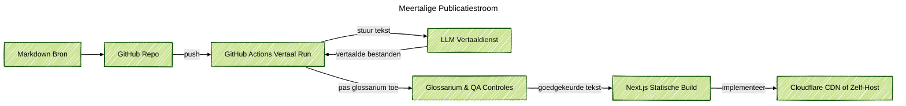

### Projectoverzicht
Ik heb een meertalig website framework gebouwd voor productteams die een duidelijke marketingwebsite willen zonder vertalers in te huren. Redacteuren schrijven eenmaal Markdown, pushen naar GitHub, en de pijplijn levert binnen enkele minuten gelokaliseerde pagina's. De React front-end blijft licht, mobielvriendelijk en eenvoudig uit te breiden met nieuwe secties of componenten.

### Probleemcontext
Bedrijven met groeiende wereldwijde doelgroepen hebben snel nieuwe content online nodig, maar vertaalbureaus vertragen elke update. Zelfgemaakte scripts breken vaak de opmaak, missen glossaria of vergeten rechts-naar-links lay-outs. Productmanagers vroegen ook om een aanpak die transparant is, menselijke controle in de lus houdt en kan draaien op goedkope infrastructuur.

### Belangrijkste Technische Uitdagingen
- Houd de bron-Markdown eenvoudig terwijl gestructureerde metadata voor elke taal wordt vastgelegd.
- Voer LLM-vertalingen uit met ondersteuning voor glossaria, toonregeling en de optie voor menselijke bewerkingen vóór publicatie.
- Vermijd dure cloudhosting zodat kleine teams het framework op hun eigen hardware of budgetservers kunnen hosten.
- Zorg ervoor dat build-artifacten gesynchroniseerd blijven over talen heen, inclusief afbeeldingen, links en navigatielabels.

### Oplossingsarchitectuur
Het framework gebruikt een GitHub-repository als de enige bron van waarheid. Een GitHub Actions-workflow detecteert nieuwe commits, splitst Markdown in vertaalbare segmenten en roept een LLM-vertaaldienst aan met projectglossaria. De workflow schrijft vertaalde Markdown-bestanden terug naar de repository via een pull request, zodat reviewers de tekst kunnen accepteren of aanpassen. Na goedkeuring bouwt een andere taak de statische Next.js-site en implementeert deze op Cloudflare Pages of een CDN dat edge-caching ondersteunt.

### Technologie Hoogtepunten
- Next.js front-end met locatiebewuste routering, RTL-ondersteuning en herbruikbare componenten gebouwd in Storybook.
- Markdown-pijplijn die inhoud opslaat in versiebeheer en optionele frontmatter voor SEO-metadata blootstelt.
- GitHub Actions-taken die vertaalverzoeken beheren, glossariumcontroles uitvoeren en pull request-beoordelingen beheren.
- LLM-vertaaladapters met retry-logica, snelheidslimieten en terugvallen op menselijke reviewers wanneer het vertrouwen daalt.
- Implementatie vanaf een thuislabserver getunneld via Cloudflare Zero Trust.

### Resultaten
- Verkort de vertaaltijd van weken tot minuten terwijl menselijke controle behouden blijft vóór livegang.
- Verlaagde hostingkosten door ondersteuning van zelfgehoste labs of goedkope edge-platforms in plaats van grote cloudclusters.
- Bied contentredacteuren een voorspelbare workflow met controleerbare pull requests en ingebouwde glossaria.
- Geleverd een meertalige site-structuur die marketingteams kunnen uitbreiden zonder backend-code aan te raken.