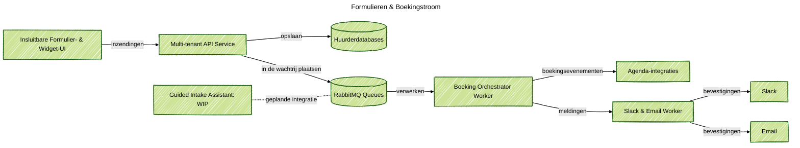

### Projectoverzicht
Een SaaS-formulierenplatform gebouwd zodat marketing- en operationele teams merkgebonden formulieren op elke site kunnen plaatsen, gestructureerde antwoorden kunnen verzamelen en vergaderingen kunnen boeken zonder elke keer ingenieurs te hoeven vragen. Deze website draait al de service voor de "Laten we praten"-knop: elk veld, elke taalversie en elke beschikbaarheidsslot komt uit de instellingen van de huurder en linkt direct naar de agenda van de aanvrager. Een eenvoudige gespreksassistent is nog in ontwikkeling, en ik heb nog niet opgelost hoe ik de kwaliteit ervan kan bewaken.

### Probleemcontext
Bedrijfseenheden wilden betrouwbare trechters—nieuwsbriefinschrijvingen, consultatieboekingen, workshopaanmeldingen—op veel websites. Ad-hocformulieren schonden eigendomsregels, agenda-overdrachten bleven handmatig, en nalevingscontroles vertraagden elk klein experiment. Teams vroegen ook om een AI-conciërge uit te proberen, maar er was geen gedeelde laag die normale formulieren mengde met gespreksinvoer terwijl de audittrail behouden bleef.

### Belangrijkste Technische Uitdagingen
- Houd de schemas, validatie en vertalingen van huurderformulieren geïsoleerd, maar vermijd copy-paste over microsites.
- Trigger agenda's, bevestigingsmails en Slack-meldingen vanuit één inzending zonder de snelheidslimieten van de huurder te negeren.
- Deel één datamodel tussen API, workers en widgets zodat analyses en retentieregels synchroon blijven.
- Plan de toekomstige begeleide gespreksassistent zonder een duidelijke methode om modelkwaliteit te volgen of regressies te detecteren.

### Oplossingsarchitectuur
Geleverd een modulaire monorepo met een Express API, orkestrator workers en insluitbare widgetpakketten verbonden via RabbitMQ. Formulierinzendingen bereiken de API, worden opgeslagen met gedeelde Mongoose-modellen en verspreiden zich vervolgens naar boekingsstromen, e-mailbevestigingen en Slack-meldingen. Een roadmap-gesprekslaag (we noemen het voorlopig Guided Intake Assistant) deelt dezelfde pijpen maar blijft uitgeschakeld totdat we monitoring voor LLM-antwoorden en kwaliteitsbeoordeling hebben uitgewerkt.

### Technologie Hoogtepunten
- Express REST API met huurdermiddleware, strikte validatie en boekingsendpoints ondersteund door gedeelde datamodellen.
- RabbitMQ-queues voor boekingen, meldingen en toekomstige chatevenementen, met gebruik van lazy policies om pieken te overleven.
- Orchestrator worker die boekingsplannen bouwt, agenda-slots controleert en standaard levenscyclusgebeurtenissen uitzendt.
- Meldingsworker die Slack-meldingen en gelokaliseerde e-mailsjablonen verzendt terwijl auditlogs per huurder worden bijgehouden.
- Widget bootloader plus React UI-pakketten die insteekbare formulieren weergeven, toestemming respecteren en huurderthema's laden.
- Vroege Guided Intake Assistant die dezelfde orkestratiestack hergebruikt; monitoring en beoordelingspijplijnen zijn nog niet opgelost.

### Resultaten

- Geleverd plug-and-play formulieren met consistente branding en validatie over huurderwebsites, waardoor de lanceringstijd van weken naar dagen werd verkort.
- Geautomatiseerde boekingsbevestigingen, agendacreatie en belanghebbende meldingen, waardoor handmatige overdrachten werden verwijderd.
- Eén gedeeld datamodel behouden dat analyses, retentiebeleid en nalevingscontroles aandrijft zonder herwerk.
- De weg voorbereid voor gespreksinvoer terwijl duidelijk werd gewaarschuwd dat kwaliteitsmonitoring en vangrails moeten worden opgelost voordat algemene release plaatsvindt.