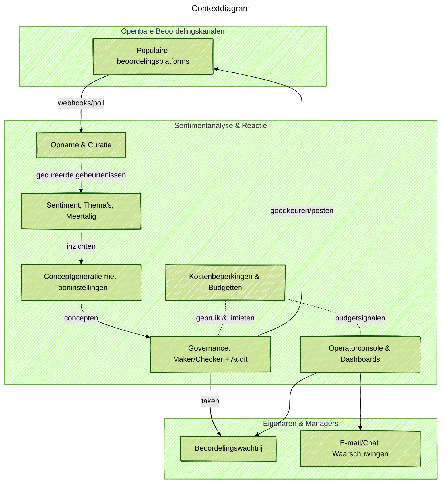

Status: Actieve ontwikkeling (MVP in uitvoering). De onderstaande notities beschrijven het ontwerp en de doelen; niet alle functies zijn al beschikbaar.

### Projectoverzicht
Ik bouw een kleine, pragmatische dienst die openbare beoordelingen verzamelt, de sentimenten en thema's begrijpt en vriendelijke en merkconforme conceptantwoorden voorbereidt. Mijn focus ligt op snelheid en governance: snelle concepten voor eigenaren en managers, maar altijd met menselijke controle. Ik ontwerp de flow, implementeer de kernanalyse en conceptpipeline, creëer de operatorconsole en stel de kostenbeperkingen in zodat AI-uitgaven voorspelbaar blijven.

### Probleemcontext
Kleine ondernemers ontvangen veel beoordelingen op verschillende platforms. Handmatige afhandeling is traag en niet consistent. Het is moeilijk om de toon vriendelijk te houden in meerdere talen en toch binnen het budget voor AI-gebruik te blijven. Teams besteden tijd aan het kopiëren van tekst tussen tools en missen de beste tijd om te reageren.

### Belangrijkste technische uitdagingen
- Multi-channel opname moet betrouwbaar zijn, beoordelingen dedupliceren en locaties correct taggen.
- Conceptantwoorden moeten menselijk aanvoelen en tooninstellingen volgen, maar toch snelle bewerking en goedkeuring mogelijk maken.
- Meertalige beoordelingen vereisen detectie, vertaling voor operators en concepten in dezelfde taal.
- Governance is belangrijk: maker/checker workflow, audit trail en beleidsfilters (zoals geen beloftes van compensatie zonder goedkeuring).
- AI-tokenkosten moeten zichtbaar en gecontroleerd zijn met budgetten, waarschuwingen en caching.

### Oplossingsarchitectuur
Ik bouw een gebeurtenisgestuurde pipeline die beoordelingen opneemt, verrijkt, sentiment- en thema-analyse uitvoert en conceptantwoorden genereert met tooncontroles. Een console toont een beoordelingswachtrij, dashboards en waarschuwingen. Kostenbeperkingen volgen het tokengebruik en zullen automatisch de kosten verlagen wanneer het budget dicht bij de limiet komt.

### Technologiehoogtepunten (Gepland/Alpha)
- Gebeurtenisgestuurde diensten die schalen met wachtrijdiepte en verwerking binnen enkele minuten houden.
- Meertalige verwerking: taal detecteren, vertaling naast elkaar tonen voor operators, concepten in dezelfde taal produceren.
- Tooninstellingen (Formeel, Warm, Bondig, Empathisch) met beleidsfilters en bijgehouden wijzigingen tijdens bewerkingen.
- Maker/checker workflow met volledige auditlog en escalatie voor risicovollere reacties.
- Dashboards voor sentimenttrends, top thema's, reactietijd SLA en bespaarde uren.
- Kostenbeperkingen met tokenaccounting, budgetlimieten, waarschuwingen en caching/terugvalprompts.

### Doelstellingen
- Snellere doorlooptijd voor negatieve beoordelingen met consistente, vriendelijke toon.
- Minder handmatige inspanning voor eigenaren en managers door kant-en-klare concepten ter goedkeuring te bieden.
- Duidelijke governance: goedkeuringsstatussen, audit trail en beleidscontroles verminderen risico.
- Voorspelbare AI-uitgaven met live budgetmeter en automatische kostenveilige modi.