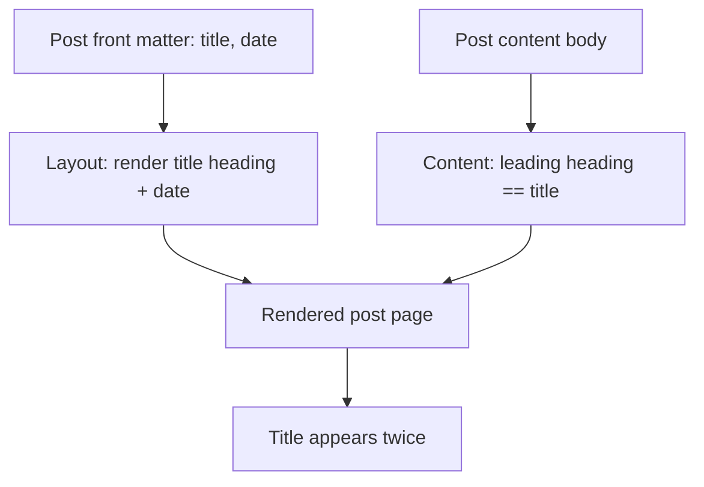
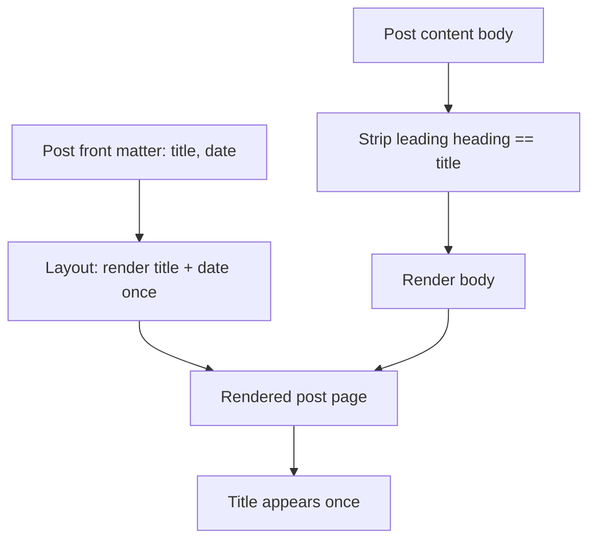

# Remove duplicate page title on blog post pages

## Summary
On blog post pages the title is emitted twice: the post **layout** renders the title (plus date) as the page heading, and the post **content** also opens with the same title as a top-level heading. The two stack, producing the duplicate the spec reports. The fix establishes a single source of truth for the visible title — the layout renders it from front matter, and content must not repeat it — and adds a guard so a leading content heading equal to the front-matter title does not render. The change is confined to the blog post template and affected content files; no routing, data, or dependency changes.

## Requirements traceability
> The spec enumerates the acceptance criteria below. Each maps to a design element. If the committed spec uses different AC ids/wording, this table is reconciled in the clarify pass before the gate.

| AC | Satisfied by |
|---|---|
| AC-1 — a blog post page shows its title exactly once | Single-source title rendering in the post layout + leading-duplicate-heading guard (Task 1) |
| AC-2 — the date still appears under the title | Layout retains title→date order; only the duplicate is removed (Task 1) |
| AC-3 — the browser tab `<title>` / metadata is unchanged | No change to the document `<head>`/metadata path; verified, not modified (Task 1) |
| AC-4 — listing/home and non-duplicating pages are unaffected | Fix scoped to the post layout/content; shared listing components untouched (Task 1, Task 2) |

## Architecture
The site is a static-site generator: front matter (title, date) drives a per-post **layout**, which wraps rendered post **content**. The duplicate arises because two independent paths both emit the title.

Target state: the layout is the **sole** renderer of the visible title; content bodies carry no leading title heading. A defensive guard in the layout suppresses a content heading whose text equals the front-matter title, so the fix holds even if a content file still carries one.

## Data model
No data-model change. The post entity is unchanged: front matter `title` (string) and `date` remain the authoritative title source; content body remains markdown.

## API / contracts
No HTTP/API surface. The relevant contract is the **post layout contract**:

- Input: post front matter (`title`, `date`) + rendered content body.
- Output: one visible title (from `title`), the date directly beneath it, then the body.
- Invariant: the body MUST NOT render a heading textually equal to the front-matter `title`. The layout enforces this by suppressing a leading body heading that matches `title` (case- and whitespace-insensitive comparison), so an authoring slip cannot reintroduce the duplicate.
- Document metadata (`<title>` tag, social/OG tags) is produced from the same `title` and is **unchanged** by this work.

## Trade-offs
- **Guard in the layout vs. only editing content files.** Editing content alone fixes today's posts; a layout guard also prevents recurrence from future authoring. We do both: it is a few lines and removes a class of regressions. The cost is one comparison per post render — negligible for a static build.
- **Comparison strictness.** We match the *leading* heading only and compare on normalised text, not arbitrary headings in the body, to avoid stripping legitimate in-body headings that happen to repeat the title. The cost is that a duplicate title placed mid-body would survive; that is out of scope and unobserved.

No architectural decision is engaged (no new runtime, store, protocol, or boundary), so no ADR is proposed.

## Task list

| # | Task | Targets | Requirements | Depends on |
|---|---|---|---|---|
| 1 | In the blog post layout/template, render the title (then date) once and add a guard suppressing a leading body heading equal to the front-matter `title`; confirm `<head>` title/metadata is untouched | fps4/web-faridgurbanov | AC-1, AC-2, AC-3, AC-4 | — |
| 2 | Remove the now-redundant leading title heading from affected post content files so the body starts at its first real section | fps4/web-faridgurbanov | AC-1, AC-4 | 1 |

## Notes
- **Stack assumption.** Design is based on the standard SSG layout-wraps-content pattern this repo uses; the implementing task works on the existing template and content files and introduces **no new dependency**. If reading the repo reveals the duplication comes from a different path (e.g. two layout components both emitting the title rather than layout-plus-content), Task 1's locus shifts to deduplicating those components — the contract (title rendered exactly once) is unchanged.
- **Verification.** The page in the spec's example (the "How I get non-technical POs writing specs agents can execute" post) is the canonical check: it must show the title once, the date below it, and an unchanged browser tab title.
- Deferred: no broader template refactor or heading-hierarchy normalisation is in scope.