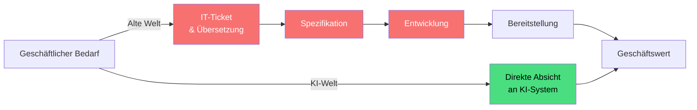
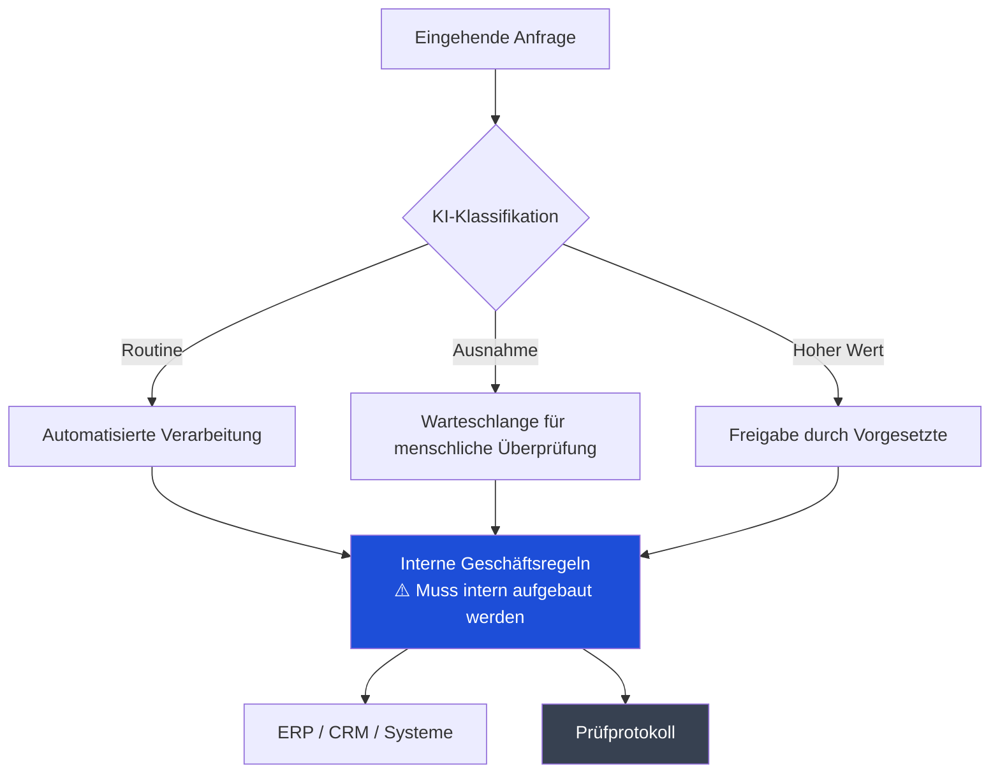
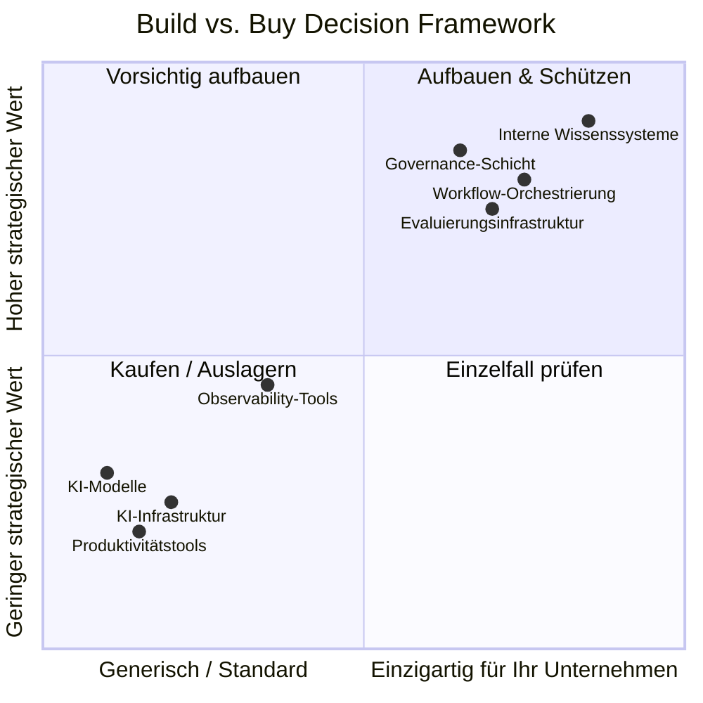
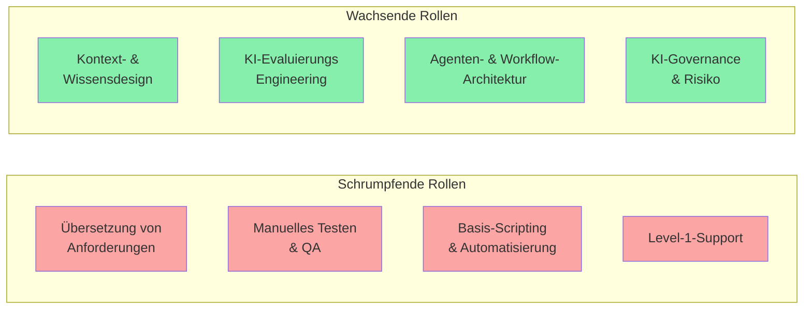

---

## Die alte IT war eine Übersetzungsschicht

Vielleicht dreißig Jahre lang bestand die Aufgabe der IT im Wesentlichen darin: Geschäftliche Anforderungen existieren, IT‑Leute übersetzen diese Anforderungen in technische Dinge, dann baut oder kauft die IT diese technischen Dinge und betreibt sie. Die IT war absichtlich der Engpass. So hat man verhindert, dass Dinge kaputtgehen.

Das Problem ist, dass KI, die fähig genug ist, echte Arbeit zu leisten, genau diese Übersetzungsschicht aufzulösen beginnt. Eine Business‑Analystin kann jetzt in Klartext beschreiben, was sie will, und etwas Nützliches zurückbekommen. Sie braucht kein Ticket. Sie braucht keinen Sprint. Sie muss nicht warten.

Das ist keine Kleinigkeit. Es ist eine Identitätskrise für die meisten IT‑Organisationen.

Die alte Kette hatte Wert, weil Komplexität sie erforderte. KI komprimiert diese Kette drastisch. Was bleibt, sind Governance, Kontext und die harten Architekturentscheidungen. Darauf muss sich die IT neu ausrichten.

---

## Was Sie intern bauen müssen

Es besteht die Versuchung, alles auszulagern. Ich verstehe diese Versuchung. Es fühlt sich schnell an. Es fühlt sich modern an. Aber an manchen Stellen ist Outsourcing eine Falle, weil das, was KI für Ihr Unternehmen nützlich macht, Kontext ist, den nur Sie haben.

### 1. Kontext- und Wissensinfrastruktur

KI‑Modelle sind schlau, aber sie sind auch leer. Sie wissen nicht, dass Ihr Vertriebsteam einen bestimmten Deal‑Typ „Lighthouse Account“ nennt. Sie wissen nicht, warum Ihr Unternehmen 2019 eine bestimmte Architekturentscheidung getroffen hat. Sie kennen nicht die unausgesprochenen Regeln, wie Ihr Finanzteam genehmigt.

Dieser interne Kontext — verstreut in alten E‑Mails, Confluence‑Seiten, die niemand pflegt, und in den Köpfen langjähriger Mitarbeiter — ist Ihr eigentliches Wettbewerbsasset. Systeme zu bauen, die diesen Kontext erfassen, strukturieren und der KI zugänglich machen, ist interne Arbeit. Keine glamouröse Arbeit. Aber unersetzliche Arbeit.

Das bedeutet: Aufbau von Wissensgraphen, interne Retrieval‑Systeme (oft RAG genannt — Retrieval‑Augmented Generation), Pipelines, die Wissen aktuell halten, und die kulturellen Prozesse, damit Menschen tatsächlich zu diesen Systemen beitragen.

### 2. Workflow‑Orchestrierung

Sie können ein Modell kaufen. Sie können nicht die Logik kaufen, wie Ihr Geschäft läuft.

Wenn Sie einen KI‑Agenten bauen, der Ihr Beschaffungswesen unterstützt, ist die Abfolge der Schritte — was was auslöst, wann ein Mensch genehmigen muss, was passiert, wenn ein Lieferant nicht im System ist, wie Ausnahmen eskaliert werden — Ihre Geschäftslogik. Sie enkodiert Jahrzehnte an hart erarbeitetem Prozesswissen. Die Orchestrierungsschicht auszulagern heißt im Grunde, Ihr Prozessdesign an einen Anbieter zu geben, der Ihr Geschäft nicht versteht.

### 3. Evaluierungsinfrastruktur

In diesem Bereich sehe ich Unternehmen am wenigsten vorbereitet.

Woran erkennen Sie, ob die KI gute Arbeit leistet? „Es fühlt sich richtig an“ ist keine Strategie. Sie brauchen domänenspezifische Evaluierung — Testsets, die Ihre tatsächlichen Anwendungsfälle widerspiegeln, menschliche Review‑Pipelines, Feedback‑Schleifen und Monitoring, das erkennt, wenn sich das Modellverhalten nach einem Vendor‑Update verschiebt oder verschlechtert.

Kein externer Anbieter kann das für Ihre Domäne bauen. Nur Sie wissen, wie „gut“ in Ihrem Kontext aussieht. Diese Infrastruktur ist unsexy, teuer und absolut notwendig.

### 4. Identitäts-, Zugriffs‑ und Governance‑Schicht

Wer kann einer KI was anweisen, mit welchen Daten und mit wie viel Autonomie? Das klingt nach einer Sicherheitsfrage, ist aber eigentlich eine Frage der organisatorischen Gestaltung.

Ein KI‑Agent, der Ihre Kundendatenbank lesen, E‑Mails im Namen von Vertriebsmitarbeitern senden und Datensätze in Ihrem CRM anlegen kann, ist mächtig. Er ist auch eine erhebliche Angriffsfläche. Die Richtlinien dazu — wer Agentenbefugnisse autorisiert, wie Sie auditieren, was die KI getan und warum, wie Sie Zugriff widerrufen — müssen an Ihren spezifischen regulatorischen und Compliance‑Kontext angepasst sein. Sie können Komponenten und Plattformen nutzen, aber das Design muss von Ihnen kommen.

---

## Was Sie gefahrlos auslagern können

Nicht alles muss intern gebaut werden. Viele Dinge sind bereits Commodity, und zu versuchen, sie selbst zu bauen, ist reine Verschwendung.

**Die zugrunde liegenden KI‑Modelle** — das ist offensichtlich, aber erwähnenswert. Frontier‑Modelle zu trainieren ist nichts, was ein normales Unternehmen versuchen sollte. Nutzen Sie die APIs. Die Wechselkosten sind geringer, als Sie denken.

**Allgemeine Produktivitätstools** — Coding‑Assistenten, Meeting‑Zusammenfassungen, Dokumentenentwürfe. Das ist bereits Commodity. Der Wettbewerbsvorteil hier ist ungefähr null, unabhängig davon, ob Sie Anbieter A oder B nutzen. Standardisieren, Preise verhandeln, weitermachen.

**KI‑Infrastruktur** — Inferenz‑Compute, Vektordatenbanken, Fine‑Tuning‑Infrastruktur. Die Cloud‑Provider konkurrieren hier hart und die Ökonomie spricht selten dafür, das selbst zu betreiben. Das ist nicht wie die alte Debatte über On‑Premise vs. Cloud für allgemeinen Compute. Das Tempo der Veränderung in der KI‑Infrastruktur bedeutet, dass das Eigenbauen wahrscheinlich veraltet ist, bevor es fertig ist.

**Observability‑Tooling für KI‑Systeme** — Plattformen zum Monitoring von LLM‑Verhalten, zum Tracing agentischer Workflows, zum Erkennen von Halluzinationen. Diese reifen schnell. Nutzen Sie sie, statt sie zu bauen.

---

## Wie sich die Organisation ändern muss

Das ist der schwierigste Teil. Denn die technologischen Änderungen sind tatsächlich leichter als die Veränderungen bei den Menschen.

### Vom Engpass zur Plattform

Die IT‑Organisation, die darauf ausgerichtet war, der einzige Pfad zu sein, über den Technologie bereitgestellt wird, kann in diesem Umfeld nicht überleben. Nicht weil Menschen nicht mehr gebraucht werden — das werden sie — sondern weil das Modell „Ticket einreichen und warten“ einfach von jedem umgangen wird, der KI‑Tools direkt nutzen kann.

Die erfolgreiche IT‑Organisation wird zur Plattformorganisation: Sie setzt Standards, stellt gemeinsame Infrastruktur bereit, definiert Leitplanken und befähigt andere, innerhalb dieser Leitplanken schnell zu handeln. Das verlangt, dass die IT Kontrolle aufgibt, die sie derzeit hat, und akzeptiert, dass ihr Wert darin liegt, Geschwindigkeit zu ermöglichen statt Zugang zu verwalten.

Das ist ein echter kultureller Wandel. Viele IT‑Organisationen werden sich dagegen wehren. Die, die das nicht tun, werden irrelevant.

### Fähigkeiten, die jetzt wichtiger sind

Die Leute, die verstanden haben, wie man detaillierte technische Spezifikationen schreibt — Geschäftssprache in Systemanforderungen übersetzt —, werden weniger gebraucht. Gefragt sind jetzt diejenigen, die Kontextsysteme entwerfen können, gute Prompts in großem Maßstab schreiben, Evaluierungspipelines bauen und sorgfältig über Grenzen der Agenten‑Autonomie nachdenken können.

Die meisten IT‑Organisationen haben nicht viele Menschen dieses zweiten Typs. Umschulung funktioniert bei manchen, aber nicht bei allen. Das ist ein schwieriges Gespräch, das viele Organisationen aufschieben.

### Die Sicherheit muss tatsächlich nachrüsten

„Richtlinie zur KI‑Nutzung“ zur bestehenden Security‑Compliance‑Checkliste hinzuzufügen, ist nicht ausreichend. Die Angriffsfläche ist wirklich neu.

Prompt‑Injektion — wo bösartige Inhalte in Daten das KI‑Verhalten manipulieren — wird von traditionellen Sicherheitsrahmen nicht abgedeckt. Datenausleitung über Kontextfenster von Modellen ist ein neuer Angriffsvektor. Autonome Agenten, die Aktionen durchführen können, schaffen Verantwortlichkeitsfragen, für die bestehende Governance‑Rahmen nicht ausgelegt sind.

Die Sicherheitsfunktion, die KI mit denselben Frameworks angeht, die sie für SaaS‑Anwendungen nutzt, wird reale Risiken übersehen und Dinge blockieren, die tatsächlich sicher sind — das ist das Schlimmste von beidem.

---

## Die ehrliche Zusammenfassung

Die meisten Unternehmen versuchen, KI‑Fähigkeiten zu übernehmen, während sie die Organisationsstruktur beibehalten, die diese Fähigkeiten zum Teil obsolet macht. Das ist verständlich. Umstrukturieren ist schwer, langsam und schmerzhaft. Aber es ist wahrscheinlich unvermeidlich.

Die Unternehmen, von denen ich glaube, dass sie das gut schaffen, sind diejenigen, die bereit sind zu akzeptieren, dass einige Rollen schrumpfen müssen, einige Fähigkeiten zentraler werden, die vorher nicht zentral waren, und dass sich das Governance‑Modell ändern muss, bevor Sie vollständig verstanden haben, was Sie eigentlich steuern.

Dieser letzte Punkt ist wichtig. Sie werden nicht perfekte Klarheit haben, bevor Sie handeln müssen. Die Organisationen, die auf ein vollständiges Bild warten, werden immer noch warten, während andere bereits aus echten Deployments lernen.

Bauen Sie die Kontext‑Infrastruktur. Bauen Sie die Evaluierungsfähigkeit. Bauen Sie die Governance‑Schicht. Lagern Sie das Commodity aus. Reorganisieren Sie hin zur Plattform. Akzeptieren Sie das Unbehagen.

Es ist nicht komplizierter als das. Es ist nur schwerer.

---

*Wenn Sie das nützlich fanden oder denken, ich liege in irgendeinem Punkt falsch, würde ich das wirklich gerne wissen. Das sind schwierige Probleme und ich behaupte nicht, alle Antworten zu haben.*