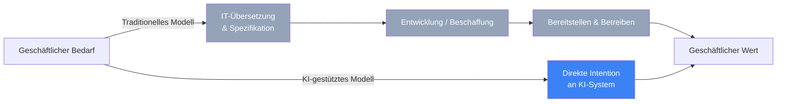
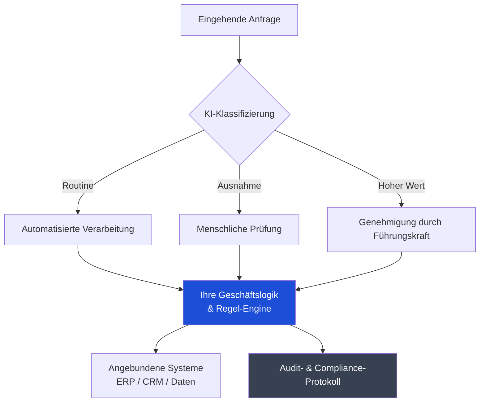
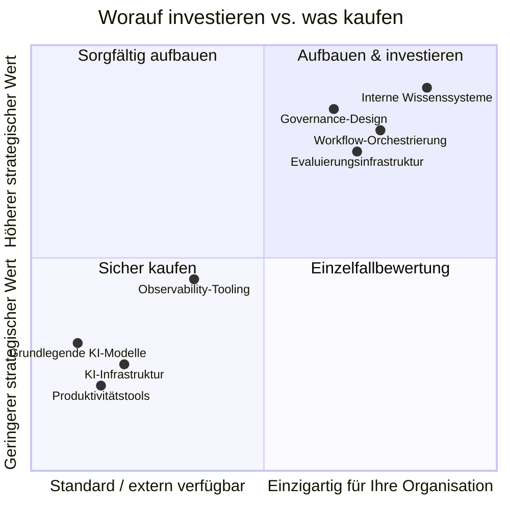
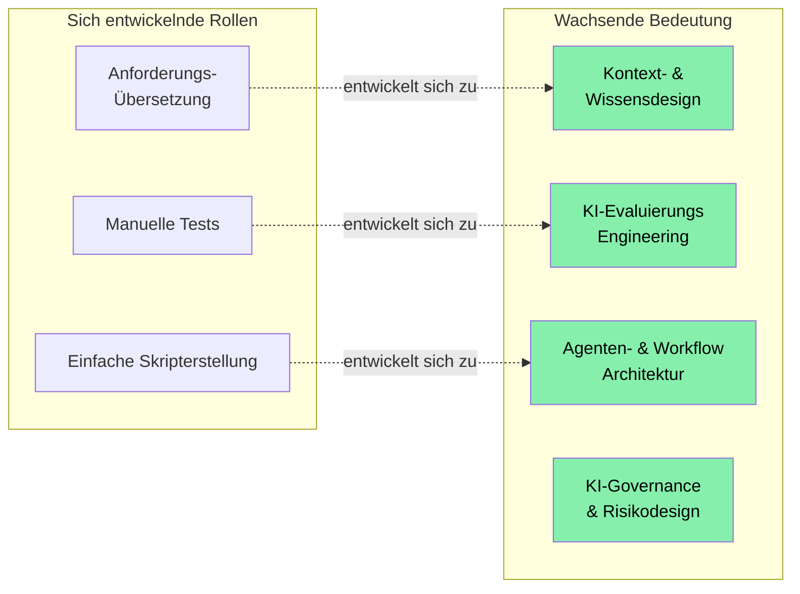

---

Wir befinden uns in einem interessanten Moment. KI-Modelle sind inzwischen leistungsfähig genug, um echte Arbeit zu erledigen — nicht nur dabei zu assistieren, sondern sie tatsächlich zu tun. Für IT‑Führungskräfte eröffnet das eine echte Chance, neu zu gestalten, wie Technologie innerhalb von Organisationen Wert schafft. Die Frage ist nicht, ob man sich diesem Wandel stellt, sondern wie man dies bedacht und gut angeht.

Dieser Beitrag ist mein Versuch, einen praktischen Rahmen zum Nachdenken über diese Frage zu teilen: was sich organisatorisch ändern muss, was es sich lohnt, intern aufzubauen, und was sicher an Anbieter ausgelagert werden kann.

---

## Die Rolle der IT neu denken

Jahrzehntelang hat die IT als Übersetzungsschicht zwischen geschäftlichen Anforderungen und technischer Umsetzung fungiert. Fachbereiche formulieren, was sie wollen; IT-Teams übersetzen das in Spezifikationen, bauen oder beschaffen Systeme und betreiben sie. Dieses Modell hat Organisationen gut gedient, solange die technische Komplexität das erforderte.

KI, die in der Lage ist, auf Absichten in natürlicher Sprache zu reagieren, verändert die Situation. Fachanwender können Bedürfnisse jetzt direkt an KI-Systeme richten und nützliche Ergebnisse erhalten — ohne Ticket, ohne Sprint, ohne lange Wartezeiten. Das ist keine Bedrohung für die IT; es ist eine Einladung, sich in eine strategischere Rolle zu entwickeln.

Die Chance ist beträchtlich. IT kann sich vom Verwalter von Zugängen zum Ermöglicher von Geschwindigkeit wandeln — Standards, gemeinsame Infrastruktur und Leitplanken setzen, die dem Rest der Organisation ermöglichen, mit Zuversicht zu handeln. Das ist eine strategischere Rolle, mit größerer Nähe zu Geschäftsergebnissen und echtem Einfluss.

---

## Was es sich lohnt, intern zu bauen

Die wertvollsten Investitionen liegen dort, wo der spezifische Kontext Ihrer Organisation die primäre Wertquelle ist. Das sind die Dinge, die KI nicht von außen beziehen kann — nur von Ihnen.

### Ihr internes Wissen und Kontext

KI-Modelle sind leistungsfähig, arbeiten jedoch mit dem Kontext, der ihnen gegeben wird. Ihre Organisation hat etwas wirklich Wertvolles angesammelt: institutionelles Wissen darüber, wie Entscheidungen getroffen werden, warum bestimmte Prozesse so funktionieren, wie sie es tun, was Begriffe in Ihrem speziellen Bereich bedeuten und was Ihre Kunden wichtig finden. Dieser Kontext existiert in keinem externen System.

In den Aufbau, die Strukturierung und die Bereitstellung dieses Wissens für KI-Systeme zu investieren, ist eine der ertragsstärksten Maßnahmen, die eine IT‑Organisation derzeit ergreifen kann. Das bedeutet, interne Retrieval‑Systeme zu bauen, Wissensdatenbanken aktuell zu halten und kulturelle Prozesse zu schaffen, die die Mitarbeiterschaft ermutigen, beizutragen. Organisationen, die das gut umsetzen, werden feststellen, dass ihre KI-Systeme deutlich nützlicher sind als solche, die nur mit generischem Kontext arbeiten.

### Workflow-Orchestrierung und Geschäftslogik

Die Reihenfolge, in der die KI arbeitet — was was auslöst, wann ein Mensch prüfen sollte, wie Ausnahmen gehandhabt werden, wie die KI mit Ihren bestehenden Systemen interagiert — kodiert Ihre tatsächliche Geschäftslogik. Selbst beim Einsatz standardisierter Modell‑APIs liegt die Orchestrierungsschicht, die KI‑Fähigkeiten mit realen Geschäftsprozessen verbindet, in Ihrer Verantwortung.

Das lohnt sich, sorgfältig und intern zu gestalten, weil es widerspiegelt, wie Ihre Organisation tatsächlich funktioniert. Gut gemacht, wird es zu einem dauerhaften Vermögenswert.

### Evaluierungsinfrastruktur

Zu wissen, ob KI in Ihrem speziellen Kontext gute Arbeit leistet, können nur Sie beurteilen. Wie sieht ein qualitativ hochwertiges Ergebnis für Ihre Anwendungsfälle aus? Welche Ausfallmodi sind in Ihrem Bereich am bedeutsamsten?

Der Aufbau von Evaluierungsinfrastruktur — domänenspezifische Testsets, menschliche Review‑Pipelines, Feedback‑Schleifen, Monitoring, das Verschlechterungen im Zeitverlauf erkennt — ist eine Investition, die sich vervielfacht. Sie gibt Vertrauen in Ihre Deployments, schützt vor stillen Fehlern und liefert die Belege, um den KI‑Einsatz verantwortungsvoll auszuweiten.

### Governance und Zugriffsgestaltung

Zu definieren, wer KI‑Systeme wozu, mit welchen Daten und mit welchem Autonomieniveau anweisen darf, ist eine Gestaltungsaufgabe, die für Ihre Organisation einzigartig ist. Sie erfordert das Verständnis Ihres regulatorischen Kontexts, Ihrer Risikotoleranz und Ihrer Rechenschaftsstrukturen.

Organisationen, die dies früh durchdacht gestalten — klare Richtlinien, Audit‑Mechanismen und Eskalationspfade — können den KI‑Einsatz deutlich selbstbewusster ausweiten als diejenigen, die Governance nachträglich aufbauen müssen, wenn etwas schiefgeht.

---

## Was bedenkenlos ausgelagert werden kann

Nicht alles muss intern gebaut werden. Viele Fähigkeiten sind bereits reif, wettbewerbsfähig und marktgerecht bepreist.

**Grundlegende KI‑Modelle** sind das deutlichste Beispiel. Das Training von Spitzenmodellen ist außerhalb der wenigen Labore, die das betreiben, keine sinnvolle Investition. Die APIs großer Anbieter bieten exzellente Fähigkeiten zu zugänglichen Kosten, und die Wechselkosten sind geringer, als die meisten erwarten.

**Allgemeine Produktivitätstools** — Code‑Unterstützung, Zusammenfassungen von Meetings, Dokumentenentwurf — sind bereits Commodity. Der Wert liegt hier in Adoption und Nutzung, nicht in Differenzierung. Standardisieren Sie auf einen Anbieter, verhandeln Sie Preise und konzentrieren Sie Ihre Energie anderswo.

**KI‑Infrastruktur** — Inferenz‑Compute, Vektor‑Datenbanken, Feinabstimmungsplattformen — ist ein Bereich, in dem Cloud‑Anbieter aktiv konkurrieren und die Ökonomie stark für Managed Services spricht. Die Innovationsgeschwindigkeit ist so hoch, dass proprietäre Infrastruktur wahrscheinlich schnell ins Hintertreffen gerät.

**Beobachtbarkeits‑ und Monitoring‑Tools** für KI‑Systeme reifen schnell. Gute Plattformen für das Tracking von Modellverhalten, das Nachverfolgen von Agentenaktionen und das Erkennen von Anomalien existieren bereits. Diese sind eher zu kaufen als zu bauen.

---

## Wie sich die Organisation entwickeln kann

Die Technologieentscheidungen sind tatsächlich der einfachere Teil. Die organisatorische Entwicklung ist die eigentliche Arbeit — und dort liegt die echte Chance.

### Zur Plattform‑Organisation werden

Der Wandel von dem Team, das Anfragen verwaltet, hin zu dem Team, das die Organisation befähigt, ist bedeutsam. Er erfordert, dass die IT gemeinsame Infrastruktur entwirft, Standards setzt, innerhalb derer andere sicher bauen können, und Leitplanken entwickelt, die schützen, ohne unnötig zu verlangsamen.

Dieses Modell verschafft der IT mehr Einfluss, nicht weniger. Das Plattform‑Team prägt, wie KI organisationsweit genutzt wird. Das ist eine bedeutende Position.

### Aufbau neuer Kompetenzen

Mehrere Disziplinen werden zentral für KI‑fähige IT‑Organisationen: Kontext‑ und Wissensdesign, Evaluierungs‑Engineering, Agenten‑Architektur und KI‑Governance. Das sind wachsende Felder, und Menschen, die sich jetzt echte Expertise in diesen Bereichen aufbauen, werden sehr wertvoll sein.

Ein praktischer Ansatz ist, eine kleine Gruppe von Personen zu identifizieren, die an diesen Themen interessiert sind, und ihnen Raum zu geben, echte Fähigkeiten zu entwickeln — durch Projekte, Lernen und Arbeit an echten Deployments. Diese Investition wirkt oft schnell.

### Sicherheit und Risiko zu einer strategischen Funktion erheben

Die Sicherheitsfunktion hat die Chance, ein echter strategischer Partner bei KI‑Deployments zu werden, statt ein nachgelagerter Prüfer zu sein. Die Bedrohungslandschaft rund um KI — Prompt‑Injektion, Datenexposition durch Modellkontext, Verantwortlichkeit autonomer Agenten — ist neu genug, dass Organisationen, die früh Expertise entwickeln, im Vorteil sind.

KI‑Sicherheit von Anfang an als Gestaltungsaufgabe zu betrachten, statt als Compliance‑Checkliste am Ende, führt zu besseren Ergebnissen und schnelleren Deployments.

---

## Ein praktischer Einstiegspunkt

Für IT‑Führungskräfte, die überlegen, wo sie beginnen sollen, schlage ich vor, sich auf drei Dinge zu konzentrieren:

- Starten Sie mit Kontext‑Infrastruktur. Identifizieren Sie das wertvollste interne Wissen Ihrer Organisation und bauen Sie Systeme, um es KI verfügbar zu machen. Schon eine bescheidene Investition hier verbessert jede KI‑Einführung deutlich.

- Entwerfen Sie Governance, bevor Sie sie benötigen. Definieren Sie Richtlinien rund um Agentenzugriff und Autonomie, bevor Sie Agenten in großem Maßstab einsetzen. Es ist viel einfacher, dies durchdacht zu gestalten, wenn Sie Zeit dafür haben, als es unter Druck nachträglich anzupassen.

- Setzen Sie etwas Reales ein. Klarheit darüber, was in Ihrer Organisation funktioniert, entsteht durch Tun, nicht nur durch Planung. Wählen Sie einen wertvollen, risikoärmeren Anwendungsfall, bauen Sie ihn sorgfältig, messen Sie ehrlich und nutzen Sie die Erkenntnisse, um den nächsten Schritt zu beschleunigen.

Organisationen, die diesen Moment mit echter Neugier und der Bereitschaft zum Wandel angehen, werden feststellen, dass KI das verstärkt, worin sie ohnehin gut sind. Das institutionelle Wissen, das tiefe Verständnis für das Geschäft, die Beziehungen zu Stakeholdern — all das wird in einer KI‑fähigen Organisation wertvoller, nicht weniger.

Das ist ein guter Moment, in der IT zu sein. Die Rolle wird strategischer, stärker mit Geschäftsergebnissen verbunden und wirklich interessanter. Führungskräfte, die diesen Wandel annehmen, werden prägen, wie ihre Organisationen im nächsten Jahrzehnt arbeiten.

---

*Ich würde gerne hören, wie Sie darüber in Ihrer Organisation denken. Was funktioniert, was ist schwierig, wo finden Sie den größten Nutzen? Der Austausch ist nützlicher als jedes Framework.*