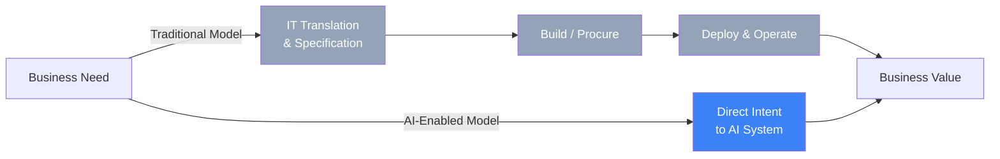
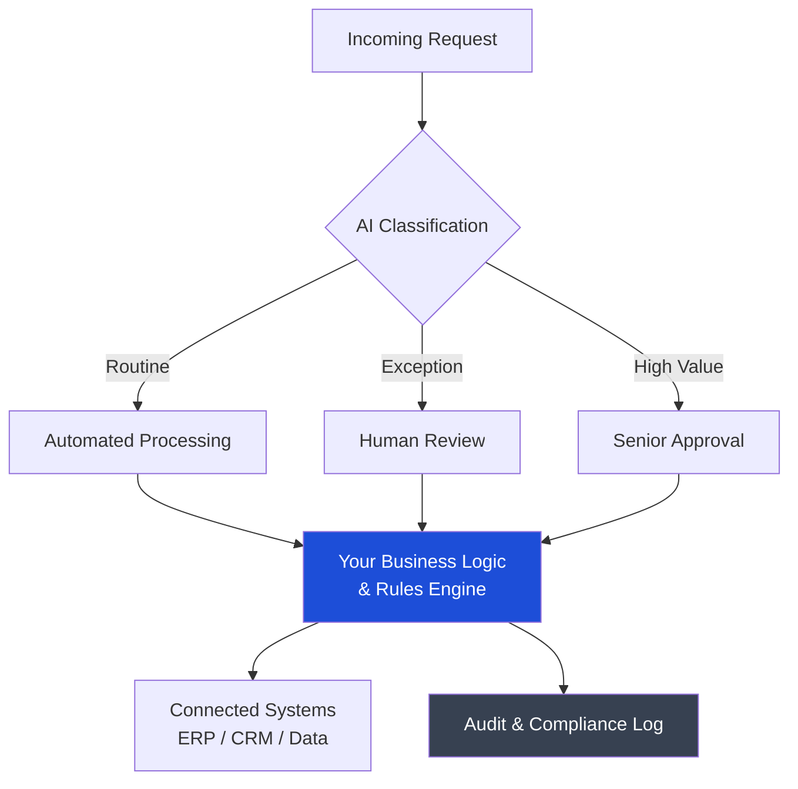
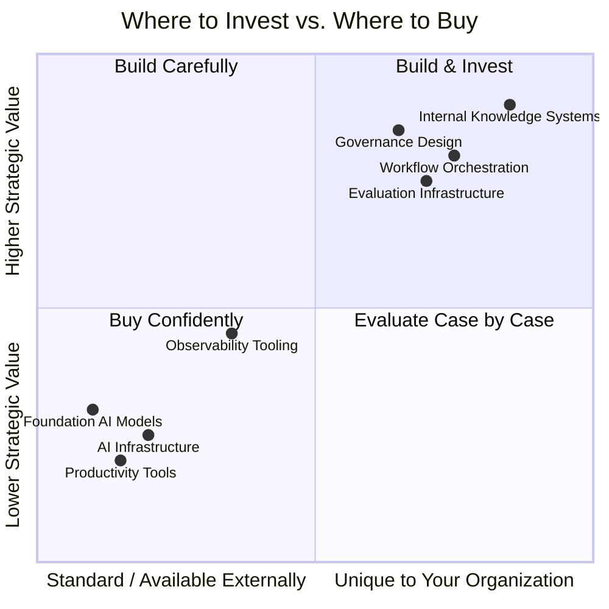
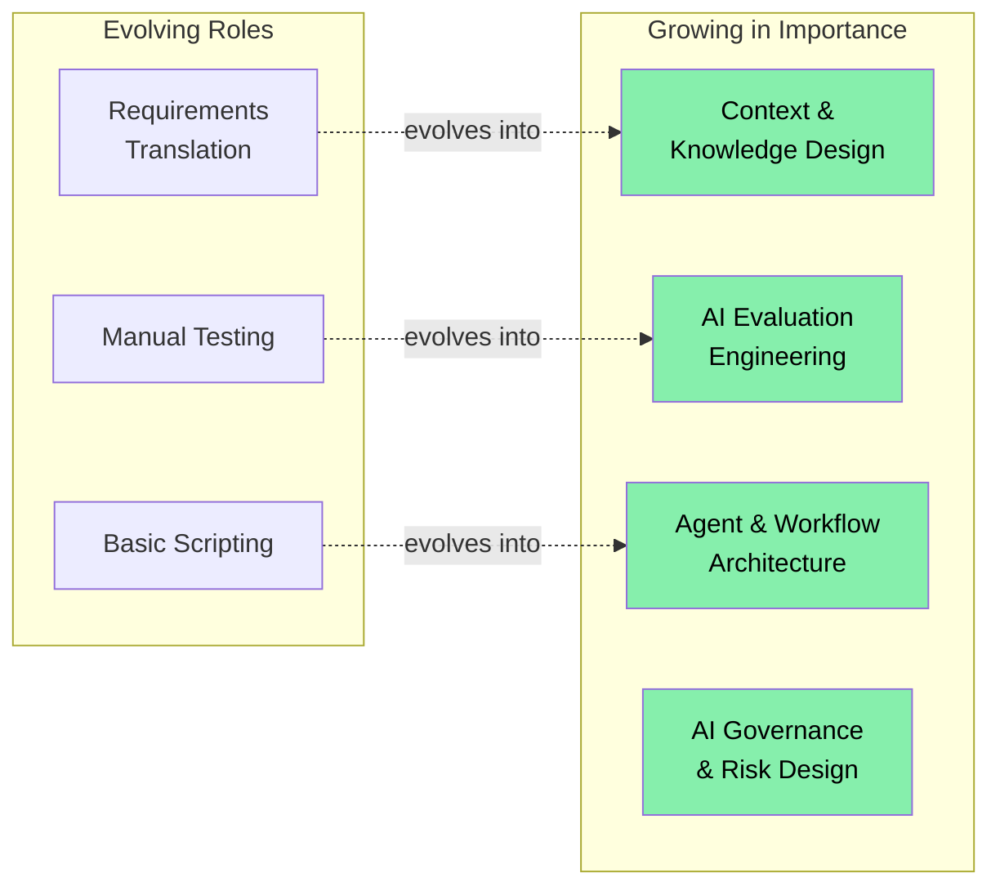

---

We are at an interesting moment. AI models have become capable enough to do real work — not just assist with it, but actually do it. For IT leaders, this creates a genuine opportunity to reshape how technology creates value inside organizations. The question is not whether to engage with this shift, but how to do it thoughtfully and well.

This post is my attempt to share a practical framework for thinking through that question: what needs to change organizationally, what is worth building internally, and what can be safely handed to vendors.

---

## Rethinking the Role of IT

For decades, IT has served as the translation layer between business needs and technical execution. Business teams express what they want; IT teams translate that into specifications, build or procure systems, and operate them. This model served organizations well when technical complexity required it.

AI capable enough to act on natural language intent changes the equation. Business users can now express needs directly to AI systems and receive useful outputs — without a ticket, without a sprint, without waiting. This is not a threat to IT; it is an invitation to evolve toward something more strategic.

The opportunity here is significant. IT can move from managing access to enabling speed — setting the standards, shared infrastructure, and guardrails that allow the rest of the organization to move confidently. That is a more strategic role, with more proximity to business outcomes and more real influence.

---

## What Is Worth Building Internally

The most valuable investments are in the areas where your organization's specific context is the primary source of value. These are the things that AI cannot get from anywhere else — only from you.

### Your Internal Knowledge and Context

AI models are capable, but they operate on the context they are given. Your organization has accumulated something genuinely valuable: institutional knowledge about how decisions get made, why certain processes work the way they do, what terms mean in your specific domain, what your customers care about. This context does not exist in any external system.

Investing in capturing, structuring, and making this knowledge available to AI systems is one of the highest-return things an IT organization can do right now. This means building internal retrieval systems, maintaining knowledge bases that stay current, and creating the cultural processes that encourage people to contribute to them. The organizations that do this well will find that their AI systems are meaningfully more useful than those running on generic context alone.

### Workflow Orchestration and Business Logic

The sequence in which AI does work — what triggers what, when a human should review, how exceptions are handled, how the AI interacts with your existing systems — encodes your actual business logic. Even when using commodity model APIs, the orchestration layer that connects AI capability to real business processes is yours to design.

This is worth doing carefully and internally because it reflects how your organization actually operates. Done well, it becomes a durable asset.

### Evaluation Infrastructure

Knowing whether AI is doing a good job in your specific context is something only you can assess. What does a high-quality output look like for your use cases? What are the failure modes that matter most in your domain?

Building evaluation infrastructure — domain-specific test sets, human review pipelines, feedback loops, monitoring that catches degradation over time — is an investment that compounds. It gives you confidence in your deployments, protects you from silent failures, and gives you the evidence to expand AI use responsibly over time.

### Governance and Access Design

Defining who can instruct AI systems to do what, with which data, and with how much autonomy is a design challenge that is unique to your organization. It requires understanding your regulatory context, your risk tolerance, and your accountability structures.

The organizations that design this thoughtfully early — building clear policies, audit mechanisms, and escalation paths — will be able to expand AI use much more confidently than those who have to retrofit governance after something goes wrong.

---

## What Can Be Confidently Outsourced

Not everything needs to be built internally. Many capabilities are already mature, competitive, and well-priced in the market.

**Foundation AI models** are the clearest example. Training frontier models is not a reasonable investment for organizations outside the handful of labs doing it. The APIs from major providers offer excellent capability at accessible cost, and the switching costs are lower than most people expect.

**General productivity tools** — coding assistance, meeting summarization, document drafting — are already commodity. The value here comes from adoption and usage, not from differentiation. Standardize on a vendor, negotiate pricing, and focus energy elsewhere.

**AI infrastructure** — inference compute, vector databases, fine-tuning platforms — is an area where cloud providers are competing actively and the economics strongly favor using managed services. The pace of innovation here is fast enough that building proprietary infrastructure is likely to fall behind quickly.

**Observability and monitoring tooling** for AI systems is maturing rapidly. Good platforms exist for tracking model behavior, tracing agent actions, and catching anomalies. These are worth buying rather than building.

---

## How the Organization Can Evolve

The technology decisions are actually the easier part. The organizational evolution is where the real work happens — and where the real opportunity lies.

### Becoming a Platform Organization

The shift from being the team that manages requests to being the team that enables the organization is a meaningful one. It requires IT to design shared infrastructure, set standards that others can build confidently within, and develop guardrails that protect without slowing things down unnecessarily.

This model gives IT more influence, not less. The platform team shapes how AI is used across the entire organization. That is a significant position to be in.

### Building New Capabilities

Several disciplines are becoming central to AI-capable IT organizations: context and knowledge design, evaluation engineering, agent architecture, and AI governance. These are growing fields and people who develop genuine expertise in them now will be extremely valuable.

A practical approach is to identify a small number of people who are curious about these areas and give them the space to develop real capability — through projects, through learning, through working on actual deployments. That investment tends to compound quickly.

### Elevating Security and Risk to a Strategic Function

The security function has an opportunity to become a genuine strategic partner in AI deployment rather than a downstream reviewer. The threat landscape around AI — prompt injection, data exposure through model context, autonomous agent accountability — is new enough that the organizations that develop expertise early will be ahead.

Approaching AI security as a design challenge from the beginning, rather than a compliance checklist at the end, produces better outcomes and faster deployments.

---

## A Practical Starting Point

For IT leaders thinking about where to begin, I would suggest focusing on three things:

**Start with context infrastructure.** Identify the most valuable internal knowledge your organization has and build the systems to make it available to AI. Even a modest investment here will make every AI deployment meaningfully better.

**Design governance before you need it.** Define the policies around AI agent access and autonomy before you deploy agents at scale. It is much easier to design this thoughtfully when you have time than to retrofit it under pressure.

**Deploy something real.** Clarity about what works in your organization comes from doing, not from planning. Pick a high-value, lower-risk use case, build it carefully, measure it honestly, and use what you learn to accelerate the next one.

The organizations that approach this moment with genuine curiosity and a willingness to evolve will find that AI amplifies what they are already good at. The institutional knowledge, the deep understanding of the business, the relationships with stakeholders — all of that becomes more valuable, not less, in an AI-capable organization.

This is a good moment to be in IT. The role is becoming more strategic, more connected to business outcomes, and more genuinely interesting. The leaders who embrace that evolution will shape how their organizations operate for the next decade.

---

*I would love to hear how you are thinking about this in your organization. What is working, what is hard, where are you finding the most value? The conversation is more useful than any framework.*