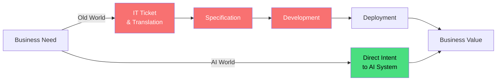
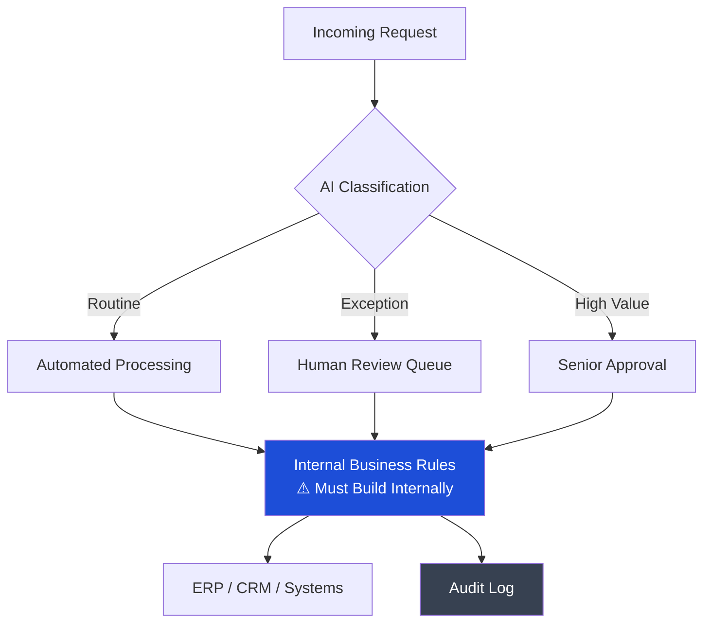
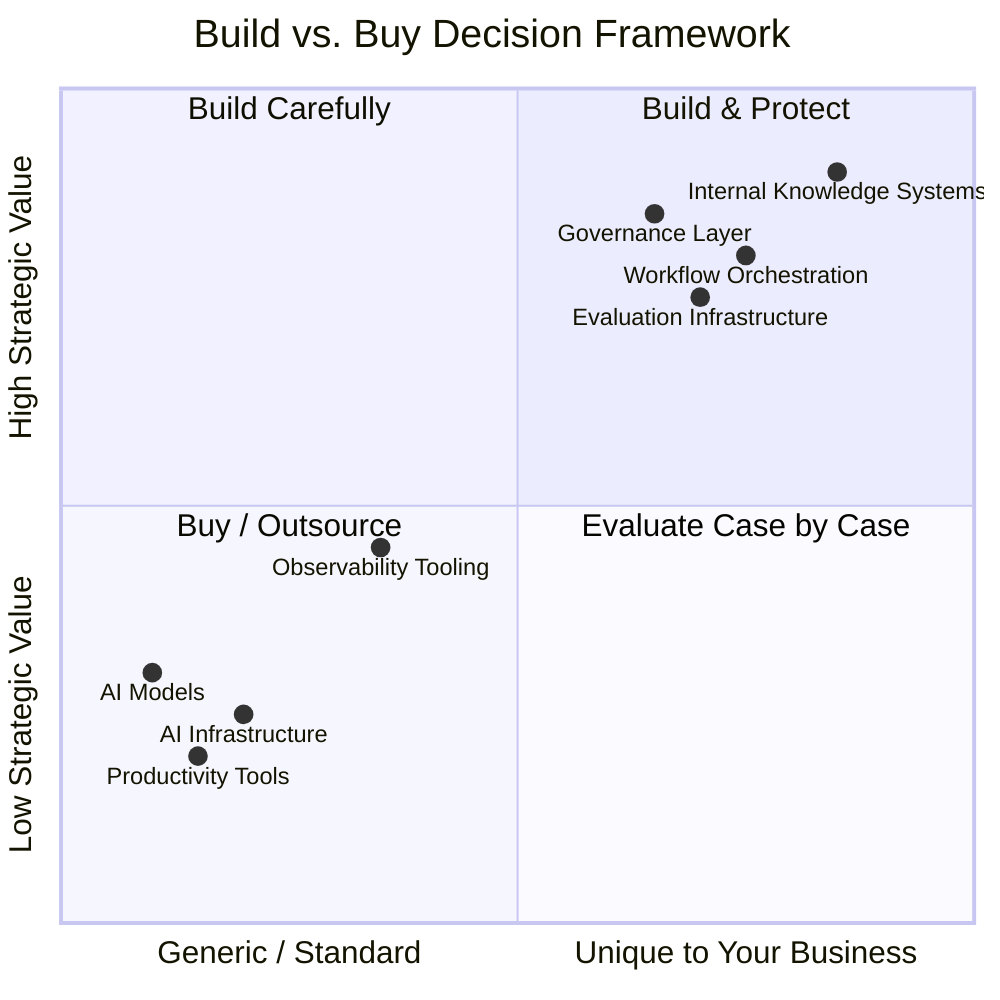
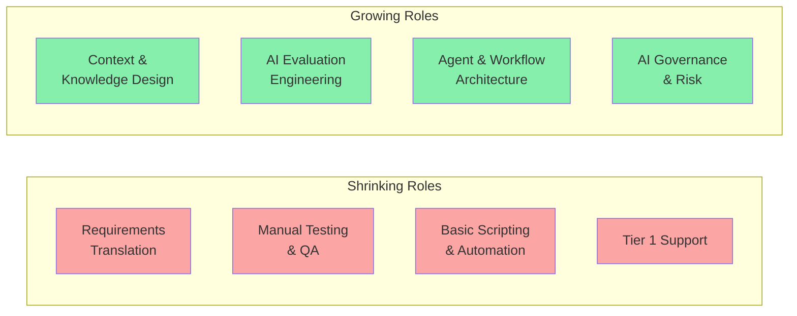

---

## The Old IT Was a Translation Layer

For maybe thirty years, the job of IT was essentially this: business people have needs, IT people translate those needs into technical things, then IT people build or buy those technical things and operate them. IT was the bottleneck on purpose. It was how you kept things from breaking.

The problem is that AI capable enough to do real work starts to dissolve that translation layer. A business analyst can now describe what she wants in plain language and get something useful back. She does not need a ticket. She does not need a sprint. She does not need to wait.

This is not a small thing. It is an identity crisis for most IT organizations.

The old chain had value because complexity required it. AI compresses that chain dramatically. What remains is governance, context, and the hard architectural decisions. That is what IT must reorganize around.

---

## What You Must Build Internally

There is a temptation to outsource everything. I understand this temptation. It feels fast. It feels modern. But there are parts of this where outsourcing is a trap, because the thing that makes AI useful *for your company specifically* is context that only you have.

### 1. Context and Knowledge Infrastructure

AI models are smart but they are also blank. They do not know that your sales team calls a certain deal type a "lighthouse account." They do not know why your company made a certain architectural decision in 2019. They do not know the unwritten rules of how your finance team approves things.

This internal context — scattered across old emails, Confluence pages nobody maintains, the brains of long-tenured employees — is your actual competitive asset. Building the systems that capture it, structure it, and make it available to AI is internal work. Not glamorous work. But irreplaceable work.

This means: knowledge graph construction, internal retrieval systems (what people call RAG — retrieval-augmented generation), pipelines that keep knowledge current, and the cultural processes to actually get people to contribute to these systems.

### 2. Workflow Orchestration

You can buy a model. You cannot buy the logic of how your business runs.

When you build an AI agent that helps your procurement team, the sequence of steps — what triggers what, when a human must approve, what happens when a supplier is not in the system, how exceptions are escalated — that is your business logic. It encodes decades of hard-won process knowledge. Outsourcing the orchestration layer is essentially outsourcing your process design to a vendor who does not understand your business.

### 3. Evaluation Infrastructure

This is the area where I see companies most underprepared.

How do you know if the AI is doing a good job? "It feels right" is not a strategy. You need domain-specific evaluation — test sets that reflect your actual use cases, human review pipelines, feedback loops, and monitoring that catches when model behavior drifts or degrades after a vendor updates their model.

No external vendor can build this for your domain. Only you know what "good" looks like in your context. This infrastructure is unsexy and expensive and absolutely necessary.

### 4. Identity, Access, and Governance Layer

Who can instruct an AI to do what, with which data, and with how much autonomy? This sounds like a security question but it is actually an organizational design question.

An AI agent that can read your customer database, send emails on behalf of sales reps, and create records in your CRM is powerful. It is also a significant risk surface. The policies around this — who authorizes agent capabilities, how you audit what AI did and why, how you revoke access — must be built to your specific regulatory and compliance context. You can use components and platforms, but the design must be yours.

---

## What You Can Safely Outsource

Not everything needs to be built internally. Many things are already commodity and trying to build them yourself is just waste.

**The underlying AI models** — this is obvious, but worth saying. Training frontier models is not something any normal company should attempt. Use the APIs. The switching costs are lower than you think.

**General productivity tools** — coding assistants, meeting summarization, document drafting. These are already commodity. The competitive advantage here is roughly zero regardless of whether you use vendor A or vendor B. Standardize, negotiate pricing, move on.

**AI infrastructure** — inference compute, vector databases, fine-tuning infrastructure. The cloud providers are competing hard here and the economics of running it yourself almost never make sense. This is not like the old debate about on-premise vs. cloud for general compute. The pace of change in AI infrastructure means that building your own is likely to be obsolete before it is finished.

**Observability tooling for AI systems** — platforms for monitoring LLM behavior, tracing agentic workflows, catching hallucinations. These are maturing fast. Use them rather than build them.

---

## How the Organization Must Change

This is the hardest part. Because the technology changes are actually easier than the people changes.

### From Bottleneck to Platform

The IT org that was organized around being the single path through which technology gets deployed cannot survive in this environment. Not because people will not be needed — they will — but because the model of "submit a ticket and wait" will simply be bypassed by anyone who can use AI tools directly.

The successful IT org becomes a platform organization: it sets standards, provides shared infrastructure, defines the guardrails, and enables others to move fast within those guardrails. This requires IT to give up control it currently has and accept that its value comes from enabling speed rather than managing access.

This is a genuine cultural shift. Many IT organizations will resist it. The ones that do not will become irrelevant.

### Skills That Now Matter More

The people who understood how to write detailed technical specifications — translating business language into system requirements — are less needed. The people who can design context systems, write good prompts at scale, build evaluation pipelines, and think carefully about agent autonomy boundaries are urgently needed.

Most IT organizations do not have many of the second type. Retraining works for some people, but not everyone. This is a difficult conversation that most organizations are postponing.

### Security Must Actually Upskill

Adding "AI Use Policy" to the existing security compliance checklist is not sufficient. The threat surface is genuinely new.

Prompt injection — where malicious content in data manipulates AI behavior — is not covered by traditional security frameworks. Data exfiltration through model context windows is a new attack vector. Autonomous agents that can take actions create accountability questions that existing governance frameworks were not designed for.

The security function that approaches AI with the same frameworks it uses for SaaS applications will miss real risks and block things that are actually safe, which is the worst of both worlds.

---

## The Honest Summary

Most companies are trying to adopt AI capabilities while keeping the organizational structure that those capabilities partially make obsolete. That is understandable. Reorganizing is hard and slow and painful. But it is probably unavoidable.

The companies I think will do this well are the ones who are willing to accept that some roles must shrink, some skills must become central that were not before, and the governance model must change before you have fully figured out what you are governing.

That last point is important. You will not have perfect clarity before you need to act. The organizations waiting for a complete picture will still be waiting while others are already learning from real deployments.

Build the context infrastructure. Build the evaluation capability. Build the governance layer. Outsource the commodity. Reorganize toward platform. Accept the discomfort.

It is not more complicated than that. It is just harder.

---

*If you found this useful or think I am wrong about something, I would genuinely like to know. These are hard problems and I do not pretend to have all the answers.*
