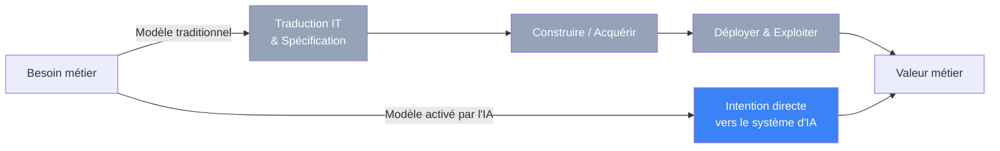
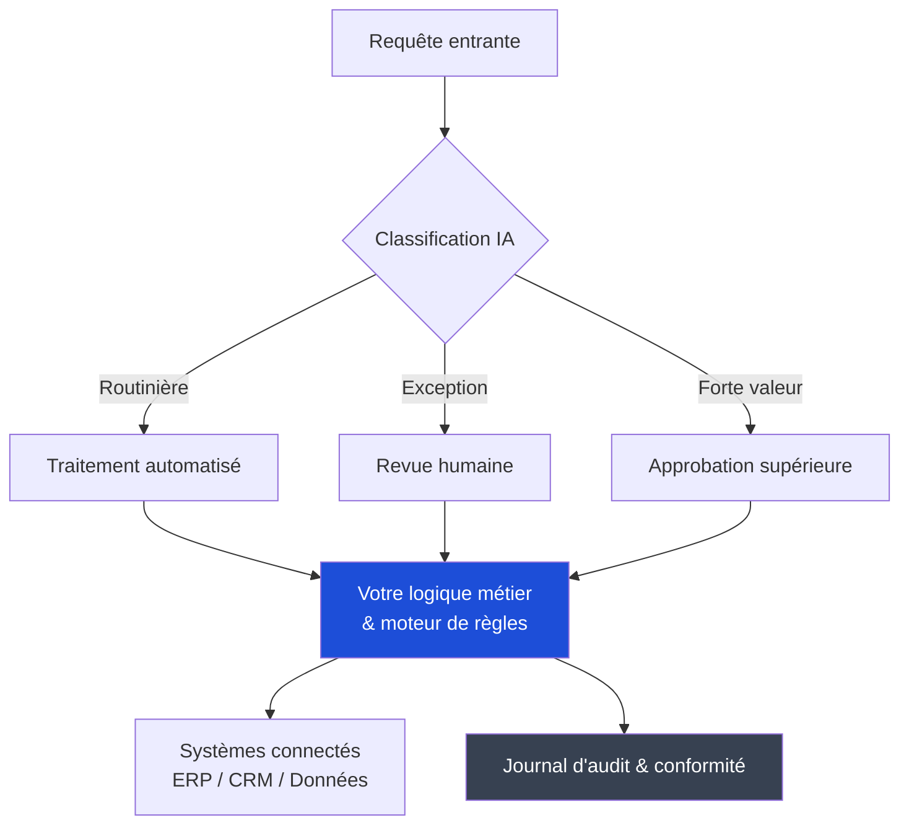
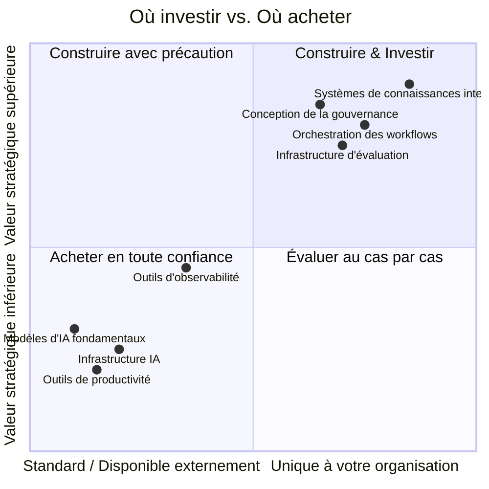
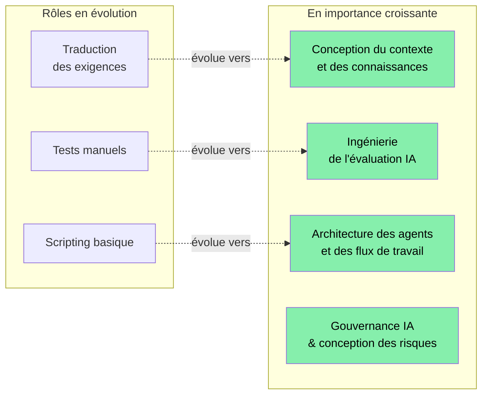

---

Nous sommes à un moment intéressant. Les modèles d'IA sont devenus suffisamment capables pour accomplir un vrai travail — pas seulement pour y assister, mais pour le réaliser réellement. Pour les responsables informatiques, cela crée une opportunité réelle de remodeler la façon dont la technologie crée de la valeur au sein des organisations. La question n'est pas de savoir s'il faut s'engager dans ce changement, mais comment le faire de manière réfléchie et efficace.

Ce billet est ma tentative de partager un cadre pratique pour réfléchir à cette question : ce qui doit changer organisationnellement, ce qui mérite d'être construit en interne et ce qui peut être confié en toute sécurité à des fournisseurs.

---

## Repenser le rôle de l'informatique

Pendant des décennies, l'informatique a servi de couche de traduction entre les besoins métiers et l'exécution technique. Les équipes métiers expriment ce qu'elles veulent ; les équipes informatiques traduisent cela en spécifications, construisent ou achètent des systèmes, et les exploitent. Ce modèle a bien servi les organisations quand la complexité technique l'exigeait.

L'IA, désormais capable d'agir sur une intention exprimée en langage naturel, change la donne. Les utilisateurs métiers peuvent maintenant exprimer leurs besoins directement aux systèmes d'IA et recevoir des résultats utiles — sans ticket, sans sprint, sans attendre. Ce n'est pas une menace pour l'informatique ; c'est une invitation à évoluer vers quelque chose de plus stratégique.

L'opportunité est significative. L'informatique peut passer de la gestion de l'accès à l'habilitation de la rapidité — définir les standards, l'infrastructure partagée et les garde-fous qui permettent au reste de l'organisation d'avancer en confiance. C'est un rôle plus stratégique, avec une plus grande proximité des résultats métier et une influence réelle.

---

## Ce qui mérite d'être construit en interne

Les investissements les plus précieux sont dans les domaines où le contexte spécifique de votre organisation est la principale source de valeur. Ce sont des choses que l'IA ne peut pas obtenir ailleurs — uniquement de vous.

### Vos connaissances et votre contexte internes

Les modèles d'IA sont capables, mais ils opèrent sur le contexte qu'on leur fournit. Votre organisation a accumulé quelque chose de réellement précieux : des connaissances institutionnelles sur la façon dont les décisions sont prises, pourquoi certains processus fonctionnent comme ils le font, ce que signifient certains termes dans votre domaine spécifique, ce qui importe à vos clients. Ce contexte n'existe dans aucun système externe.

Investir dans la capture, la structuration et la mise à disposition de ces connaissances pour les systèmes d'IA est l'un des meilleurs retours sur investissement qu'une organisation informatique puisse faire aujourd'hui. Cela signifie construire des systèmes de recherche internes, maintenir des bases de connaissances à jour et créer les processus culturels qui encouragent les contributions. Les organisations qui font cela bien constateront que leurs systèmes d'IA sont nettement plus utiles que ceux s'appuyant uniquement sur un contexte générique.

### Orchestration des workflows et logique métier

La séquence selon laquelle l'IA effectue le travail — ce qui déclenche quoi, quand un humain doit intervenir, comment les exceptions sont gérées, comment l'IA interagit avec vos systèmes existants — encode votre logique métier réelle. Même en utilisant des API de modèles standard, la couche d'orchestration qui relie la capacité d'IA aux processus métier réels est de votre ressort.

Cela mérite d'être conçu avec soin et en interne, car cela reflète le fonctionnement réel de votre organisation. Bien fait, cela devient un actif durable.

### Infrastructure d'évaluation

Savoir si l'IA fait du bon travail dans votre contexte spécifique est quelque chose que vous seul pouvez évaluer. À quoi ressemble une sortie de haute qualité pour vos cas d'usage ? Quels sont les modes de défaillance qui importent le plus dans votre domaine ?

Construire une infrastructure d'évaluation — jeux de tests spécifiques au domaine, pipelines de revue humaine, boucles de rétroaction, monitoring qui détecte la dégradation au fil du temps — est un investissement qui se cumule. Il vous donne confiance dans vos déploiements, vous protège des échecs silencieux et vous fournit des preuves pour étendre l'utilisation de l'IA de manière responsable au fil du temps.

### Gouvernance et conception des accès

Définir qui peut commander les systèmes d'IA pour faire quoi, avec quelles données et avec quel degré d'autonomie est un défi de conception unique à votre organisation. Cela nécessite de comprendre votre contexte réglementaire, votre tolérance au risque et vos structures de responsabilité.

Les organisations qui conçoivent cela de manière réfléchie et tôt — en construisant des politiques claires, des mécanismes d'audit et des voies d'escalade — seront capables d'étendre l'utilisation de l'IA bien plus sereinement que celles qui devront adapter la gouvernance après qu'un problème soit survenu.

---

## Ce qui peut être externalisé en toute confiance

Tout n'a pas besoin d'être construit en interne. Beaucoup de capacités sont déjà matures, compétitives et bien tarifées sur le marché.

Les modèles d'IA fondamentaux (foundation models) sont l'exemple le plus clair. Former des modèles de pointe n'est pas un investissement raisonnable pour des organisations en dehors de la poignée de laboratoires qui le font. Les API des principaux fournisseurs offrent d'excellentes capacités à un coût accessible, et les coûts de changement sont plus faibles que la plupart ne le pensent.

Les outils de productivité généraux — assistance au codage, synthèse des réunions, rédaction de documents — sont déjà une commodité. La valeur ici vient de l'adoption et de l'utilisation, pas de la différenciation. Standardisez sur un fournisseur, négociez les tarifs et concentrez votre énergie ailleurs.

L'infrastructure IA — calcul d'inférence, bases de données vectorielles, plateformes de fine-tuning — est un domaine où les fournisseurs cloud sont en forte concurrence et où l'économie favorise nettement l'utilisation de services managés. Le rythme d'innovation est suffisamment rapide pour que construire une infrastructure propriétaire ait de fortes chances de prendre du retard rapidement.

Les outils d'observabilité et de monitoring pour les systèmes d'IA mûrissent rapidement. De bonnes plateformes existent pour suivre le comportement des modèles, tracer les actions des agents et détecter les anomalies. Il vaut mieux les acheter que les construire.

---

## Comment l'organisation peut évoluer

Les décisions technologiques sont en fait la partie la plus facile. L'évolution organisationnelle est là où le vrai travail se joue — et où se trouve la véritable opportunité.

### Devenir une organisation plateforme

Le passage d'une équipe qui gère des demandes à une équipe qui habilite l'organisation est significatif. Il exige que l'informatique conçoive une infrastructure partagée, définisse des standards que les autres peuvent utiliser en toute confiance et développe des garde-fous qui protègent sans ralentir inutilement.

Ce modèle donne plus d'influence à l'informatique, pas moins. L'équipe plateforme façonne la manière dont l'IA est utilisée dans l'ensemble de l'organisation. C'est une position importante à occuper.

### Construire de nouvelles compétences

Plusieurs disciplines deviennent centrales pour les organisations informatiques capables d'IA : conception du contexte et des connaissances, ingénierie d'évaluation, architecture des agents et des workflows, et gouvernance de l'IA. Ce sont des domaines en croissance et les personnes qui y développent une véritable expertise seront extrêmement précieuses.

Une approche pratique consiste à identifier un petit nombre de personnes curieuses de ces domaines et à leur donner l'espace pour développer de réelles compétences — via des projets, de l'apprentissage, et le travail sur des déploiements concrets. Cet investissement a tendance à se compenser rapidement.

### Élever la sécurité et le risque en fonction stratégique

La fonction sécurité a l'opportunité de devenir un véritable partenaire stratégique dans le déploiement de l'IA plutôt qu'un simple réviseur en aval. Le paysage des menaces autour de l'IA — injection de prompts, exposition de données via le contexte des modèles, responsabilité des agents autonomes — est suffisamment nouveau pour que les organisations qui développent une expertise tôt prennent de l'avance.

Aborder la sécurité de l'IA comme un défi de conception dès le départ, plutôt que comme une case de conformité à cocher à la fin, produit de meilleurs résultats et accélère les déploiements.

---

## Un point de départ pratique

Pour les responsables informatiques qui se demandent par où commencer, je suggère de se concentrer sur trois choses :

Commencez par l'infrastructure de contexte. Identifiez les connaissances internes les plus précieuses de votre organisation et construisez les systèmes pour les rendre disponibles aux IA. Même un investissement modeste ici rendra chaque déploiement d'IA sensiblement meilleur.

Concevez la gouvernance avant d'en avoir besoin. Définissez les politiques autour de l'accès et de l'autonomie des agents IA avant de déployer des agents à grande échelle. Il est bien plus facile de concevoir cela de manière réfléchie quand vous avez le temps, que de le réadapter sous pression.

Déployez quelque chose de réel. La clarté sur ce qui fonctionne dans votre organisation vient de l'action, pas de la planification. Choisissez un cas d'usage à forte valeur et à risque faible, construisez-le soigneusement, mesurez-le honnêtement et utilisez ce que vous apprenez pour accélérer le suivant.

Les organisations qui abordent ce moment avec une curiosité sincère et une volonté d'évoluer constateront que l'IA amplifie ce qu'elles savent déjà bien faire. Les connaissances institutionnelles, la compréhension approfondie du métier, les relations avec les parties prenantes — tout cela devient plus précieux, pas moins, dans une organisation capable d'IA.

C'est un bon moment pour travailler en informatique. Le rôle devient plus stratégique, plus connecté aux résultats métier et véritablement plus intéressant. Les leaders qui adoptent cette évolution façonneront la manière dont leurs organisations fonctionneront pour la décennie à venir.

---

*J'aimerais beaucoup savoir comment vous réfléchissez à tout cela dans votre organisation. Qu'est-ce qui fonctionne, qu'est-ce qui est difficile, où trouvez-vous le plus de valeur ? La conversation est plus utile que n'importe quel cadre.*