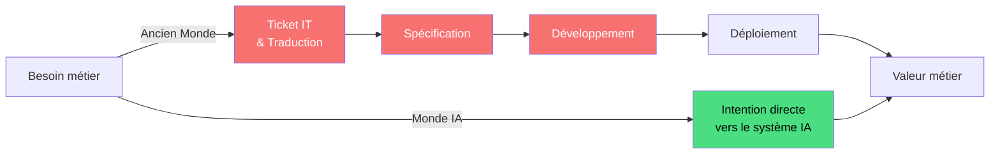
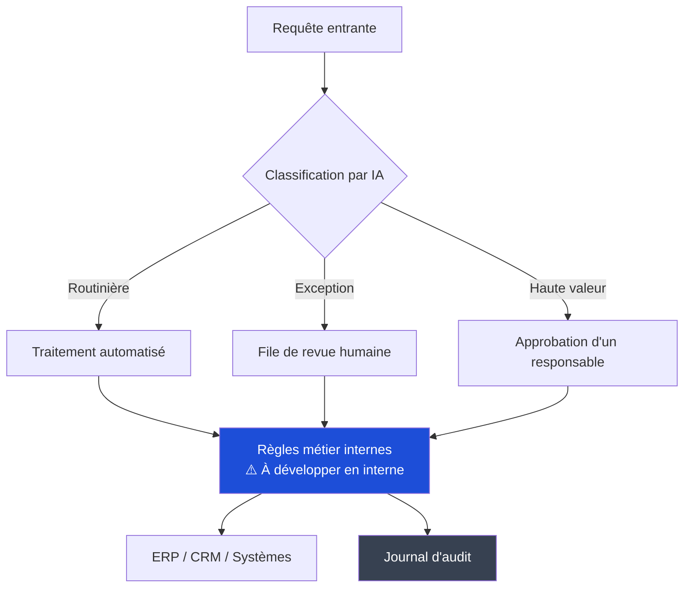
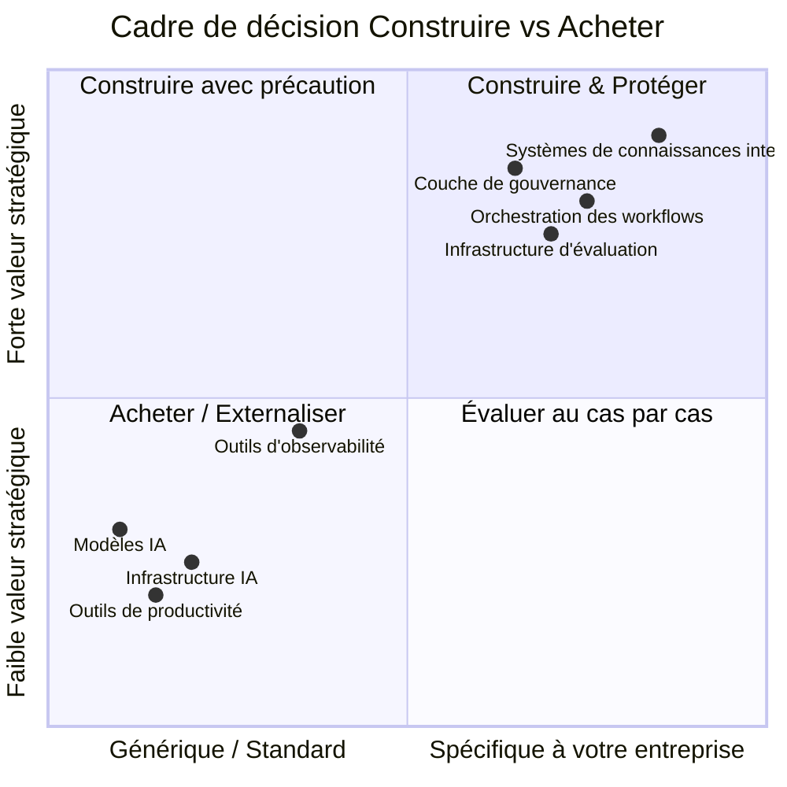
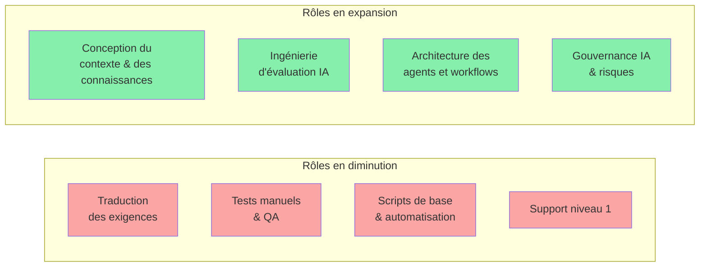

---

## L'ancien service informatique était une couche de traduction

Pendant peut-être trente ans, le rôle de l'informatique se résumait essentiellement à ceci : les métiers ont des besoins, les informaticiens traduisent ces besoins en éléments techniques, puis les informaticiens construisent ou achètent ces éléments techniques et les exploitent. L'informatique était volontairement le goulot d'étranglement. C'était la manière d'empêcher que les choses ne se cassent.

Le problème est que l'IA suffisamment capable de faire du vrai travail commence à dissoudre cette couche de traduction. Une analyste métier peut maintenant décrire ce qu'elle veut en langage courant et obtenir quelque chose d'utile en retour. Elle n'a pas besoin d'un ticket. Elle n'a pas besoin d'un sprint. Elle n'a pas besoin d'attendre.

Ce n'est pas une petite affaire. C'est une crise d'identité pour la plupart des organisations informatiques.

La chaîne d'autrefois avait de la valeur parce que la complexité l'exigeait. L'IA compresse cette chaîne de manière spectaculaire. Ce qui reste, ce sont la gouvernance, le contexte et les décisions architecturales difficiles. C'est autour de cela que l'informatique doit se réorganiser.

---

## Ce que vous devez construire en interne

Il y a une tentation à tout externaliser. Je comprends cette tentation. Ça paraît rapide. Ça paraît moderne. Mais il y a des aspects où l'externalisation est un piège, parce que ce qui rend l'IA utile *pour votre entreprise spécifiquement* est un contexte que vous seul possédez.

### 1. Contexte et infrastructure des connaissances

Les modèles d'IA sont intelligents mais ils sont aussi vides. Ils ne savent pas que votre équipe commerciale appelle un certain type d'affaire un « lighthouse account ». Ils ne savent pas pourquoi votre entreprise a pris une certaine décision architecturale en 2019. Ils ne connaissent pas les règles non écrites sur la façon dont votre équipe finance approuve les choses.

Ce contexte interne — dispersé dans de vieux e-mails, des pages Confluence que personne ne tient à jour, dans les têtes des employés de longue date — est votre véritable actif compétitif. Construire les systèmes qui le capturent, le structurent et le rendent disponible à l'IA est un travail interne. Pas un travail glamour. Mais un travail irremplaçable.

Cela signifie : construction de graphes de connaissance, systèmes internes de récupération (ce que l'on appelle RAG — retrieval-augmented generation), pipelines qui maintiennent les connaissances à jour, et processus culturels pour réellement amener les gens à contribuer à ces systèmes.

### 2. Orchestration des workflows

Vous pouvez acheter un modèle. Vous ne pouvez pas acheter la logique de fonctionnement de votre entreprise.

Quand vous construisez un agent IA qui aide votre équipe achats, la séquence d'étapes — ce qui déclenche quoi, quand un humain doit approuver, ce qui se passe quand un fournisseur n'est pas dans le système, comment les exceptions sont escaladées — c'est votre logique métier. Elle encode des décennies de savoir-faire processus. Externaliser la couche d'orchestration revient essentiellement à externaliser la conception de vos processus à un fournisseur qui ne comprend pas votre entreprise.

### 3. Infrastructure d'évaluation

C'est le domaine où je vois les entreprises les moins préparées.

Comment savez-vous si l'IA fait du bon travail ? « Ça a l'air bien » n'est pas une stratégie. Vous avez besoin d'évaluations spécifiques au domaine — jeux de tests qui reflètent vos cas d'usage réels, pipelines de revue humaine, boucles de rétroaction et surveillance qui détecte quand le comportement du modèle dérive ou se dégrade après qu'un fournisseur a mis à jour son modèle.

Aucun fournisseur externe ne peut construire cela pour votre domaine. Seul vous savez ce à quoi « bon » ressemble dans votre contexte. Cette infrastructure est peu sexy, coûteuse et absolument nécessaire.

### 4. Couche d'identité, d'accès et de gouvernance

Qui peut donner des instructions à une IA pour faire quoi, avec quelles données, et avec quel niveau d'autonomie ? Cela ressemble à une question de sécurité mais c'est en réalité une question de conception organisationnelle.

Un agent IA qui peut lire votre base clients, envoyer des e-mails au nom des commerciaux et créer des enregistrements dans votre CRM est puissant. C'est aussi une surface de risque significative. Les politiques autour de cela — qui autorise les capacités des agents, comment vous auditez ce que l'IA a fait et pourquoi, comment vous révoquez les accès — doivent être construites en fonction de votre contexte réglementaire et de conformité spécifique. Vous pouvez utiliser des composants et des plateformes, mais la conception doit être la vôtre.

---

## Ce que vous pouvez externaliser en toute sécurité

Tout n'a pas besoin d'être construit en interne. Beaucoup de choses sont déjà des commodités et essayer de les construire vous-même est du gaspillage.

**Les modèles d'IA sous-jacents** — c'est évident, mais ça vaut la peine de le dire. Entraîner des modèles de pointe n'est pas quelque chose qu'une entreprise normale devrait tenter. Utilisez les API. Les coûts de changement sont plus faibles que vous ne le pensez.

**Outils de productivité généraux** — assistants de codage, résumés de réunions, rédaction de documents. Ce sont déjà des commodités. L'avantage compétitif ici est à peu près nul, que vous utilisiez le fournisseur A ou le fournisseur B. Standardisez, négociez les tarifs, passez à autre chose.

**Infrastructure IA** — calcul d'inférence, bases de données vectorielles, infrastructures de fine-tuning. Les fournisseurs cloud se battent fort ici et l'économie de le faire vous-même a peu de sens. Ce n'est pas comme l'ancien débat on-premise vs cloud pour le calcul général. Le rythme de changement de l'infrastructure IA signifie que construire la vôtre sera probablement obsolète avant d'être terminée.

**Outils d'observabilité pour systèmes IA** — plateformes de surveillance du comportement des LLM, traçage des workflows agentifs, détection des hallucinations. Ceux-ci mûrissent rapidement. Utilisez-les plutôt que de les construire.

---

## Comment l'organisation doit changer

C'est la partie la plus difficile. Parce que les changements technologiques sont en réalité plus faciles que les changements humains.

### D'un goulet d'étranglement à une plateforme

L'organisation informatique organisée autour du fait d'être le chemin unique par lequel la technologie est déployée ne peut pas survivre dans cet environnement. Pas parce que les gens ne seront pas nécessaires — ils le seront — mais parce que le modèle du « soumettez un ticket et attendez » sera simplement contourné par quiconque sait utiliser des outils d'IA directement.

L'organisation informatique qui réussit devient une organisation plateforme : elle définit des standards, fournit une infrastructure partagée, définit les garde-fous et permet aux autres d'aller vite à l'intérieur de ces garde-fous. Cela exige que l'informatique abandonne un certain contrôle qu'elle détient actuellement et accepte que sa valeur vienne de la capacité à permettre la rapidité plutôt que de gérer l'accès.

C'est un véritable changement culturel. Beaucoup d'organisations informatiques y résisteront. Celles qui ne résisteront pas deviendront obsolètes.

### Compétences qui comptent désormais davantage

Les personnes qui savaient écrire des spécifications techniques détaillées — traduire le langage métier en exigences système — sont moins nécessaires. Les personnes capables de concevoir des systèmes de contexte, rédiger de bons prompts à l'échelle, construire des pipelines d'évaluation et réfléchir soigneusement aux limites d'autonomie des agents sont urgemment nécessaires.

La plupart des organisations informatiques n'ont pas beaucoup de personnes de ce deuxième type. La reconversion fonctionne pour certains, mais pas pour tout le monde. C'est une conversation difficile que la plupart des organisations repoussent.

### La sécurité doit véritablement monter en compétences

Ajouter une « politique d'utilisation de l'IA » à la checklist de conformité sécurité existante n'est pas suffisant. La surface d'attaque est réellement nouvelle.

L'injection de prompts — où du contenu malveillant dans les données manipule le comportement de l'IA — n'est pas couverte par les cadres de sécurité traditionnels. L'exfiltration de données via les fenêtres de contexte des modèles est un nouveau vecteur d'attaque. Les agents autonomes capables d'agir créent des questions de responsabilité que les cadres de gouvernance existants n'étaient pas conçus pour traiter.

La fonction sécurité qui aborde l'IA avec les mêmes cadres qu'elle utilise pour les applications SaaS manquera les vrais risques et bloquera des choses qui sont en réalité sûres, ce qui est le pire des deux mondes.

---

## La synthèse honnête

La plupart des entreprises essaient d'adopter des capacités d'IA tout en conservant la structure organisationnelle que ces capacités rendent en partie obsolète. C'est compréhensible. Se réorganiser est difficile, lent et douloureux. Mais c'est probablement inévitable.

Les entreprises que je pense réussiront sont celles qui acceptent que certains rôles doivent diminuer, que certaines compétences doivent devenir centrales alors qu'elles ne l'étaient pas auparavant, et que le modèle de gouvernance doit changer avant même que vous ayez complètement défini ce que vous gouvernez.

Ce dernier point est important. Vous n'aurez pas une clarté parfaite avant d'avoir besoin d'agir. Les organisations qui attendent une image complète attendront encore pendant que d'autres apprennent déjà grâce à des déploiements réels.

Construisez l'infrastructure de contexte. Construisez la capacité d'évaluation. Construisez la couche de gouvernance. Externalisez la commodité. Réorganisez-vous vers une plateforme. Acceptez l'inconfort.

Ce n'est pas plus compliqué que cela. C'est juste plus difficile.

---

*Si vous avez trouvé ceci utile ou pensez que je me trompe sur quelque chose, j'aimerais vraiment le savoir. Ce sont des problèmes difficiles et je ne prétends pas avoir toutes les réponses.*