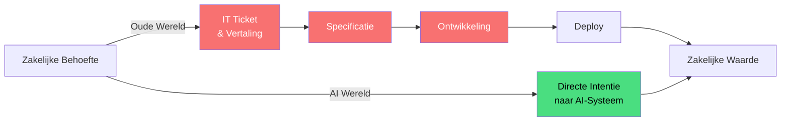
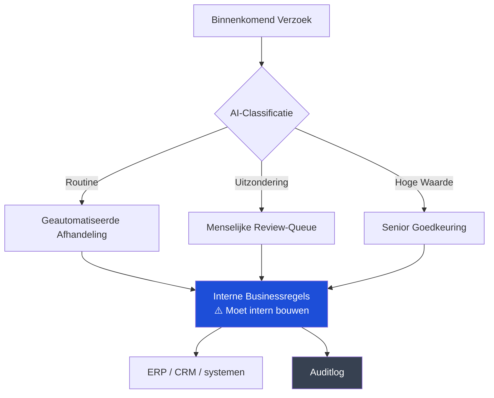
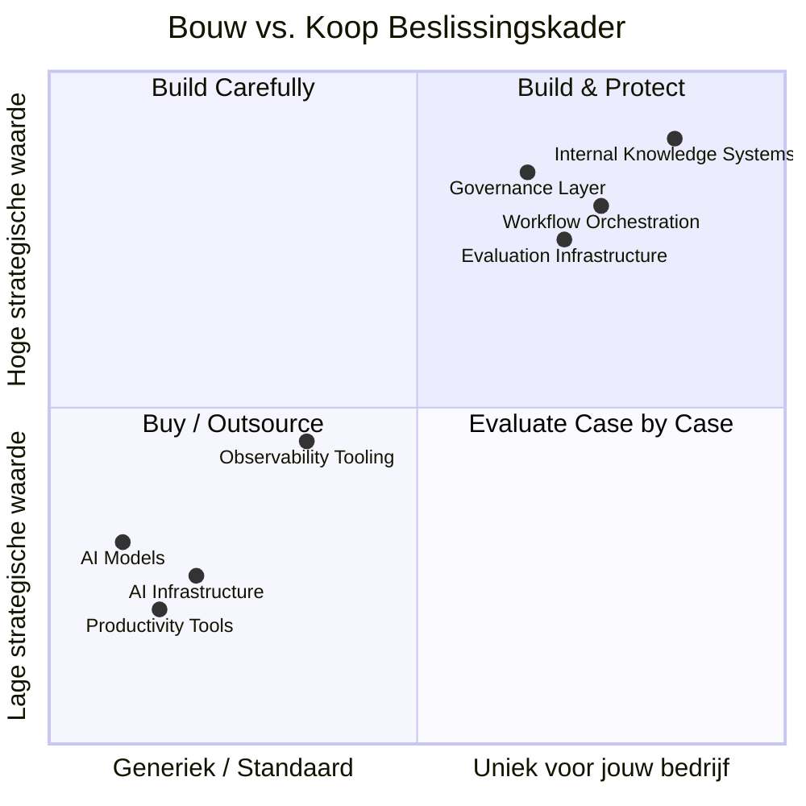
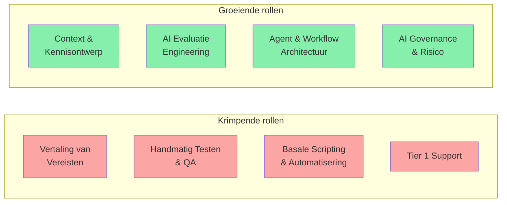

---

## Het oude IT was een vertaallaag

Al ongeveer dertig jaar was de taak van IT in wezen dit: zakelijke mensen hebben behoeften, IT‑mensen vertalen die behoeften naar technische zaken, vervolgens bouwen of kopen IT‑mensen die technische oplossingen en beheren ze die. IT was opzettelijk de bottleneck. Zo voorkwam je dat dingen kapotgingen.

Het probleem is dat AI, die slim genoeg is om echt werk te doen, die vertaallaag begint op te lossen. Een businessanalist kan nu in gewone taal beschrijven wat ze wil en iets bruikbaars terugkrijgen. Ze heeft geen ticket nodig. Ze heeft geen sprint nodig. Ze hoeft niet te wachten.

Dit is geen kleinigheid. Het is een identiteitscrisis voor de meeste IT‑organisaties.

De oude keten had waarde omdat complexiteit dat vereiste. AI comprimeert die keten dramatisch. Wat overblijft is governance, context en de moeilijke architectuurkeuzes. Daar moet IT zich omheen herorganiseren.

---

## Wat je intern moet bouwen

Er is de verleiding om alles uit te besteden. Ik begrijp die verleiding. Het voelt snel. Het voelt modern. Maar op sommige punten is uitbesteden een val, omdat datgene wat AI nuttig maakt — specifiek voor jouw bedrijf — context is die alleen jij hebt.

### 1. Context- en kennisinfrastructuur

AI‑modellen zijn slim maar ook blanco. Ze weten niet dat je sales‑team een bepaald type deal een "lighthouse account" noemt. Ze weten niet waarom je bedrijf in 2019 een bepaalde architectuurkeuze maakte. Ze kennen de ongeschreven regels niet van hoe je finance‑team dingen goedkeurt.

Die interne context — verspreid over oude e‑mails, Confluence‑pagina’s die niemand onderhoudt, de kennis in het hoofd van langzittende medewerkers — is je echte concurrentievoordeel. Systemen bouwen die dat vastleggen, structureren en beschikbaar maken voor AI is intern werk. Niet glamorous werk. Maar onmisbaar werk.

Dat betekent: kennisgrafen opbouwen, interne retrieval‑systemen (wat men RAG noemt — retrieval‑augmented generation), pipelines die kennis actueel houden, en de culturele processen om mensen echt te laten bijdragen aan die systemen.

### 2. Workflow‑orchestratie

Je kunt een model kopen. Je kunt niet de logica kopen van hoe jouw business draait.

Wanneer je een AI‑agent bouwt die je inkoopteam helpt, is de volgorde van stappen — wat wat triggert, wanneer een mens moet goedkeuren, wat er gebeurt als een leverancier niet in het systeem staat, hoe uitzonderingen worden geëscaleerd — dat jouw businesslogica. Het codeert decennia aan hard verworven proceskennis. Het uitbesteden van de orchestratielaag is in feite het uitbesteden van je procesontwerp aan een leverancier die je business niet begrijpt.

### 3. Evaluatie‑infrastructuur

Dit is het gebied waar ik bedrijven het meest onderbemand zie.

Hoe weet je of de AI z’n werk goed doet? "Het voelt goed" is geen strategie. Je hebt domainspecifieke evaluatie nodig — testsets die je werkelijke use cases reflecteren, menselijke review‑pipelines, feedbacklussen en monitoring die signaleert wanneer modelgedrag afdrijft of verslechtert na een update van de leverancier.

Geen externe vendor kan dit voor jouw domein bouwen. Alleen jij weet hoe "goed" eruitziet in jouw context. Deze infrastructuur is niet sexy en duur en absoluut noodzakelijk.

### 4. Identiteit, toegang en governance‑laag

Wie mag een AI instrueren om wat te doen, met welke data, en met hoeveel autonomie? Dit klinkt als een beveiligingsvraag, maar het is eigenlijk een vraag van organisatorisch ontwerp.

Een AI‑agent die je klantendatabase kan lezen, namens sales e‑mails kan sturen en records kan aanmaken in je CRM is krachtig. Het is ook een aanzienlijk risico‑oppervlak. De beleidsregels hieromheen — wie agent‑capabilities autoriseert, hoe je audit wat AI deed en waarom, hoe je toegang intrekt — moeten gebouwd zijn naar jouw specifieke regelgevende en compliance‑context. Je kunt componenten en platforms gebruiken, maar het ontwerp moet van jullie zijn.

---

## Wat je veilig kunt uitbesteden

Niet alles hoeft intern gebouwd te worden. Veel dingen zijn al commodity en proberen die zelf te bouwen is gewoon verspilling.

- De onderliggende AI‑modellen — dit is evident, maar het is het waard om te zeggen. Frontier‑modellen trainen is niets wat een normaal bedrijf zou moeten proberen. Gebruik de API’s. De switching‑kosten zijn lager dan je denkt.
- Algemene productiviteitstools — codeerassistenten, vergaderingssamenvattingen, documentopstelling. Dit is al commoditized. Het concurrentievoordeel hier is vrijwel nihil, ongeacht of je leverancier A of leverancier B gebruikt. Standaardiseer, onderhandel over prijzen, en ga verder.
- AI‑infrastructuur — inference‑compute, vector‑databases, fine‑tuning infrastructuur. De cloudproviders concurreren hier hard en de economie van het zelf draaien maakt zelden zin. Dit is niet zoals het oude debat over on‑premise vs. cloud voor algemene compute. De snelheid van verandering in AI‑infrastructuur betekent dat zelf bouwen waarschijnlijk verouderd is voordat het af is.
- Observability‑tooling voor AI‑systemen — platforms om LLM‑gedrag te monitoren, agentische workflows te tracen, hallucinaties te detecteren. Deze rijpen snel. Gebruik ze in plaats van ze te bouwen.

---

## Hoe de organisatie moet veranderen

Dit is het moeilijkste deel. Want de technologische veranderingen zijn eigenlijk makkelijker dan de personele veranderingen.

### Van bottleneck naar platform

De IT‑organisatie die was ingericht als het enige pad waarlangs technologie wordt uitgerold, kan niet overleven in deze omgeving. Niet omdat mensen niet meer nodig zijn — ze zullen dat wel zijn — maar omdat het model van "diens een ticket in en wacht" simpelweg wordt omzeild door iedereen die AI‑tools direct kan gebruiken.

De succesvolle IT‑org wordt een platformorganisatie: zij stelt standaarden, levert gedeelde infrastructuur, definieert de guardrails en stelt anderen in staat snel te bewegen binnen die guardrails. Dit vereist dat IT controle opgeeft die het nu heeft en accepteert dat zijn waarde voortkomt uit het mogelijk maken van snelheid in plaats van het beheren van toegang.

Dit is een echte culturele verschuiving. Veel IT‑organisaties zullen zich hiertegen verzetten. De organisaties die dat niet doen, zullen irrelevant worden.

### Vaardigheden die nu belangrijker zijn

Mensen die goed waren in het schrijven van gedetailleerde technische specificaties — het vertalen van zakelijke taal naar systeemvereisten — zijn minder nodig. Mensen die contextsystemen kunnen ontwerpen, goede prompts op schaal kunnen schrijven, evaluatiepijplijnen kunnen bouwen en zorgvuldig kunnen nadenken over de grenzen van agent‑autonomie zijn dringend nodig.

De meeste IT‑organisaties hebben niet veel van het tweede type. Omscholen werkt voor sommige mensen, maar niet voor iedereen. Dit is een moeilijk gesprek dat de meeste organisaties uitstellen.

### Security moet echt upskillen

Het toevoegen van "AI‑gebruikbeleid" aan de bestaande security‑compliance checklist is niet voldoende. Het dreigingsoppervlak is echt nieuw.

Prompt‑injectie — waar kwaadaardige inhoud in data het AI‑gedrag manipuleert — wordt niet afgedekt door traditionele securitykaders. Data‑exfiltratie via modelcontextvensters is een nieuwe aanvalsvector. Autonome agents die acties kunnen ondernemen creëren aansprakelijkheidsvragen waar bestaande governancekaders niet voor ontworpen zijn.

De securityfunctie die AI benadert met dezelfde kaders als voor SaaS‑applicaties zal echte risico’s missen en tegelijk dingen blokkeren die eigenlijk veilig zijn, wat het ergste van twee werelden is.

---

## De eerlijke samenvatting

De meeste bedrijven proberen AI‑capaciteiten te adopteren terwijl ze de organisatorische structuur behouden die deze capaciteiten gedeeltelijk overbodig maakt. Dat is begrijpelijk. Herorganiseren is moeilijk, traag en pijnlijk. Maar het is waarschijnlijk onvermijdelijk.

De bedrijven waarvan ik denk dat ze dit goed doen, zijn degenen die bereid zijn te accepteren dat sommige rollen moeten krimpen, sommige vaardigheden centraal moeten komen te staan die dat eerder niet waren, en het governance‑model moet veranderen voordat je volledig begrijpt wat je eigenlijk reguleert.

Dat laatste punt is belangrijk. Je zult niet perfecte duidelijkheid hebben voordat je moet handelen. Organisaties die wachten op een volledig plaatje zullen nog steeds wachten terwijl anderen al leren van echte implementaties.

Bouw de contextinfrastructuur. Bouw de evaluatiecapaciteit. Bouw de governance‑laag. Besteed de commodity uit. Herorganiseer richting een platform. Accepteer het ongemak.

Het is niet ingewikkelder dan dat. Het is alleen zwaarder.

---

*Als je dit nuttig vond of denkt dat ik ergens ongelijk heb, hoor ik dat graag. Dit zijn lastige problemen en ik pretendeer niet alle antwoorden te hebben.*