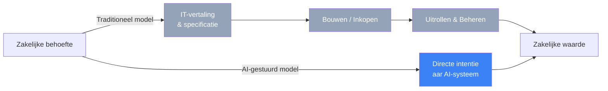
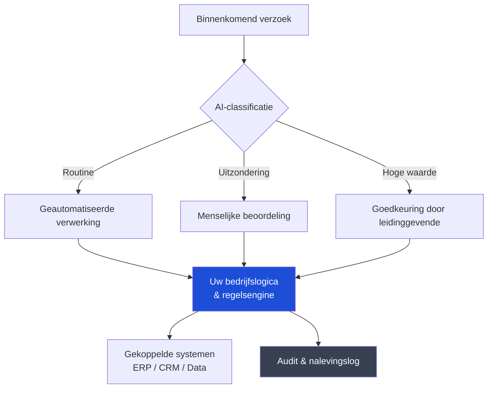
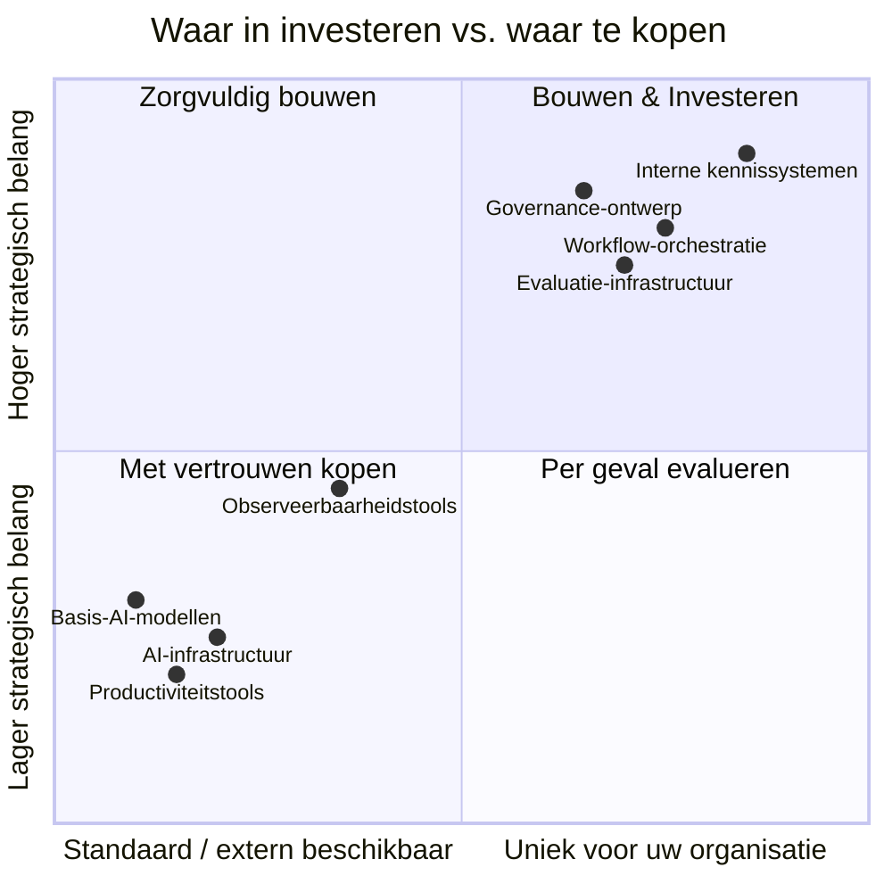
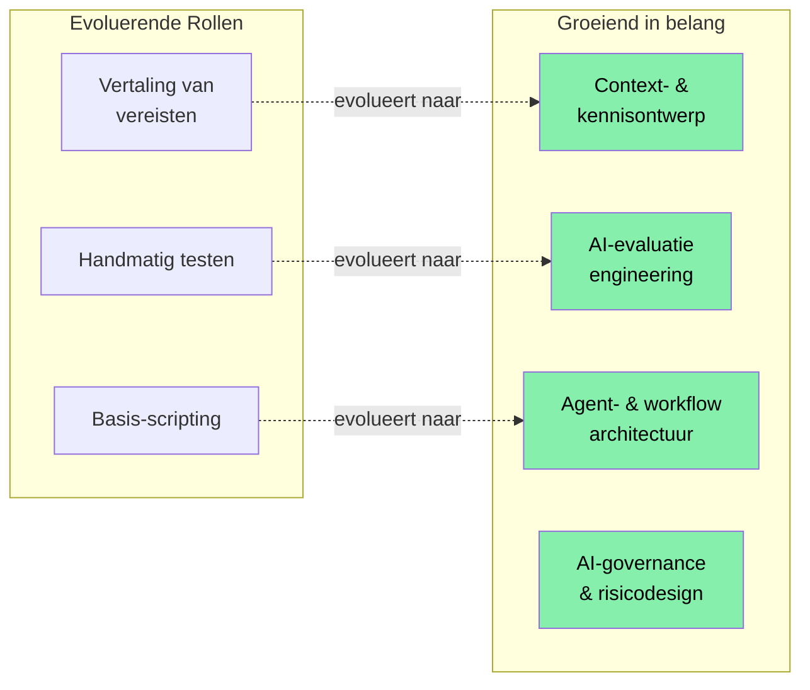

---

We bevinden ons op een interessant moment. AI-modellen zijn nu capabel genoeg om echt werk te doen — niet alleen om daarbij te assisteren, maar om het daadwerkelijk uit te voeren. Voor IT-leiders creëert dit een echte kans om te herdefiniëren hoe technologie waarde creëert binnen organisaties. De vraag is niet of je je met deze verschuiving moet bezighouden, maar hoe je dat doordacht en goed doet.

Dit bericht is mijn poging om een praktisch kader te delen om die vraag te doordenken: wat er organisatorisch moet veranderen, wat de moeite waard is om intern te bouwen en wat veilig aan leveranciers kan worden overgelaten.

---

## De rol van IT heroverwegen

Gedurende decennia heeft IT gefungeerd als de vertaallaag tussen zakelijke behoeften en technische uitvoering. Businessteams geven aan wat ze willen; IT-teams vertalen dat naar specificaties, bouwen of kopen systemen en beheren ze. Dit model werkte goed toen technische complexiteit dat vereiste.

AI die capabel genoeg is om op natuurlijke taalintenties te reageren verandert die vergelijking. Businessgebruikers kunnen nu behoeften rechtstreeks aan AI-systemen uitdrukken en bruikbare output ontvangen — zonder een ticket, zonder een sprint, zonder te wachten. Dit is geen bedreiging voor IT; het is een uitnodiging om te evolueren naar iets strategischers.

De kans hier is aanzienlijk. IT kan verschuiven van toegang beheren naar snelheid mogelijk maken — het vaststellen van standaarden, gedeelde infrastructuur en guardrails die de rest van de organisatie in staat stellen zelfverzekerd te handelen. Dat is een strategischere rol, met meer nabijheid tot bedrijfsresultaten en meer echte invloed.

---

## Wat de moeite waard is om intern te bouwen

De meest waardevolle investeringen liggen op de plekken waar de specifieke context van uw organisatie de primaire bron van waarde is. Dit zijn de dingen die AI nergens anders vandaan kan halen — alleen van u.

### Uw interne kennis en context

AI-modellen zijn capabel, maar ze werken op de context die ze krijgen. Uw organisatie heeft iets echt waardevols opgebouwd: institutionele kennis over hoe beslissingen worden genomen, waarom bepaalde processen zo werken, wat termen in uw specifieke domein betekenen en waar uw klanten om geven. Deze context bestaat niet in een extern systeem.

Investeren in het vastleggen, structureren en beschikbaar maken van deze kennis voor AI-systemen is een van de rendementrijkste dingen die een IT-organisatie nu kan doen. Dat betekent interne retrieval-systemen bouwen, kennisbanken onderhouden die actueel blijven en culturele processen creëren die mensen aanmoedigen eraan bij te dragen. Organisaties die dit goed doen zullen merken dat hun AI-systemen wezenlijk nuttiger zijn dan systemen die alleen op generieke context draaien.

### Workflow-orchestratie en bedrijfslogica

De volgorde waarin AI werk uitvoert — wat wat triggert, wanneer een mens moet beoordelen, hoe uitzonderingen worden afgehandeld, hoe de AI met uw bestaande systemen interageert — codeert uw feitelijke bedrijfslogica. Zelfs bij gebruik van commodity model-API's is de orchestratielaag die AI-capaciteit aan echte bedrijfsprocessen koppelt van u om te ontwerpen.

Dit is de moeite waard om zorgvuldig en intern te doen omdat het weerspiegelt hoe uw organisatie daadwerkelijk werkt. Goed uitgevoerd wordt het een duurzaam bezit.

### Evaluatie-infrastructuur

Weten of AI goed werk levert in uw specifieke context is iets dat alleen u kunt beoordelen. Hoe ziet een hoogwaardige output eruit voor uw use cases? Wat zijn de faalpatronen die in uw domein het meest van belang zijn?

Het bouwen van evaluatie-infrastructuur — domeinspecifieke testsets, menselijke review-pijplijnen, feedbackloops, monitoring die degradatie over tijd vangt — is een investering die componeert. Het geeft vertrouwen in uw uitrol, beschermt tegen stille fouten en levert het bewijs om AI-gebruik verantwoordelijk uit te breiden.

### Governance en toegangsontwerp

Het definiëren wie AI-systemen mag instrueren om wat te doen, met welke data en met hoeveel autonomie, is een ontwerpprobleem dat uniek is voor uw organisatie. Het vereist begrip van uw regelgevende context, uw risicotolerantie en uw verantwoordingsstructuren.

Organisaties die dit vroegtijdig doordacht ontwerpen — door duidelijke beleidslijnen, audit-mechanismen en escalatiepaden te bouwen — kunnen AI-gebruik veel zelfverzekerder uitbreiden dan zij die governance achteraf moeten aanpassen nadat er iets misgaat.

---

## Wat met vertrouwen uitbesteed kan worden

Niet alles hoeft intern te worden gebouwd. Veel capaciteiten zijn al volwassen, competitief en gunstig geprijsd op de markt.

**Basis-AI-modellen** zijn het duidelijkste voorbeeld. Het trainen van grensverleggende modellen is geen redelijke investering voor organisaties buiten de handvol labs die dat doen. De API's van grote aanbieders bieden uitstekende mogelijkheden tegen toegankelijke kosten, en de switchingkosten zijn lager dan de meeste mensen verwachten.

**Algemene productiviteitstools** — codeerassistentie, vergadersamenvattingen, documenten opstellen — zijn al commodity. De waarde zit in adoptie en gebruik, niet in differentiatie. Standardiseer op een aanbieder, onderhandel over prijs en richt uw energie elders.

**AI-infrastructuur** — inference-compute, vectordatabases, fine-tuningplatforms — is een gebied waar cloudproviders actief concurreren en de economie sterk pleit voor het gebruik van managed services. Het innovatietempo is hier snel genoeg dat het bouwen van propriëtaire infrastructuur waarschijnlijk snel achterop raakt.

**Observeerbaarheid- en monitoringtools** voor AI-systemen rijpen snel. Er bestaan goede platforms voor het volgen van modelgedrag, het traceren van agent-acties en het detecteren van anomalieën. Deze zijn het waard om te kopen in plaats van te bouwen.

---

## Hoe de organisatie kan evolueren

De technologiebeslissingen zijn eigenlijk het gemakkelijkere deel. De organisatorische evolutie is waar het echte werk gebeurt — en waar de echte kans ligt.

### Een platformorganisatie worden

De verschuiving van het team dat verzoeken beheert naar het team dat de organisatie in staat stelt, is betekenisvol. Het vereist dat IT gedeelde infrastructuur ontwerpt, standaarden opstelt waarbinnen anderen zelfverzekerd kunnen bouwen, en guardrails ontwikkelt die beschermen zonder onnodig te vertragen.

Dit model geeft IT meer invloed, niet minder. Het platformteam bepaalt hoe AI wordt gebruikt in de hele organisatie. Dat is een belangrijke positie om in te zitten.

### Nieuwe capaciteiten ontwikkelen

Verschillende disciplines worden centraal voor AI-capabele IT-organisaties: context- en kennisontwerp, evaluatie-engineering, agentarchitectuur en AI-governance. Dit zijn groeiende vakgebieden en mensen die nu echte expertise daarin ontwikkelen zullen buitengewoon waardevol zijn.

Een praktische aanpak is om een klein aantal mensen te identificeren die nieuwsgierig zijn naar deze gebieden en hen de ruimte te geven om echte vaardigheden te ontwikkelen — via projecten, via leren, via werken aan daadwerkelijke uitrol. Die investering componeert doorgaans snel.

### Beveiliging en risico verheffen tot een strategische functie

De beveiligingsfunctie heeft de kans om een echte strategische partner te worden in AI-uitrol in plaats van een downstream reviewer. Het dreigingslandschap rond AI — prompt-injectie, blootstelling van data via modelcontext, verantwoording van autonome agents — is nieuw genoeg dat organisaties die vroeg expertise ontwikkelen voorop zullen lopen.

AI-beveiliging vanaf het begin als een ontwerpprobleem benaderen, in plaats van als een compliance-checklist aan het eind, levert betere uitkomsten en snellere uitrol op.

---

## Een praktisch startpunt

Voor IT-leiders die nadenken over waar te beginnen, zou ik aanraden om te focussen op drie dingen:

**Begin met contextinfrastructuur.** Identificeer de meest waardevolle interne kennis van uw organisatie en bouw de systemen om die beschikbaar te maken voor AI. Zelfs een bescheiden investering hier zal elke AI-uitrol wezenlijk verbeteren.

**Ontwerp governance voordat u het nodig hebt.** Definieer het beleid rond toegang van AI-agenten en autonomie voordat u agents op schaal uitrolt. Het is veel makkelijker om dit doordacht te ontwerpen als u de tijd heeft dan het onder druk achteraf te moeten aanpassen.

**Implementeer iets concreets.** Duidelijkheid over wat werkt in uw organisatie komt door doen, niet door plannen. Kies een use case met hoge waarde en laag risico, bouw die zorgvuldig, meet eerlijk en gebruik wat u leert om de volgende te versnellen.

Organisaties die dit moment benaderen met oprechte nieuwsgierigheid en de bereidheid om te evolueren zullen merken dat AI versterkt waar ze al goed in zijn. De institutionele kennis, het diepe begrip van het bedrijf, de relaties met stakeholders — dat alles wordt waardevoller, niet minder, in een AI-capabele organisatie.

Dit is een goed moment om in IT te zitten. De rol wordt strategischer, meer verbonden met bedrijfsresultaten en wezenlijk interessanter. Leiders die die evolutie omarmen zullen bepalen hoe hun organisaties het komende decennium opereren.

---

*Ik hoor graag hoe u hierover denkt in uw organisatie. Wat werkt, wat is moeilijk, waar vindt u de meeste waarde? Het gesprek is nuttiger dan welk framework ook.*